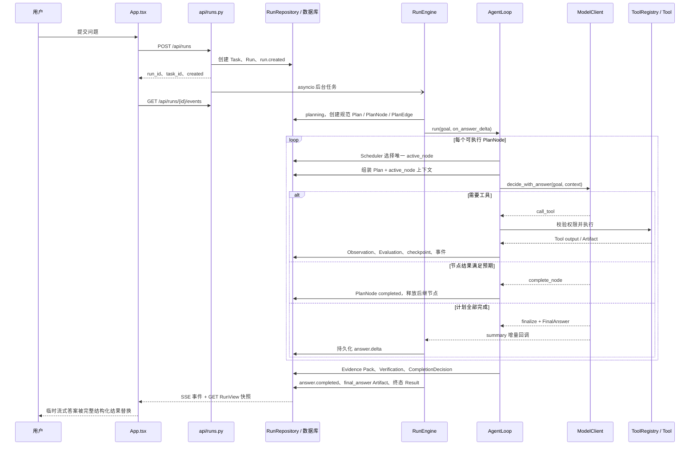
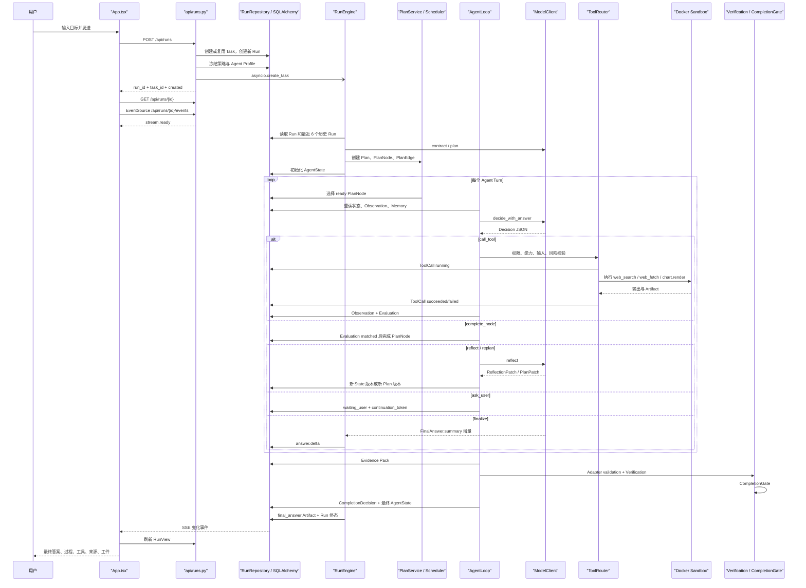

# 跟着一次用户提问读懂 Astra Agent Loop

本文不从类名或数据表开始介绍 Astra，而是跟随一次真实问题在系统中的移动轨迹：用户在聊天框按下发送，问题如何成为一个持久化 Run，后台如何准备任务、逐轮决定是否使用工具，答案文字为何能先出现在界面上，验证结果又如何替换临时文字。文中出现的概念都指向当前代码中的真实模块；如果名称所暗示的能力尚未完全落地，也按当前实现说明，不把设计目标写成现状。

为了便于理解，下面假设用户问的是一个可能需要最新资料的问题。若模型判断它只需要稳定知识，流程会在 Agent Loop 的第一轮直接走向最终回答；若需要外部证据，则会经历若干工具轮次后再回答。

## 用户按下发送：前台先获得运行标识，而不是答案

交互从 [`frontend/src/App.tsx`](../frontend/src/App.tsx) 的 `submit()` 开始。它先在浏览器本地拒绝空问题，随后把界面上的推理强度、规划策略、反思开关、执行模式、模型供应商和模型名称整理成请求。普通提问调用 [`frontend/src/api.ts`](../frontend/src/api.ts) 的 `createRun()`，向 `POST /api/runs` 发送 `goal`；同一段对话的后续问题还会携带已有 `task_id`，因此一次用户提问对应一个新的 Run，而连续对话可以共享同一个 Task。

这里的 **Task** 是对话级容器，**Run** 才是一次后台执行。这个对应关系实际落在 [`backend/app/repositories/runs.py`](../backend/app/repositories/runs.py) 的 `create_task_run()`：没有 `task_id` 时创建 `TaskRecord`，每次都新建 `RunRecord`，并把本次原始问题保存到 `model_policy.conversation_goal`。`RunRecord.status` 起始为 `created`，同时生成第一条持久化事件 `run.created`。

请求由 [`backend/app/api/runs.py`](../backend/app/api/runs.py) 的 `create_run()` 接收。它并不直接运行模型，而是先读取数据库中的工具开关，将本次选择的模型覆盖到一份 Run 专用 Settings，通过 [`backend/app/runner/reasoning.py`](../backend/app/runner/reasoning.py) 的 `PolicyCompiler.compile()` 把用户请求的推理策略编译成不可变的 `ReasoningPolicySnapshot`。快、均衡、深入最终不是提示词标签，而是不同的 turn、tool call、reflection 和 replan 预算。随后系统还会通过 `load_agent_profile().snapshot()` 冻结本次运行使用的 Agent Profile。这样即使运行期间身份文档发生变化，已经创建的 Run 仍使用创建时的版本。

数据库提交成功后，API 用 `_schedule_run()` 创建进程内 `asyncio.Task`，再立即把 `run_id`、`task_id` 和 `created` 返回给浏览器。前台因此能马上插入用户消息和一个乐观 Run，而不用等待规划或模型输出。真正的后台入口是 [`backend/app/runner/engine.py`](../backend/app/runner/engine.py) 的 `start_run_in_process()` 与 `RunEngine.run()`。

这一步也界定了当前的运行可靠性：后台任务保存在当前 API 进程的 `_background_tasks` 集合中，并不是外部任务队列。Run、事件和中间对象会持久化，但进程本身的执行调度仍是 in-process。

## 浏览器在后台执行开始时建立两条观察通道

拿到 `run_id` 后，前台一边调用 `GET /api/runs/{run_id}` 获取完整快照，一边由 `streamRunEvents()` 打开 `GET /api/runs/{run_id}/events` 的 `EventSource`。这两条通道承担不同职责。

SSE 端点由 [`backend/app/api/runs.py`](../backend/app/api/runs.py) 的 `stream_run_events()` 实现。它不订阅内存消息总线，而是每 50 毫秒按递增事件 ID 查询 `RunEventRecord`，把数据库中已经提交的事件依序发给浏览器。因此这里的 **Event** 是可回放的持久化运行日志，SSE 只是运输方式，不是真实状态的唯一存放处。连接开始时会发 `stream.ready`，Run 进入 `completed`、`completed_with_warnings`、`failed`、`blocked` 或 `waiting_user` 后关闭。

完整界面状态则来自 `GET /api/runs/{run_id}`。[`backend/app/repositories/runs.py`](../backend/app/repositories/runs.py) 的 `run_to_view()` 把 Run 连同 Step、ToolCall、Artifact、SandboxJob、Event、AgentTurn 和 Memory 组合成 `RunView`。前端收到任何非心跳 SSE 事件时，会短延时刷新一次这个快照；即使 SSE 失败，也每三秒轮询恢复。因此 **RunView 是展示快照，Event 是变化通知**。过程面板不需要仅凭事件重建全部状态。

## Engine 接管 Run：先恢复对话语境，再建立本轮执行边界

`RunEngine.run()` 首先为模型客户端绑定 `DatabaseUsageRecorder`，使每次模型调用的 provider、model、operation、耗时和 token usage 可以归属于当前 Run。随后 `_run_with_repo()` 重新读取 Run，并从冻结快照恢复 `AgentProfile`，交给 `ModelClient.bind_agent_profile()`。Profile 的提示词组合最终由 [`backend/app/agent_profile/prompts.py`](../backend/app/agent_profile/prompts.py) 的 `PromptComposer` 参与每种模型操作，不是前端临时拼接的角色说明。

接着 `_conversation_goal()` 恢复对话上下文。若同一 Task 还有之前的 Run，它最多读取最近六次，将每次的 `conversation_goal` 和 `summary` 拼成 `Conversation context`，最后附上当前问题。也就是说，当前对话延续依赖同 Task 下的历史 Run 摘要，不是把前端完整消息数组原样发给模型。

若 Run 已有 `state_version` 和 `agent_state`，Engine 认为它是被恢复的执行，直接重新进入 Agent Loop。否则状态从 `planning` 开始，`_prepare_plan()` 根据有效规划策略准备 **TaskContract** 和 **Plan**。

**TaskContract** 是用户目标的可验证边界，对应 [`backend/app/schemas/agent.py`](../backend/app/schemas/agent.py) 的 `TaskContract`，其中包含 deliverables、constraints、prohibited actions、assumptions、success criteria 和 verification requirements。新 Run 只提供 `adaptive` 与 `plan_first`：`adaptive` 在通用 runtime 开启时让模型生成 Contract，但使用一个“自适应处理”的轻量默认计划；`plan_first` 则并发调用模型的 `contract()` 与 `plan()`。模型输出无效时，Contract 或 Plan 会分别回退到安全默认值。历史 Run 中持久化的 `direct` 只通过兼容执行路径读取，不再作为新请求选项。

模型计划首先由 [`backend/app/runner/planning.py`](../backend/app/runner/planning.py) 的 `plan_output_to_draft()` 归一为 **PlanDraft**，然后经过 `PlanValidator` 检查节点引用、环、根节点、成功准则、能力和预算。`PlanService.create()` 将其落为 `PlanRecord`、`PlanNodeRecord` 与 `PlanEdgeRecord`。这组记录是新 Run 唯一可写的执行事实源；`Run.plan_graph`、API `steps` 和模型 Context 都由它单向投影，不能反向覆盖节点状态。旧 Run 若没有 `PlanRecord`，仍可只读显示原有 `StepRecord`，但不会被新调度器恢复执行。

**AgentState** 不再复制一份可变计划，只保存 `active_plan_id`、`active_plan_version` 和 `active_node_id` 等运行状态。`RunRepository.initialize_reasoning_state()` 初始化 Contract、计划投影和 AgentState；之后节点状态由 `PlanRepository` 转换，AgentState 通过乐观版本号同步活动节点。

如果 Contract 判断问题仍有歧义，Engine 不进入循环，而由 `set_waiting_state()` 保存暂停节点、状态版本、计划版本、澄清问题和 `continuation_token`，把 Run 置为 `waiting_user`。前台下一次提交会改走 `POST /api/runs/{id}/resume`；`resume_waiting_run()` 校验 token，把用户补充内容追加为 AgentState 的 Observation，清除 Contract 歧义并从同一个 Run 继续执行。

`plan_only` 也创建正式的规范 Plan，但状态保持 `planned`，AgentState 不设置 active plan。调用 `POST /api/runs/{id}/activate-plan` 后，同一版本切换为 `active` 并从首个 ready node 开始执行，不需要重新规划。`request_approval` 与 `auto_approval` 会被保存在策略快照中，但当前 Agent Loop 的 ToolRouter 尚未根据这两个值暂停审批；不能把 `request_approval` 理解为当前所有工具调用前都会出现审批 UI。

## Agent Loop 开始：每一轮都从已提交状态重新组装上下文

Engine 把 Run 改为 `executing`，构造 [`backend/app/runner/agent_loop.py`](../backend/app/runner/agent_loop.py) 中的 `AgentLoop`，并先写入 `answer.started`。这条事件表示回答流通道已经准备好，不表示模型已经决定回答；需要工具的任务可能在它之后很久才出现第一段文本。

`AgentLoop.run()` 会同时准备 `ContextAssembler`、`MemoryManager`、`VerificationEngine`、`ArtifactService`、Sandbox 服务和 `ToolRouter`。有效预算取策略预算与服务端 Settings 上限中的较小值，因此用户选择“深入”也不能越过部署级硬上限。

每轮开始先由 `PlanScheduler.ready_nodes()` 计算依赖全部 `completed` 的 pending 节点，再按稳定 index 选择一个节点并执行 `pending → running`，同时写入 `AgentState.active_node_id`。失败或阻塞的硬依赖会让后继节点进入结构化 `dependency_broken` 状态。节点转换和 loop phase 转换都经过 [`backend/app/runner/runtime.py`](../backend/app/runner/runtime.py) 的生产校验边界。

随后 `ContextAssembler.assemble()` 重新读取当前 Run。生成的 **Context** 包含 goal、规范 Plan 投影、唯一 `active_node`、该节点的成功条件、此前 observations、当前 Run 的 memory reads、reasoning policy、TaskContract 和 AgentState。`ToolRouter.eligible_specs()` 先按能力、权限、风险级别和执行后端检查，再按活动节点声明的 required capabilities 收窄 manifest；真正执行前，loop 还会验证所选工具属于活动节点，`resolve()` 再校验工具名和必填输入。

当前 Memory 读取也有明确范围：`ContextAssembler` 调用 `list_memories(run_id=run_id)`，所以实际注入的是当前 Run 最多八条 Memory。虽然数据模型允许 workspace 或 user scope，当前 loop 上下文并没有自动检索跨 Run Memory。

组装完成后，loop 调用 [`backend/app/runner/model_client.py`](../backend/app/runner/model_client.py) 的 `decide_with_answer()`。OpenAI-compatible 实现要求模型返回一个 JSON 对象，核心字段是 `decision_type` 与可审计的 `reasoning_summary`。可选动作是 `call_tool`、`complete_node`、`reflect`、`replan`、`finalize`、`ask_user` 或 `blocked`。模型只负责活动节点内部的动作选择；`target_step_id` 一旦提供，必须严格等于活动节点 ID 或 node key。`complete_node` 提交节点结果供 Evaluation 验证，只有所有必需节点完成后，`finalize` 才能成为任务级动作。

模型网关本身使用 `/chat/completions` 的流式响应和 `response_format: json_object`。[`backend/app/runner/model_client.py`](../backend/app/runner/model_client.py) 的 `_chat_json()` 一边累积完整 JSON，一边从尚未结束的 JSON 字符串中提取 `summary` 字段增量。模型不是直接发送自由文本给前台；只有结构化对象里的用户答案字段被解码后，才经回调进入回答流。完整响应结束后仍要解析和 Pydantic 校验；非 JSON 输出会自动追加纠正提示重试一次。

每个已校验决策都会成为一个持久化 **AgentTurn**。`RunRepository.create_agent_turn()` 保存轮次编号、决策类型、简短 reasoning summary、所选工具、memory reads、状态版本、计划版本和阶段，并产生 `agent_turn.created`。**AgentTurn 是一次“观察上下文后作出动作并提交结果”的审计单元**，不等同于用户的一条聊天消息。

## 如果模型可以直接回答，第一轮就在生成 FinalAnswer

当规范计划仍有活动节点时，模型返回的旧式 `finalize` 只作为兼容性的节点完成提议处理，不能提前结束任务；节点级临时 summary 也不会进入前台答案流。只有计划没有未完成必需节点时，任务级 `finalize` 才必须携带 **FinalAnswer**。其 `summary` 是前台可独立阅读的完整答案，findings、sources、caveats 和 verification notes 用于随后结构化展示与验证。

在模型生成 JSON 的过程中，`summary` 增量已经通过 `on_answer_delta` 回到 `RunEngine._handle_answer_delta()`。Engine 首段立即提交，之后按约 20 毫秒或 96 字符批量写入 `answer.delta`，降低数据库事件写入频率。模型关闭 `summary` 字符串时，特殊内部信号触发 `answer.settling`：前台此时保留已经显示的文字，同时提示“正在整理并验证结果”。这些 `\0`、`\1` 只是 ModelClient 与 Engine 之间的内部控制信号，不会作为答案正文保存。

如果模型选择了 `finalize` 却没有给出可校验的 FinalAnswer，当前 loop 会在离开逐轮循环后调用 `model_client.finalize()` 再做一次综合。模型决策输出完全无法解析时，loop 会记录 `model_error` Observation，按策略尝试 Reflection，然后进入下一 turn；为了防止无效响应已经流出的局部文字留在界面，Engine 会收到重置回答流的内部信号并重新发出 `answer.started`。

## 如果模型选择工具，本轮先形成 Observation，再回到下一轮决策

`call_tool` 决策先验证目标就是活动节点，并根据 Run、turn、tool name 和输入生成稳定幂等键，再经过 `ToolRouter.resolve()`。随后 `RunRepository.start_tool_call()` 写入显式关联 `plan_node_id` 的 **ToolCall**，状态为 `running`，并产生 `tool_call.started`。新路径不再通过标题、意图或 capability 字符串猜测 Step，也不会动态创建展示 Step。

工具接收的 `ToolExecutionContext` 包含 run ID、tool call ID、规范 plan node ID、trace ID、ArtifactService 和 SandboxJobService。注册表来自 [`backend/app/tools/registry.py`](../backend/app/tools/registry.py) 的 `build_tool_registry()`；网络搜索、网页抓取等工具可在进程内执行，图表等需要隔离计算的能力则通过 [`backend/app/sandbox/runtime.py`](../backend/app/sandbox/runtime.py) 管理 SandboxJob，并由 ArtifactService 接收输出。

工具返回的原始字典先保存到 ToolCall。成功时 `finish_tool_call()` 把状态改为 `succeeded` 并发出 `tool_call.completed`；失败时保存结构化错误并标记 `failed`。随后 ProcessorRegistry 按工具类型把 output 转成统一的 **AgentObservation** 和 Step evidence：WebTaskAdapter 负责搜索/抓取证据语义，ChartTaskAdapter 负责图表结果，其他工具使用通用 `tool_result` Observation。

Observation 不是工具输出的别名。ToolCall.output 保留调用结果，Observation 则是 Agent 下一轮能够消费的归一化事实。`ObservationEvaluator.evaluate()` 将它与 PlanNode 的 `expected_outcome`、required fields 和 success criteria 对比，生成带 `plan_node_id` 的 **Evaluation**，结果可能是 matched、partial、mismatch、conflict 或 inconclusive。工具调用成功只产生 Observation，绝不会直接完成节点；只有 `PlanService.complete_node()` 收到 matched 结果且没有阻塞验证时，才写入 `completed`、证据引用并释放后继节点。

本轮以 AgentTurn 的 `phase=committed` 结束。下一轮重新执行 ContextAssembler，因此刚才的 Observation、Memory 和持久化状态会进入下一次 `decide_with_answer()`，模型据此继续调用工具或选择 `finalize`。这就是当前 loop 的主闭环：**Context → Decision → Action → Observation → Evaluation → 新 Context**，而不是预先生成一条固定工具链后顺序跑完。

外部行动在 AgentTurn 上依次留下 `prepared → executing → result_recorded → committed` checkpoint，并保存活动节点和幂等键。进程中断后，已有 `result_recorded` 的调用会直接重放结果而不重复执行；处于 `executing` 的只读行动可按同一幂等键安全重试，结果未知的非幂等行动则进入 `waiting_user`，等待用户确认。

ToolExecutionError 会走另一条闭环。loop 将相同工具与输入序列化成 action signature，同时根据工具、输入、错误类别和意图生成 failure fingerprint，写入失败 Observation，并按策略触发 Reflection。相同失败策略或同一工具达到 `agent_per_tool_retry_limit` 后，Run 以 blocked 意图退出，避免模型无限重复同一动作。

## Reflection 通过 PlanPatch 产生不可变的新计划版本

Reflection 是否发生由 [`backend/app/runner/reasoning.py`](../backend/app/runner/reasoning.py) 的 `ReflectionGate` 决定。`failure_only` 只响应工具失败、模型输出失败和完成门失败；`adaptive` 响应预定义的异常信号与模型主动请求；`every_turn` 则在预算内允许每轮触发。

真正执行反思的是 `ModelClient.reflect()`。模型返回 `AgentReflection`，其中可包含带 **PlanPatch** 的 `ReflectionPatch`。PlanPatch 支持增加节点、更新 pending 节点、增删依赖、跳过可选节点和阻塞节点。应用时必须携带 `expected_plan_version`，并保护 completed 节点、已有证据和 running 节点；完整 DAG 复验通过后，系统创建带 lineage 与 `supersedes_plan_id` 的新 Plan 版本，原版本进入 `superseded`。过期、成环或越权补丁产生 `plan.patch_rejected`，不会部分覆盖现有计划。

`decision_type=replan` 会进入计划级反思；若反思返回有效 PlanPatch，活动版本原子切换并由 Scheduler 重新选择 ready node。无有效补丁、补丁被拒或超过 replan/reflection 预算时，Run 会澄清或阻塞，而不是只增加一个计数后假装已经重新规划。`NoProgressDetector` 同时观察证据增益、准则变化、完成节点和计划版本，避免在没有进展时无限循环。

同样，模型主动返回 `ask_user` 时，loop 会保存 waiting state 并进入 `waiting_user`；返回 `blocked` 时记录终止摘要。二者都停止当前循环。用户补充信息后，恢复路径仍是前面描述的同 Run resume，而不是创建新的 AgentTurn 对话历史副本。

## 循环退出后，答案还要经过证据、Artifact 和完成门

逐轮循环结束不等于 Run 已完成。loop 先让 WebTaskAdapter 根据已经尝试的搜索与抓取构造 **Evidence Pack**，并把它保存为 `evidence_pack` Artifact。随后形成 final context。若因为预算、重复失败或显式 blocked 退出，系统生成一份说明运行状态的 FinalAnswer；若之前已经得到流式 FinalAnswer，则复用它；否则调用 `model_client.finalize()` 生成最终结构化答案。

随后 `normalize_final_answer_artifact_references()` 查询当前 Run 的 Artifact，只保留属于本 Run、`security_status=verified` 且具有 `storage_key` 的引用。无效、跨 Run 或不可访问的 Artifact ID 会从 finding 中移除，拒绝数量进入 VerificationReport。因而模型产生的 Artifact 关系只是候选，清洗后的关系才有资格进入最终结果。

`VerificationEngine.verify()` 根据 Evidence Pack 检查是否尝试了外部证据、是否成功抓取来源、来源质量、失败来源以及答案是否有引用，生成 **VerificationReport**。若任务没有尝试外部证据，它不会强迫普通知识回答伪造来源；若尝试过但没有可用来源、存在低质量或失败来源，状态会变为 `completed_with_warnings`。

WebTaskAdapter 或 ChartTaskAdapter 还会给出任务类型验证结果。若 Run 有 AgentState，`CompletionGate.evaluate()` 会同时检查活动 Plan 的必需节点、依赖失败、TaskContract 强制成功准则、验证、审批和等待状态。任何必需节点仍为 pending/running 都只能 `continue`，failed/blocked 则得到 `blocked`；只有计划与强制准则都满足且验证通过，才能得到 `completed` 或 `completed_with_warnings`。

最终 `result` 由清洗后的 FinalAnswer 扩展而来，加入 `verification_report`、`completion_decision` 和 `audit_refs`。`audit_refs` 连接 Evidence Pack Artifact、AgentTurn 数量和被答案真正引用的 Artifact ID。loop 发出 `reasoning.completion_decided` 与 `verification.created` 后，把结果返回 Engine。

## Engine 提交终态，前台用完整快照替换临时答案

Engine 收到 loop 结果后，先由 `_complete_answer_stream()` 冲刷剩余文字并写入 `answer.completed`。该事件携带的是经过 loop 清洗后的完整 `summary`，所以前台会用它覆盖可能不完整的增量缓冲。随后 `_finalize_agent_loop()` 依次把 Run 标记为 `synthesizing` 和 `verifying`，保存 `final_answer` Artifact，最后通过 `RunRepository.update_run_status()` 写入终态 status、summary 和完整 result。新路径不会在 Run 结束时批量把未执行节点标为完成；规范 PlanNode 保留真实终态，API `steps` 只是它的投影。

这里存在一个有意的展示窗口：`answer.completed` 可能早于 Run 终态提交。[`frontend/src/App.tsx`](../frontend/src/App.tsx) 收到它后把答案标为完整但仍显示“正在整理并验证结果”，并立刻刷新 Run。只有快照已经包含终态 `result` 时，前端才清空 `streamingAnswer`、关闭 SSE 和轮询。

最终展示由 [`frontend/src/conversations.ts`](../frontend/src/conversations.ts) 的 `buildPresentation()` 组织。用户消息来自 `chat_messages`；存在 AgentTurn 或 ToolCall 时加入一个携带 Run 快照的 process 消息；存在 result 时加入正式 assistant 消息。App 在流式期间过滤正式答案，显示临时气泡；终态快照到达后临时气泡消失，ProcessPanel 与结构化结果接管界面。Artifact 的具体关联与安全渲染继续遵循 [一次 Run 如何返回并展示工具输出](run-result-and-contextual-tool-output.md)。

因此，从用户视角看是“一问一答”，从实现视角看则是同一个 Run 上三条同步推进的轨迹：Engine 持续改变持久化状态，Agent Loop 以 AgentTurn 形成决策闭环，Event 流只把已经提交的变化及时送到浏览器。最终可信结果不是最后一个模型 token，而是经过工具审计、Artifact 引用清洗、Verification 和 CompletionGate 后写入 Run.result 的结构化快照。

