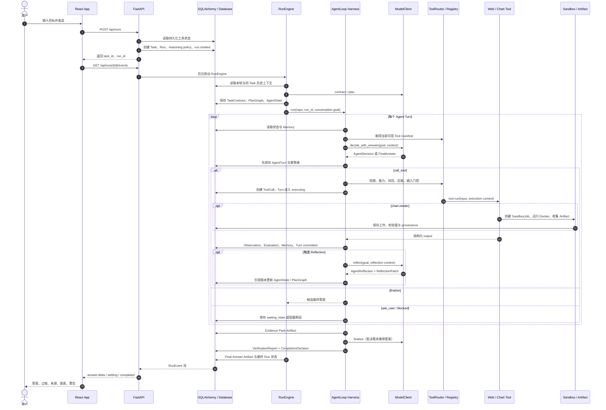

# 跟着上下文流读懂 Astra Agent：Agent Loop Harness 交互与执行全景

本文只沿一条真实执行时间线讲 Astra，不按“API、数据库、工具、模型”分别罗列。读者会跟随上下文，看它怎样从浏览器中的一句话开始，经过持久化、规划、Agent Loop Harness、工具与沙箱，再以流式答案和审计记录回到浏览器。

本文不把 Harness、Context、Memory 或 Verification 当作没有代码归属的抽象名词。概念第一次进入执行顺序时，会同时给出 `文件::类/函数`。其中“Agent Loop Harness”是对在线执行组合的统称，核心实现是 `backend/app/runner/agent_loop.py::AgentLoop.run()`；仓库中不存在名为 `Harness` 的 Python 类，也不存在单独的 Harness 服务。

为了让所有核心路径都在同一次交互中出现，假设用户提交：

> 搜索 Astra 最近的发布变化，阅读可靠来源，总结要点，并把版本趋势生成一张图。

这个目标同时需要 `web_search`、`web_fetch` 和 `chart.render`。如果某个工具被关闭、Docker 不可用、网页失败或证据不足，我们也会在它真正发生的位置走入对应分支。

---

## 一条请求的完整时序



这张图是全文的地图。下面不再切换观察角度，而是从第一个前置动作开始顺序走完它。

图中的参与者也都有确定代码入口：React App 是 `frontend/src/App.tsx::AppContent`，FastAPI 是 `backend/app/main.py::create_app()` 与 `backend/app/api/runs.py`，数据库访问统一经过 `backend/app/repositories/runs.py::RunRepository`，RunEngine 是 `backend/app/runner/engine.py::RunEngine`，AgentLoop Harness 是 `backend/app/runner/agent_loop.py::AgentLoop`，模型边界是 `backend/app/runner/model_client.py::ModelClient`，工具门控是 `backend/app/runner/agent_loop.py::ToolRouter` 与 `backend/app/tools/base.py::ToolRegistry`，Web/Chart 工具分别是 `backend/app/tools/web.py::WebSearchTool/WebFetchTool` 和 `backend/app/tools/chart.py::ChartRenderTool`，沙箱与工件分别由 `backend/app/sandbox/runtime.py` 和 `backend/app/artifacts.py` 实现。

---

## 第 0 步：请求到来前，系统先把“可执行世界”准备好

本步从 `backend/alembic/versions/*.py`、`backend/alembic/env.py`、`backend/app/db/session.py`、`backend/app/core/config.py::Settings` 和 `backend/app/main.py::create_app()` 开始；Agent Profile 的加载与提示组合分别对应 `backend/app/agent_profile/profile.py::AgentProfileLoader/load_agent_profile()` 和 `backend/app/agent_profile/prompts.py::PromptComposer`。

后端启动前，`alembic upgrade head` 先沿 `backend/alembic/versions/` 的版本链建立数据库。`0001` 创建 Task、Run、Step、ToolCall、Artifact 和 RunEvent；`0002` 加入 AgentTurn 与 Memory；`0003` 加入 TaskContract、PlanGraph、AgentState、版本与等待态；`0004` 加入 SandboxJob 和可验证工件字段；`0005` 加入模型调用与 Token 台账；`0006` 创建 `tool_settings`，把工具开关从进程内变量变成数据库事实。

`0007` 为 Run 增加不可变 `agent_profile_snapshot`。新 Run 从 Python package resources 读取 Git 管理的 `IDENTITY.md`、`SOUL.md`、`MEMORY.md` 和 `AUTODREAM.md`，在第一次模型调用前冻结规范化内容、组合规则和 SHA-256 版本。旧记录明确标记为 `legacy-unversioned`，不会伪造当时并不存在的 Profile 版本。普通 Run API 只序列化文档名、状态、大小和哈希，不返回完整 system prompt。

模型调用由统一 Prompt Composer 按 operation 选择 Profile：contract/plan 使用 Identity，controller/answer 使用 Identity 与 Soul，reflection 使用 Identity 与 Memory 治理，memory extraction 只使用 Memory 治理。AutoDream 当前为禁用协议，不进入同步问答，也不会产生后台任务。对话历史、数据库 Memory、工具观察和外部页面均放入明确分隔的低信任上下文；它们不能覆盖 Profile、结构化角色协议或 ToolRouter 权限。

Alembic 的 `backend/alembic/env.py::get_url()` 从 `Settings.database_url` 取得数据库地址，并使用 `backend/app/db/base.py::Base.metadata` 作为迁移 metadata；`env.py` 导入 `app.db.models` 以注册模型。运行期由 `backend/app/db/session.py` 创建异步 engine、`SessionLocal` 和请求级 `get_session()`。因此后面看到的每个 API 请求、后台 Run、SSE 读取和用量记录都能拥有独立的 `AsyncSession`，而不是共享一个易冲突的长事务。

本文后续反复出现的数据概念也在这里落到代码：Task、Run、Step、ToolCall、Artifact、RunEvent、AgentTurn、Memory 和 SandboxJob 分别对应 `backend/app/db/models.py` 中的 `TaskRecord`、`RunRecord`、`StepRecord`、`ToolCallRecord`、`ArtifactRecord`、`RunEventRecord`、`AgentTurnRecord`、`MemoryRecord` 和 `SandboxJobRecord`；API 侧的结构化对象集中定义在 `backend/app/schemas/agent.py`。

Uvicorn 随后导入 `app.main`，文件底部的 `app = create_app()` 触发装配。`Settings` 先从 `.env` 读取模型、网络、Agent 预算、沙箱、工件和工具默认值；`get_settings()` 用缓存维持进程内基准配置。这里的工具布尔值不再是日常运行的最终真相，它们只在 `tool_settings` 缺行时提供初始值。

`create_app()` 再创建 FastAPI，挂载 runs、tools、runtime、usage 四组 router，安装 CORS、请求耗时日志和统一异常处理，并创建 `RuntimeProfileService`。应用 lifespan 会把上次中断的模型调用标记为 `interrupted`，退出时停止仍在运行的 Runtime 构建任务。`app.core.errors` 把输入、资源、状态、依赖、基础设施和未知异常统一转换为带 `trace_id` 的安全错误信封；内部堆栈只进日志，不直接泄露给浏览器。

此时系统具备数据库、配置、路由、错误协议和运行时服务，但还没有为某个用户构造 Agent。

---

## 第 1 步：用户先决定 Agent 在下一次运行中能看见哪些工具

本步工具开关的前端入口是 `frontend/src/App.tsx::ToolSettings()` 与 `frontend/src/api.ts::getToolSettings()/updateToolSettings()`；后端入口是 `backend/app/api/tools.py::get_tool_settings()/update_tool_settings()`，持久化由 `backend/app/repositories/tool_settings.py::ToolSettingsRepository` 完成，可用性检查落在 `backend/app/tools/registry.py::sandbox_available()`。同一步中的运行时设置对应 `frontend/src/App.tsx::RuntimeSettings()`、`frontend/src/api.ts::getRuntimeProfile()/buildRuntime()/cancelRuntimeBuild()`、`backend/app/api/runtime.py` 和 `backend/app/runtime_profiles.py::RuntimeProfileService`。

用户打开“设置 → 工具”时，`ToolSettings` React 组件调用 `frontend/src/api.ts` 的 `getToolSettings()`，请求 `GET /api/tools`。

后端 `app.api.tools.get_tool_settings()` 使用 `ToolSettingsRepository.get_or_create()` 读取 `tool_settings`。第一次启动若缺少 `web_search`、`web_fetch` 或 `chart_render`，Repository 会用 `default_tool_states(settings)` 补行并提交；之后每次读取都以表内 `enabled` 为准。

这里同时计算“启用”和“可用”两个不同维度。开关表示用户意图；`chart_render` 的 availability 还要经过 `sandbox_enabled` 与 `sandbox_available()` 检测。于是界面可以准确表达“开关打开，但 Docker 当前不可用”，而不是把配置意图误报为执行能力。

用户切换开关时，前端先乐观更新，再通过 `PUT /api/tools` 发送三个工具的完整状态。`ToolSettingsRepository.set_all()` 更新 `enabled` 与 `updated_at`，事务成功后返回数据库状态；失败时前端恢复原值。状态不会因为后端重启而丢失。

这一段交互非常关键：它发生在创建 Run 之前。Agent 并不会在循环中反复查询开关，而是在新 Run 创建时取得一个工具配置快照，确保运行中途不会因为另一个页面切换开关而突然失去或获得能力。

如果用户准备生成图表，还可能在发送问题前进入“设置 → 运行时”。前端依次通过 `GET /api/runtime` 读取 profile、`POST /api/runtime/build` 发起构建、`POST /api/runtime/build/cancel` 取消构建。`RuntimeProfileService` 会校验依赖名和版本、拒绝修改基础镜像锁定包，把 build 状态原子写入 `runtime-profile.json`。自定义镜像只在 Docker build 阶段联网安装依赖，之后用 `--network none` 做导入 smoke test；构建成功才更新 active image 和 dependency digest。这个交互决定了稍后 `ChartRenderTool` 实际使用哪一个镜像。

---

## 第 2 步：React 把当前对话、模型和推理策略组装成创建请求

本步在线代码是 `frontend/src/App.tsx::AppContent.submit()`；HTTP 调用封装在 `frontend/src/api.ts::createRun()/getRun()/streamRunEvents()/resumeRun()`，Run 快照兼容处理在 `frontend/src/conversations.ts::normalizeRunView()`。

用户点击发送后，`AppContent.submit()` 首先处理浏览器内上下文。它读取输入框目标、当前 `task_id`、模型供应商配置、推理强度、规划策略、反思开关、反思触发方式和执行模式，再调用 `createRun()`。

若当前 Run 正处于 `waiting_user`，这次输入不会新建 Run，而会走 `resumeRun()`，把 continuation token 和用户回复送回原 Run。普通输入则发送：

```json
{
  "goal": "搜索 Astra 最近的发布变化，阅读可靠来源，总结要点，并把版本趋势生成一张图。",
  "task_id": null,
  "reasoning_policy": {
    "reasoning_effort": "balanced",
    "planning_strategy": "adaptive",
    "reflection_enabled": true,
    "reflection_trigger": "adaptive",
    "execution_mode": "request_approval",
    "verification_level": "standard"
  },
  "model": {
    "provider": "openai",
    "name": "gpt-5",
    "api_key": "仅随本次请求传输",
    "base_url": "https://api.openai.com/v1"
  }
}
```

浏览器此时还没有等待后台完成。收到 `run_id` 后，它立即构造一个乐观的用户消息，随后同时做两件事：请求一次 `GET /api/runs/{id}` 获得初始快照，并打开 `/api/runs/{id}/events` 的 SSE。若 SSE 暂时失效，3 秒轮询会继续恢复状态。这使“数据库快照”和“低延迟增量事件”成为互补通道。

---

## 第 3 步：创建 API 冻结本次 Run 的能力和策略

本步从 `backend/app/api/runs.py::create_run()` 进入，依次调用 `backend/app/repositories/tool_settings.py::apply_tool_states()`、`backend/app/runner/reasoning.py::PolicyCompiler.compile()`、`backend/app/agent_profile/profile.py::load_agent_profile()` 和 `backend/app/repositories/runs.py::RunRepository.create_task_run()`；后台调度由同文件 `_schedule_run()` 完成。

`app.api.runs.create_run()` 收到 `CreateRunRequest` 后先清理 goal。空目标在这里被拒绝，不会进入后台。

随后它按严格顺序冻结本次执行上下文：

先由 `ToolSettingsRepository.get_or_create()` 读取数据库工具状态，再由 `apply_tool_states()` 深拷贝全局 Settings，把 `tool_web_search_enabled`、`tool_web_fetch_enabled`、`tool_chart_render_enabled` 写入 `run_settings`。这个对象只传给本次后台任务。

然后，如果请求携带模型覆盖，API 只在这个 `run_settings` 副本上更新 provider、name、key 和 base URL。`model_policy` 写入数据库时只保留 provider、model 和 base URL，不持久化 API Key。

接着 `PolicyCompiler.compile()` 把用户请求的推理策略编译成 `ReasoningPolicySnapshot`。`fast`、`balanced`、`deep` 对应不同的 turn、tool call、reflection、replan 和模型调用预算。`backend/app/runner/reasoning.py::PolicyCompiler.compile()` 本身也实现了 `risk_level` 和 `complexity` 参数，可提升规划、批准和验证强度并生成 `PolicyAdjustment`；但当前 `backend/app/api/runs.py::create_run()` 只调用 `compile(payload.reasoning_policy)`，没有把任务风险或复杂度传入，因此在线创建路径现在只应用用户策略与默认预算，不能把风险自动提升描述成已生效行为。

最后 `RunRepository.create_task_run()` 创建或复用 `TaskRecord`，再创建新的 `RunRecord`。Task 代表连续对话，Run 代表这一次执行。goal 被写入 `model_policy.conversation_goal`，reasoning policy 被快照化，并追加第一条 `run.created` 事件。API 提交事务后，用 `_schedule_run()` 创建带强引用的后台 asyncio task，再立即返回 ID。

从这一刻起，浏览器已经能追踪 Run，而后台才刚进入真正执行。

---

## 第 4 步：RunEngine 把对话历史、契约和计划送到 Harness 门口

本步实际调用链是 `backend/app/runner/engine.py::start_run_in_process()` → `RunEngine.run()` → `RunEngine._run_with_repo()`。模型和工具装配分别来自 `backend/app/runner/model_client.py::build_model_client()` 与 `backend/app/tools/registry.py::build_tool_registry()`；模型用量记录器是 `backend/app/usage_metering.py::DatabaseUsageRecorder`。对话压缩、规划和状态初始化分别对应 `RunEngine._conversation_goal()`、`RunEngine._prepare_plan()` 与 `RunRepository.initialize_reasoning_state()`；`TaskContract`、`PlanOutput`、`PlanGraph`、`PlanGraphStep`、`ExpectedObservation` 和 `AgentState` 的结构都定义在 `backend/app/schemas/agent.py`，构建逻辑位于 `backend/app/runner/reasoning.py::normalize_contract()/validate_contract()/build_plan_graph()`。

`start_run_in_process()` 构造 `RunEngine`。构造时，`build_model_client()` 根据本次配置选择 `MockModelClient` 或 `OpenAICompatibleModelClient`；`build_tool_registry()` 根据刚才冻结的开关注册工具。

工具注册的顺序也会影响模型能看到的世界。`build_web_registry()` 只在对应开关开启时加入 `WebSearchTool` 和 `WebFetchTool`；`ChartRenderTool` 还要求 chart 开启、沙箱开启且 Docker 探测成功。最终 `ToolRegistry` 中不存在的工具，不会出现在模型上下文里，也无法被 `ToolRouter` 取到。

`RunEngine.run()` 为后台任务打开自己的数据库 session，并给真实模型客户端安装 `DatabaseUsageRecorder`。从此 contract、plan、decision、reflection、memory 和 synthesis 的每次模型调用都会在 `model_invocations` 留下 provider、model、operation、attempt、状态、耗时、request ID 和供应商报告的 Token。

Engine 随后读取同一 Task 最近六个旧 Run，把历史 `conversation_goal` 和 summary 交错拼成：

```text
Conversation context:
User: ...
Assistant: ...
Current user request: ...
```

这就是 Harness 收到的 goal。它不是无限聊天记录，而是受控的短期对话上下文。

若 Run 已经有 `state_version` 和 `agent_state`，说明这是等待用户后恢复的执行。Engine 不重复生成契约和计划，直接把状态改回 executing 并重新进入 AgentLoop。新 Run 则先进入 planning。需要注意一个当前边界：`resume_run()` 重新调度时传入的是进程基准 Settings，没有像 `create_run()` 一样再次合并数据库工具状态；因此数据库工具开关已正确作用于所有新 Run，但跨进程恢复时的工具快照持久化仍有继续完善空间。

对于 `direct` 策略，Engine 使用默认契约和单步计划；`adaptive` 会请求 contract，但先使用一个自适应步骤；`plan_first` 会并行请求 contract 和 plan。模型输出无效时会回退到最低可用契约或计划，而非直接丢失整次任务。

`TaskContract` 把自然语言目标转成可判定边界：交付物、约束、禁止行为、假设、成功准则、验证要求、风险和歧义状态。`normalize_contract()` 只补缺，不削弱约束；`validate_contract()` 要求准则 ID 唯一且可验证。

`build_plan_graph()` 再把 `PlanOutput` 编译为有版本的 `PlanGraph`。每个 `PlanGraphStep` 带依赖、能力、成功准则引用和 `ExpectedObservation`。`AgentState` 将 TaskContract、PlanGraph、已接受事实、观察、评估、失败指纹、预算用量和 terminal intent 放在一个版本化对象中。`RunRepository.initialize_reasoning_state()` 用 `state_version` 将它整体落库。

若契约认为问题仍有歧义，Engine 立即写入 `waiting_state`，保存 paused node、state version、plan version 和澄清问题。若执行模式是 `plan_only`，Engine 保存计划后直接完成，不调用工具。只有契约清晰且允许执行时，Run 才进入 executing，Agent Loop Harness 正式接管。

---

## 第 5 步：Harness 初始化本轮的控制面与数据面

本步没有独立的 Harness 类：在线核心是 `backend/app/runner/agent_loop.py::AgentLoop.__init__()/run()`。它直接组合同文件的 `ToolRouter`、`ContextAssembler`、`MemoryManager`、`VerificationEngine`，以及 `backend/app/runner/adapters.py::ProcessorRegistry/WebTaskAdapter/ChartTaskAdapter`、`backend/app/runner/reasoning.py::ObservationEvaluator/ReflectionGate/CompletionGate`。

当前代码中的 Harness 核心是 `app.runner.agent_loop.AgentLoop`，它由多个确定性组件围住模型，而不是让模型直接控制系统。

构造 `AgentLoop` 时，`ToolRouter` 接收已经裁剪过的 ToolRegistry；`WebTaskAdapter` 与 `ChartTaskAdapter` 被放入 `ProcessorRegistry`；`ObservationEvaluator`、`ReflectionGate` 和 `CompletionGate` 分别负责观察判断、反思触发和完成判定。

进入 `AgentLoop.run()` 后，Harness 为本次运行创建 `ContextAssembler`、`MemoryManager`、`VerificationEngine`、`ArtifactService`、Sandbox provider、`SandboxSupervisor` 和 `SandboxJobService`。这些对象不是独立阶段，而会在每一轮的具体位置被调用。

Harness 从数据库中的 `ReasoningPolicySnapshot.effective` 读取预算，再和全局安全上限取较小值。于是用户选择 deep 并不意味着无限执行：`max_turns`、`max_tool_calls`、`max_reflections` 和 `max_replans` 都有双重上限。恢复运行时，之前写入 AgentState 的 observations 会成为新循环的起点。

`app.runner.runtime` 还定义了 Harness 的完整状态机契约：`TRANSITIONS` 描述 init 到 completed 的合法节点迁移，`PATCH_AUTHORITIES` 限制每个节点能修改哪些状态，`ERROR_EXITS` 限制错误可去往哪里；`LoopOrchestrator` 可验证 `NodeResult` 并决定 prepared/executing 阶段的恢复动作，`ObservationNormalizer` 统一外部结果，`NoProgressDetector` 识别连续无进展。

需要准确区分现状：这些 runtime 组件已经定义并有测试价值，但当前 `AgentLoop.run()` 仍以显式 Python 控制流执行主循环，没有实例化 `LoopOrchestrator`、`ObservationNormalizer` 或 `NoProgressDetector`。真正在线生效的是 AgentLoop 内部的预算、ToolRouter、ObservationEvaluator、ReflectionGate、版本更新与 CompletionGate。文档把两者放在同一 Harness 设计中，但不把“已定义的状态机契约”误写成“已经驱动主循环的引擎”。

---

## 第 6 步：每一轮先重建 Context，而不是只把上一句话交给模型

这里的 Context 不是全局对象，而是 `backend/app/runner/agent_loop.py::ContextAssembler.assemble()` 每轮返回的 `dict`。Run、Memory 和状态来自 `backend/app/repositories/runs.py::RunRepository`，可用工具描述来自 `ToolRouter.eligible_specs()` 和 `backend/app/tools/base.py::ToolSpec.model_dump()`。

每个 turn 开始，`ContextAssembler.assemble()` 都重新从数据库和运行内存构建模型上下文。

它读取当前 Run、最近八条 Memory 和本次 `AgentLoop.run()` 内累积的 observations；再让 `ToolRouter.eligible_specs()` 对 ToolRegistry 中每个 ToolSpec 做 availability 探测。`ContextAssembler.assemble()` 虽然接受可选 `evidence_pack` 参数，但当前 turn 循环的调用没有传入它，所以逐轮 Context 中该字段实际为 `{}`；完整 Evidence Pack 要到退出循环后才由 `WebTaskAdapter.build_evidence()` 生成。只有同时满足能力、权限、风险和执行后端要求的 manifest 才进入 `tool_manifests`，不可用项进入 `unavailable_capabilities`。

最终上下文形状接近：

```json
{
  "run_id": "...",
  "goal": "含有限历史的当前目标",
  "tool_manifests": {
    "web_search": { "input_schema": {}, "capabilities": ["network_read"] },
    "web_fetch": { "input_schema": {}, "capabilities": ["network_read"] },
    "chart.render": { "execution_backend": "sandbox.remote" }
  },
  "unavailable_capabilities": {},
  "observations": [],
  "evidence_pack": {},
  "memory_reads": [],
  "reasoning_policy": {},
  "task_contract": {},
  "plan_graph": {},
  "agent_state": {}
}
```

这一步解释了“上下文交互”的本质：模型不会自行查询数据库，也不会凭记忆知道工具；Harness 每轮把允许模型知道的状态重新投影成一个结构化快照。工具关闭后不在 manifest 中，模型即使猜出名字也无法通过后续 Router。

---

## 第 7 步：模型只返回可审计决策，Harness 决定是否执行

本步模型接口是 `backend/app/runner/model_client.py::ModelClient.decide_with_answer()`，生产实现是 `OpenAICompatibleModelClient.decide_with_answer()`，JSON 请求、重试和 summary 增量解析位于同类 `_chat_json()`；返回结构 `AgentDecision`、`FinalAnswer` 和 `AgentObservation` 定义在 `backend/app/schemas/agent.py`。

Harness 调用 `ModelClient.decide_with_answer(goal, context)`。真实实现向 OpenAI-compatible `/chat/completions` 发送 JSON-only 提示，允许的 decision type 只有 `call_tool`、`reflect`、`replan`、`finalize`、`ask_user` 和 `blocked`。提示明确要求只从 `context.tool_manifests` 选择工具，并禁止输出隐藏思维链；`reasoning_summary` 只保留简短、可审计理由。

当问题属于稳定知识、写作或普通对话时，模型可以在一次响应中返回 `finalize + final_answer`。`_chat_json()` 会从流式 JSON 中增量提取 `summary` 字段，经回调发送到 Engine。若需要外部事实，本例第一轮更可能返回：

```json
{
  "decision_type": "call_tool",
  "reasoning_summary": "先搜索最新发布来源，再决定抓取范围。",
  "tool_name": "web_search",
  "tool_input": { "query": "Astra latest release changes" },
  "expected": {
    "kind": "tool_result",
    "success_condition": "返回可访问的候选来源",
    "required_fields": ["candidates"]
  },
  "success_criteria_refs": ["criterion-result"]
}
```

若流式内容不是合法 JSON，客户端会追加纠错提示重试一次；仍失败则抛 `ModelOutputError`。Harness 把它规范化为 `model_error` Observation，并按策略决定是否反思，而不是把半截模型文本当成系统命令。

模型每次调用的 usage 由 `DatabaseUsageRecorder` 使用独立 session 写入。用量记录失败只记日志，不会反向打断 Agent 主任务。

---

## 第 8 步：Harness 先写 Turn，再触碰任何外部工具

本步顺序直接写在 `backend/app/runner/agent_loop.py::AgentLoop.run()` 中；持久化调用是 `backend/app/repositories/runs.py::RunRepository.create_agent_turn()/update_agent_turn()/add_event()`，记录模型是 `backend/app/db/models.py::AgentTurnRecord`。

收到有效 `AgentDecision` 后，Harness 不立即执行。它先为 `call_tool` 计算 SHA-256 idempotency key，输入包含 run ID、turn index、工具名和规范化输入；然后创建 `AgentTurnRecord`，记录 decision、memory reads、state version before、plan version，并把 phase 标为 `prepared`。

紧接着写入 `reasoning.decision_validated` 事件并提交。这个顺序意味着：即使进程在工具执行前崩溃，数据库仍知道当时准备做什么。`AgentTurnRecord.phase` 的 prepared、executing、committed、failed 与 idempotency key，为未来接入 `LoopOrchestrator.recovery_action()` 提供了恢复语义。

如果 decision 是 `finalize`，Harness 保存最终 turn ID 和候选答案并退出 turn 循环。如果是 `ask_user`，它写入 AgentObservation 和 waiting state；如果是 `blocked`，它保留阻塞原因；如果是 `reflect` 或 `replan`，则先处理对应预算和反思逻辑。只有 `call_tool` 会进入下一步行动门。

---

## 第 9 步：ToolRouter 是模型与执行环境之间不可绕过的门

本步门控实现是 `backend/app/runner/agent_loop.py::ToolRouter.resolve()`；工具契约与注册表分别是 `backend/app/tools/base.py::ToolSpec` 和 `ToolRegistry`，Step、ToolCall 的写入对应 `RunRepository.create_step()/update_step()/start_tool_call()`。

行动开始前，Harness 先检查本次 Run 的工具总预算，再为“工具名 + 输入”计算 action signature。如果完全相同的失败策略已经达到 `agent_per_tool_retry_limit`，它会在执行前拒绝。

随后 `ToolRouter.resolve()` 按顺序验证：工具名存在、工具已经注册、必填输入齐全、ToolSpec capabilities 在允许集合中、permissions 在允许集合中、risk 可接受、execution backend 当前可用。这里使用的是 `ToolSpec` 的机器可读 manifest，而不是模型给出的自我声明。

`ToolSpec` 同时携带 name、version、description、输入输出 schema、permission、side effect、timeout、retry policy、error categories、idempotent、capabilities、risk、backend、resource profile 和 artifact behavior。`ToolRegistry.get()` 对未注册工具抛稳定的 `tool_not_allowed`，因此关闭数据库开关后，即使模型伪造 `chart.render` 决策也无法执行。

通过门控后，Harness 找到或补建对应 Step，将 Step 改成 running，创建 `ToolCallRecord(status=running)`，增加工具调用计数，并把 AgentTurn 改为 executing。直到此刻，外部动作才获得授权。

---

## 第 10 步：Web Search 把“需要资料”变成候选来源 Observation

本步从 `backend/app/tools/web.py::WebSearchTool.run()` 执行搜索，随后进入 `backend/app/runner/agent_loop.py::AgentLoop._normalize_tool_output()`、`backend/app/runner/adapters.py::ProcessorRegistry.for_tool()` 和 `WebTaskAdapter.process()`；URL 规范化由 `WebTaskAdapter.canonical_url()` 完成，观察评估由 `backend/app/runner/reasoning.py::ObservationEvaluator.evaluate()` 完成。

第一轮工具通常是 `WebSearchTool.run()`。它先验证 query，再依据 `web_search_provider` 选择 provider。当前实现支持 Bing RSS、DuckDuckGo HTML、Google Programmable Search JSON API 和 Brave API；默认 Bing 不要求密钥，Google 与 Brave 会检查凭据。

无论 provider 返回什么，工具都标准化为 query、provider、非敏感 parameters、candidate count、warnings 和 candidates。每个 candidate 带 URL、标题、摘要、rank、display link、provider metadata 和 retrieved time。密钥不会进入输出或 ToolCall。

工具成功后，Harness 先 `finish_tool_call(output=...)`，再交给 `ProcessorRegistry.for_tool()`。`WebTaskAdapter.process()` 对候选 URL 做协议与内容类型过滤，用 `canonical_url()` 去掉 UTM、fragment 和重复项，并生成 dedupe 审计数据。返回值被转成统一 `AgentObservation(kind=tool_result)`，Step evidence 记录候选数、去重数和 warnings。

`ObservationEvaluator.evaluate()` 再将实际 Observation 与 decision.expected 比较。必填字段齐全时得到 matched，并把引用的 success criterion 更新建议写入 Evaluation；失败、缺字段或无法判断分别得到 mismatch、partial 或 inconclusive。Harness 写入 `reasoning.evaluation_created`，随后把 Observation 加入内存列表。下一轮 ContextAssembler 会把它原样交回模型。

这就完成了第一次上下文闭环：

```text
Context₀ → AgentDecision(web_search) → ToolCall → candidates
          → AgentObservation₁ → Evaluation₁ → Context₁
```

---

## 第 11 步：Memory 在 Observation 之后产生，并在下一轮成为可引用上下文

这里的 Memory 写入是 `backend/app/runner/agent_loop.py::MemoryManager.write_candidates()`，候选生成是 `ModelClient.extract_memory_candidates()`，落库和读取分别是 `RunRepository.create_memory()` 与 `RunRepository.list_memories()`；数据结构 `MemoryRecord` 位于 `backend/app/schemas/agent.py`，数据库记录 `MemoryRecord` 位于 `backend/app/db/models.py`。

每次成功工具调用后，`MemoryManager.write_candidates()` 把 last observation 交给 `ModelClient.extract_memory_candidates()`；当前这条逐工具调用路径显式传入的 `evidence_pack` 是空对象。退出循环后的第二次 `MemoryManager.write_candidates()` 才收到包含 observations、tool outputs 和完整 Evidence Pack 的 `final_context`。只有开启 `agent_memory_write_enabled` 才会执行。

候选 Memory 必须带 scope、kind、content、structured data、provenance 和 confidence。`RunRepository.create_memory()` 负责持久化；写入结果被记录到当前 AgentTurn 的 `memory_writes`。模型输出不合法时，Harness 写 `memory.extraction_skipped` 事件，但不让记忆失败破坏主任务。

下一轮 `ContextAssembler` 会从数据库读取最近 Memory，放进 `memory_reads`。因此 Memory 的方向始终是：已发生且有来源的 Observation 产生 Memory，未来 Context 再读取它；模型不能先写一条无 provenance 的“记忆”再反过来当证据。

---

## 第 12 步：Reflection 检查结果是否值得改变下一步，而不是机械重试

本步触发判断是 `backend/app/runner/reasoning.py::ReflectionGate.should_reflect()`，模型调用是 `ModelClient.reflect()`，结构是 `backend/app/schemas/agent.py::AgentReflection/ReflectionPatch`，确定性应用和乐观更新分别是 `backend/app/runner/reasoning.py::apply_reflection_patch()` 与 `RunRepository.update_reasoning_state()`。

成功 turn 完成后，Harness 以 `turn_completed` 信号询问 `ReflectionGate`；工具失败、模型输出失败、模型主动要求反思或 Completion Gate 失败时，在线代码分别使用 `tool_failed`、`model_output_failed`、`model_requested` 和 `completion_gate_failed`。`ReflectionGate.ADAPTIVE_SIGNALS` 还声明了证据冲突、低置信度、无进展和依赖破坏等信号，但当前 `AgentLoop.run()` 没有发出这些信号，因此它们是已定义接口，不是当前执行分支。

`ReflectionGate.should_reflect()` 同时检查策略开关、触发模式和预算。`failure_only` 只处理失败，`adaptive` 只处理预定义信号，`every_turn` 每轮都允许。若不触发，Harness 仍写 `reflection.skipped`，使“不反思”也可审计。

触发时，`ModelClient.reflect()` 返回 `AgentReflection`：trigger、summary、next action、是否重试、修订输入，以及可选 `ReflectionPatch`。Patch 可以失效假设、补事实、更新准则、替换更高版本计划、追加验证要求或设置 terminal intent。

`apply_reflection_patch()` 不是任意 dict merge。它先要求 `AgentState.version == expected_version`，再检查 patch 确实 actionable；替换计划的版本必须上升。Repository 的 `update_reasoning_state()` 再执行一次乐观版本检查，更新 AgentState、PlanGraph 和 state version。冲突或非法 patch 会产生 `reflection.patch_rejected`，Harness 只推进版本，不接受越界修改。

于是第二个闭环变成：

```text
Observation₁ → ReflectionGate → AgentReflection₁
             → validated ReflectionPatch → AgentState v2
             → Context₂
```

反思的作用不是展示一段“模型内心活动”，而是生成受 schema、权限与版本约束的状态变更建议。

---

## 第 13 步：Web Fetch 把候选 URL 变成可审计正文证据

本步入口是 `backend/app/tools/web.py::WebFetchTool.run()`；公网 URL 边界、抓取计划、策略选择和输出构造分别对应同文件 `validate_public_http_url()`、`validate_crawler_plan()`、`choose_strategy()` 和 `build_fetch_output()`，结果进入 `backend/app/runner/adapters.py::WebTaskAdapter.process()/record_failure()`。

下一轮模型从 Context 中看到去重后的 candidates，选择一个 URL 调用 `web_fetch`。

`WebFetchTool` 首先通过 `validate_public_http_url()` 拒绝非 HTTP(S)、带凭据 URL、localhost、`.local`、私网和保留地址；每次重定向后都会再次验证目标，最多五跳。这防止一个看似公网的 URL 把抓取器引向内部网络。

请求成功后，工具解析 title、meta description、OpenGraph、Twitter Card、schema.org 和发布时间，再按受控 `CrawlerPlan` 选择 readability、metadata first、selector extract、plain text 或 fallback snippet。模型只能从受控策略和 selector schema 中选择，不能注入 Python 或 JavaScript。

输出包含 URL、状态码、content type、title、description、主要 content、extraction strategy、quality score、content length、source type、warnings 和 retrieved time。`WebTaskAdapter` 把成功来源放入 `fetched_sources`；失败时 `record_failure()` 把 URL 与稳定错误类别放入 `failed_sources`。

每抓取一个来源，Observation、Evaluation、Memory、Reflection 和下一轮 Context 都重复同一顺序。模型由此决定继续抓取、改写查询、带警告结束，还是因为证据不足进入 blocked。

---

## 第 14 步：Chart Render 走相同 Harness 门，但在工具内部进入隔离沙箱

本步入口是 `backend/app/tools/chart.py::ChartRenderTool.run()`，声明式输入结构的真实类名是同文件 `ChartRequest`，镜像读取是 `backend/app/runtime_profiles.py::RuntimeProfileService.read()`；执行链继续进入 `backend/app/sandbox/runtime.py::SandboxJobService.execute()`、`SandboxSupervisor.run()` 和 `backend/app/sandbox/docker_provider.py::DockerSandboxProvider`。文件检查、存储和持久化分别对应 `backend/app/artifacts.py::ArtifactCollector`、`LocalArtifactStore` 和 `ArtifactService.persist_output()`，对外引用结构是 `backend/app/tools/base.py::ArtifactRef`。

当 Web Observation 已包含可绘制数据，模型可以选择 `chart.render`。它没有特殊绕过 Harness：仍然先有 AgentDecision、AgentTurn prepared、ToolRouter、Step running 和 ToolCall running。

区别从 `ChartRenderTool.run()` 内部开始。工具使用 Pydantic 的 `ChartRequest` 校验 chart 类型、数据、标题、输出格式和尺寸，再读取 `RuntimeProfileService.read()` 返回的 current active image。它在临时 input/output 目录准备请求，通过 `backend/app/tools/base.py::ToolExecutionContext.sandbox_service` 进入 `SandboxJobService.execute()`。

`SandboxJobService` 先创建 `SandboxJobRecord(queued)`，再按 preparing、running、collecting、succeeded 推进。`SandboxSupervisor` 调用 `DockerSandboxProvider`：容器使用 `--network none`、只读根目录、非 root 用户、drop all capabilities、no-new-privileges、PID/内存/CPU 限制和独立 tmpfs。输入被上传到 `/input`，结果只能从 `/output` 下载；无论成功失败，finally 都强制删除容器。

输出文件不会直接成为可信 Artifact。`ArtifactCollector` 先限制文件数量和总字节数，验证路径没有逃逸、扩展名与 magic/content 一致；JSON 必须可解析，SVG 不允许脚本与外链，HTML 必须在脚本前具有限制性 CSP。`LocalArtifactStore` 用随机 storage key 保存文件，`ArtifactService.persist_output()` 再创建带 checksum、size、MIME、security status 和 provenance 的 `ArtifactRecord`。

完成后，SandboxJob 记录 runtime name、image digest、截断脱敏日志、资源 metrics 和 output artifact IDs。`ChartTaskAdapter.process()` 只有在每个 Artifact 都具备 MIME、checksum 和正 size 时才接受结果。最终图表通过 `/api/artifacts/{id}/content` 返回；API 还会检查 security status、文件存在性和 workspace scope。

因此图表路径仍然是 Context 闭环的一部分，只是 Tool 内部多了一层：

```text
Decision(chart.render)
  → ToolRouter
  → ToolCall
  → SandboxJob
  → Docker execution
  → Artifact validation/persistence
  → Observation(chart artifacts)
  → Evaluation
  → Context(next turn)
```

---

## 第 15 步：失败不会跳出 Harness，而会变成下一轮可理解的上下文

工具错误结构是 `backend/app/tools/base.py::ToolExecutionError`，失败指纹来自 `backend/app/runner/reasoning.py::failure_fingerprint()`；失败分支位于 `AgentLoop.run()` 的 `except ToolExecutionError`，顶层异常则由 `backend/app/runner/engine.py::RunEngine.run()` 调用 `backend/app/core/errors.py::run_error_from_exception()` 收口。

任何 ToolExecutionError 都有稳定 category，例如 invalid input、permission denied、search failed、fetch failed、sandbox unavailable、timeout、OOM、policy violation 或 invalid artifact。

Harness 先结束已创建的 ToolCall，再为工具名、输入、错误类别和意图生成 `failure_fingerprint`。相同 action signature 的失败次数和每个工具的 retry count 分别更新，Observation 变成 `kind=tool_error`。对应 Processor 记录领域失败，ReflectionGate 收到 `tool_failed`，AgentTurn 进入 failed，并保存 observation、reflection、reflection patch 与 failure event。

如果重试预算尚未耗尽，下一轮 Context 会同时包含失败 Observation 和 Reflection，模型可以改查询、换 URL、停止使用图表或带限制完成。达到上限后，Harness 设置 terminal override 为 blocked，防止模型无限重复相同策略。

模型错误也采用同样原则：非 JSON decision 先成为 `model_error` Observation，再尝试 Reflection。数据库错误、模型配置错误和未分类异常最终由 RunEngine 捕获，通过 `run_error_from_exception()` 转成安全结果并把 Run 置为 blocked 或 failed。

---

## 第 16 步：退出 turn 循环后，Harness 才组装证据和判断“是否真的完成”

本步仍在 `backend/app/runner/agent_loop.py::AgentLoop.run()` 尾部，依次调用 `WebTaskAdapter.build_evidence()`、`RunRepository.create_artifact()`、`ModelClient.finalize()`、`normalize_final_answer_artifact_references()`、`VerificationEngine.verify()` 和 `backend/app/runner/reasoning.py::CompletionGate.evaluate()`。Evidence Pack 在当前实现中不是 Pydantic 类，而是 `WebTaskAdapter.build_evidence()` 返回的 `dict`；`Finding`、`FinalAnswer`、`VerificationReport` 和 `CompletionDecision` 才是 `backend/app/schemas/agent.py` 中的结构化模型。

模型返回 finalize、请求用户、明确 blocked、预算耗尽或 turn 用完后，Harness 离开循环。此时 `WebTaskAdapter.build_evidence()` 才把 query、候选、成功抓取、失败来源、dedupe、warnings 和 external evidence attempted 组装成 Evidence Pack。

Harness 立即把它创建为 `evidence_pack` Artifact，并在 metadata 写入已审计来源数与失败数。随后构造 final context，其中只包含本次 observations、tool outputs 和刚持久化的 evidence pack。

若存在 terminal override，Harness 生成状态型答案，明确“停止不等于成功”。如果 `decide_with_answer()` 已经流式返回完整 `FinalAnswer`，直接使用；否则调用 `ModelClient.finalize()`。`FinalAnswer` 的结构包含 summary、findings、sources、failed sources、source quality、conflicts、caveats、verification notes、memory references 和 audit refs；每个 finding 还可以用 `artifact_ids` 按顺序引用支撑该结论的工具输出。

模型答案此时还不能直接持久化。Harness 紧接着重新查询当前 Run 的 Artifact，只把 `security_status=verified` 且具有 `storage_key` 的 ID 放入允许集合，然后按 finding 顺序执行引用规范化：同一 finding 内保留第一次引用，未知 ID、其他 Run 的 ID、pending/expired 输出和没有可访问内容的输出全部移除。拒绝项只累加数量并写入安全 warning，不回显 ID、storage key 或路径。规范化完成后，后续 Verification、result 和 Engine 创建的 `final_answer` Artifact 都使用同一个 `FinalAnswer` 对象。

`VerificationEngine.verify()` 检查是否尝试外部 Web 证据、成功来源数、低质量来源、失败来源和 `FinalAnswer.sources`，生成 `VerificationReport`；Artifact ID 的完整性不是它检查，而是前一步 `normalize_final_answer_artifact_references()` 独立完成。随后领域 Adapter 再做一次语义验证：普通稳定问答可以无外部证据完成；Web 任务若已尝试外部证据却没有已审计抓取与来源引用，会 blocked；纯图表任务没有有效 Artifact 也会 blocked。当前混合任务采用 `chart attempted and web not attempted` 才选择 ChartTaskAdapter，否则选择 WebTaskAdapter；所以本文这种 Web+Chart 请求的图表完整性在 `ChartTaskAdapter.process()` 阶段已经检查，最终 Completion Gate 的领域决定仍以 Web 证据验证为主。

若数据库中存在 AgentState，Harness 把 Observation 与最终预算写回新版本，并把通过的强制准则标为 satisfied。`CompletionGate.evaluate()` 才拥有最终决定权：

```text
TaskContract success criteria
        +
Adapter validator decision
        +
Verification warnings
        +
waiting / runtime state
        ↓
completed | completed_with_warnings | waiting_user | blocked | failed
```

如果 Completion Gate 仍 blocked 且不是明确 terminal override，Harness 还允许一次 `completion_gate_failed` Reflection，但不会绕过 Gate 宣布成功。

最后，Harness 把 VerificationReport、audit refs 和 CompletionDecision 合并进 result；VerificationReport 包含无效 Artifact 引用计数，audit refs 记录实际保留的 Artifact IDs。随后它写入 `reasoning.completion_decided` 与 `verification.created`。最终 turn 会关联 Evidence Pack Artifact 和最后的 Memory writes，然后返回给 RunEngine。

---

## 第 17 步：RunEngine 把 Harness 结果变成用户可见的最终 Run

本步实现已经从主循环拆到 `backend/app/runner/engine.py::RunEngine._finalize_agent_loop()`；它通过 `RunRepository.create_artifact()/update_step()/update_run_status()` 保存 final_answer、步骤证据、summary、完整 result 和终态。

Harness 返回后，Engine 依次把 Run 更新为 synthesizing 和 verifying，在计划中寻找对应 Step 并补充 evidence。它创建 `final_answer` Artifact，完成尚未关闭的 Step，最后把 Run 更新为 Completion Gate 决定的状态，并保存 summary 与完整 result。

这一层看似重复，实际承担“循环结果 → Run 生命周期”的适配：Harness 决定任务是否满足契约，Engine 负责把答案、计划步骤、工件和顶层 Run 状态整理成 API 可读取的一致快照。

---

## 第 18 步：答案不是一次性返回，而是沿 Event Log 流回前端

后端流式链是 `RunEngine._start_answer_stream()` → `_handle_answer_delta()` → `_complete_answer_stream()` → `backend/app/api/runs.py::stream_run_events()`；前端接收位于 `frontend/src/App.tsx::AppContent` 内监听 Run 的 `useEffect`，消息构造位于 `frontend/src/conversations.ts::buildPresentation()`，展示组件是 `frontend/src/App.tsx::ProcessPanel/FinalAnswer/ArtifactGallery/ArtifactCard`。Artifact 的就近布局由同文件 `visibleArtifacts()/planArtifactPlacements()/OtherArtifacts()` 实现，稳定锚点由 `artifactDomId()` 生成，API 类型位于 `frontend/src/types.ts::RunView/FinalResult/ArtifactView`。

进入 AgentLoop 前，Engine 写 `answer.started`。真实模型在流式 JSON 中生成 `summary` 时，`_chat_json()` 用增量 JSON 字符串提取器只取 summary 新增部分，回调给 Engine。

Engine 用短缓冲降低数据库事件频率：首段、超过 20ms 或累计 96 字符时写 `answer.delta`。summary 字段闭合后，`OpenAICompatibleModelClient._chat_json()` 通过控制值 `"\1"` 触发 `RunEngine._handle_answer_delta()` 写 `answer.settling`，告诉前端“文本已出，正在结构化和验证”。`AgentLoop.run()` 返回后，`RunEngine._complete_answer_stream()` 先写 `answer.completed`，随后 `_finalize_agent_loop()` 才持久化 final_answer Artifact 和终态 Run；所以 `answer.completed` 表示模型文本流结束，不等同于终态快照已经落库。

`stream_run_events()` 以 RunEvent 的递增 ID 读取数据库并输出 SSE。前端收到 answer.started 时清空旧缓冲；answer.delta 通过 `requestAnimationFrame` 合并渲染；answer.settling 显示整理状态；answer.completed 后立即尝试刷新 Run。若此时 `_finalize_agent_loop()` 尚未提交 result，`frontend/src/App.tsx` 不会删除流式文字，而是继续靠后续事件刷新和轮询，直到取得“终态状态且 result 非空”的 RunView 才切换。其他步骤、工具、反思和验证事件也会触发快照刷新，SSE 中断时 3 秒轮询继续兜底。

最终 `frontend/src/conversations.ts::buildPresentation()` 把原始 Run 转成用户能理解的三类内容：用户消息、可折叠的 ProcessPanel 和最终答案。终态快照到达前，`frontend/src/App.tsx::AppContent` 的 `streamingAnswer` 状态只保留流式 summary；快照到达后一次性移除临时气泡并进入结构化渲染。

结构化渲染先建立“已验证且有 content URL”的 Artifact map，再从第一个 finding 开始依次消费 `artifact_ids`。某个输出第一次出现时，局部 ArtifactGallery 紧跟在该 finding 后；以后再次引用只显示定位链接，不重复图片或 iframe。所有 finding 处理完后，未被消费的旧数据或未关联输出按 `created_at`、`id` 排序进入“其他输出”：不超过两个直接展开，更多时折叠。图片保留 alt，HTML 继续使用 sandbox iframe，其他文件只通过受控内容 URL 打开。

与此同时，ProcessPanel 按 `tool_call_id` 找到每次调用产生的可见 Artifact。只有实际存在输出的步骤才显示数量和“查看输出”，目标是基于 Artifact ID 的 DOM 锚点；无输出或失败调用没有空入口，也不会把 storage key、Sandbox 路径带到界面。

浏览器持久化由 `frontend/src/App.tsx::writeLocalJson()/writeLocalString()` 完成。当前 localStorage 保存的是对话缓存 `ConversationEntry[]`（包含 Run 快照与 prior messages）、完整模型供应商配置和选中模型，不只是一个对话索引；`ModelProviderConfig` 当前也包含 API Key，所以它会随供应商配置写入浏览器 localStorage。后端 `RunRecord.model_policy` 不保存 API Key，但不能据此宣称浏览器没有持久化凭据。真正用于跨设备和服务端审计的 Run、事件、工具调用、Memory、用量和工具开关仍以后端数据库为准，前端启动时还会通过 `frontend/src/api.ts::listRuns()` 用服务端记录合并本地缓存。

---

## 第 19 步：用户查看用量或继续追问时，上一次运行成为下一次上下文

用量链是 `frontend/src/UsageDashboard.tsx::UsageDashboard` → `frontend/src/api.ts::getUsageSummary()` → `backend/app/api/usage.py::get_usage_summary()` → `backend/app/repositories/usage.py::UsageRepository.summary()`；追问和恢复分别回到 `createRun(...taskId...)` 与 `resumeRun()`，后端由 `RunEngine._conversation_goal()` 和 `RunRepository.resume_waiting_run()` 接续上下文。

用户打开用量面板时，`UsageDashboard` 请求 `/api/usage/summary`。`UsageRepository` 先确定 all、task 或 run 范围内的 Run IDs，再聚合 ModelInvocation、AgentTurn、ToolCall、Memory、SandboxJob 和 Artifact。Token 未由供应商报告时保持未知，不伪装成零；coverage 明确显示精确用量覆盖率。

用户继续追问时，前端沿用 `task_id` 创建新 Run。新 Run 会重新读取数据库工具开关，但 RunEngine 会把同 Task 最近六轮的 goal 与 summary 作为 conversation context。于是“工具能力”按新 Run 快照更新，“对话语义”沿 Task 延续，两者不会混为一个可变全局状态。

如果上一次停在 waiting_user，前端则使用原 Run 的 continuation token 调用 resume。Repository 把用户回复放入 AgentState observations、推进 state version、清除 waiting state，Engine 从持久化状态直接重新进入 Harness。这正是上下文交互的闭环终点：上一轮的终态，要么成为新 Run 的短期历史，要么成为同一 Run 的恢复起点。恢复时 AgentState 是持久化的，但如第 4 步所述，工具开关快照目前没有单独写入 Run，恢复调度仍使用进程基准 Settings。

---

## 用一句话理解 Agent Loop Harness

在代码层面，这句话里的 Harness 特指 `RunEngine._execute_agent_loop()` 创建并调用的 `AgentLoop` 组合；“持续重建 Context”对应 `ContextAssembler.assemble()`，“确定性 Router”对应 `ToolRouter.resolve()`，“Observation 与 Evaluation”对应 `AgentObservation` 和 `ObservationEvaluator.evaluate()`，“版本化 Patch”对应 `apply_reflection_patch()` 与 `RunRepository.update_reasoning_state()`，“最终门禁”对应 `CompletionGate.evaluate()`。

Astra 的 Agent Loop Harness 不是“模型循环调用工具”，而是一个持续重建受控 Context 的执行系统：每轮把数据库状态、Memory、Observation 和可用 Tool manifest 投影给模型；把模型输出限制为结构化 Decision；在行动前写审计记录并通过确定性 Router；把工具或沙箱结果转换为 Observation 与 Evaluation；只允许 Reflection 通过版本化 Patch 修改状态；最后由领域验证与 Completion Gate，而不是模型自己的 `finalize` 字样，决定 Run 是否真正完成。

如果按代码阅读，最顺畅的顺序就是本文的运行顺序：从 `frontend/src/App.tsx::AppContent.submit()` 进入 `backend/app/api/runs.py::create_run()`，跟到 `backend/app/runner/engine.py::RunEngine._run_with_repo()`，再把主要精力放在 `backend/app/runner/agent_loop.py::AgentLoop.run()` 的逐轮控制流；遇到 decision、observation、reflection 和 completion 时回看 `backend/app/schemas/agent.py` 与 `backend/app/runner/reasoning.py`；遇到行动时进入 `backend/app/tools/base.py`、具体 Tool、`backend/app/runner/adapters.py`，以及必要时的 `backend/app/sandbox/` 与 `backend/app/artifacts.py`；最后回到 `RunEngine` 的 answer event、`backend/app/api/runs.py::stream_run_events()` 和 `frontend/src/conversations.ts::buildPresentation()`。这样读到的不是一堆模块，而是一条上下文如何被读取、改变、验证并交付的因果链。
