# Astra Agent 原理与代码实现说明

> 面向对象：企业内部后端研发、前端研发、算法工程师、架构师与测试工程师  
> 对应版本：Astra 当前工作区实现（2026-07-12）  
> 文档性质：As-Is 实现说明，而非未来蓝图  
> 核心范围：Run 生命周期、策略编译、Agent Loop、模型协议、工具调用、反思、验证、持久化、SSE 流式输出与前端呈现

---

## 1. 文档目标

本文回答以下工程问题：

1. 用户提交一个问题后，前后端分别执行了哪些代码？
2. Astra 为什么不是一次普通的 LLM Chat Completion？
3. Agent 如何判断直接回答、调用工具、反思、重新规划或停止？
4. 推理强度、规划策略和反思循环如何真正影响运行时？
5. 模型的非确定性输出如何被转换成稳定的后端协议？
6. 工具结果、证据、记忆、状态和错误如何持久化？
7. 模型生成的 token 如何通过 SSE 到达唯一的前端回答区域？
8. 当前实现中哪些能力已经闭环，哪些仍是技术债？

本文不讨论模型训练、微调、RAG 向量库、分布式调度或生产级多租户部署，因为当前代码尚未实现这些能力。

---

## 2. 系统定位

Astra 当前是一个带有结构化控制面的通用 Agent Runtime 原型。

普通聊天系统的核心路径通常是：

```text
User Prompt → LLM → Assistant Text
```

Astra 的核心路径是：

```text
User Request
  → Run 创建
  → 策略编译
  → 任务契约 / 计划
  → Agent 决策循环
  → 工具与观察
  → 反思门控
  → 证据与完成验证
  → 结构化结果
  → 流式呈现与审计持久化
```

因此，大语言模型在 Astra 中不是系统本身，而是运行时中的一个非确定性决策与生成组件。确定性的预算、权限、状态、错误分类、验证和持久化由应用代码负责。

---

## 3. 技术栈与代码边界

| 层级 | 技术 | 关键目录 | 职责 |
| --- | --- | --- | --- |
| Web UI | React 18、TypeScript、Vite | `frontend/src` | 策略配置、对话呈现、SSE 消费、历史恢复 |
| HTTP API | FastAPI | `backend/app/api` | Run 创建、查询、恢复与事件流 |
| Runtime | Python async | `backend/app/runner` | 编排、决策、工具、反思、验证 |
| Persistence | SQLAlchemy async | `backend/app/db`、`repositories` | Run、Turn、ToolCall、Event、Memory 持久化 |
| Model Gateway | HTTPX、OpenAI-compatible API | `model_client.py` | 结构化模型调用与原生流式解析 |
| Tools | Registry + Tool interface | `backend/app/tools` | 工具注册、输入校验、权限与执行 |
| Local DB | SQLite / JSON | `astra-dev.db` | 本地开发持久化 |

代码入口：

- 前端应用：`frontend/src/App.tsx`
- 前端 API：`frontend/src/api.ts`
- Run API：`backend/app/api/runs.py`
- 总编排器：`backend/app/runner/engine.py`
- Agent Loop：`backend/app/runner/agent_loop.py`
- 模型客户端：`backend/app/runner/model_client.py`
- 策略与状态：`backend/app/runner/reasoning.py`
- 数据模型：`backend/app/db/models.py`
- 持久化仓储：`backend/app/repositories/runs.py`

---

## 4. 全量组件全景图

下图把当前实现中的前端、HTTP 边界、策略编译、运行编排、Agent Loop、模型网关、工具、持久化、错误处理和外部依赖放在同一张图中。实线表示同步调用或数据访问，虚线表示异步启动、事件流或配置注入；带数据库形状的节点表示持久化或浏览器本地状态。

```mermaid
flowchart TB
    User([用户])

    subgraph FE["前端 · React / TypeScript"]
        direction LR
        Main["main.tsx<br/>React 入口"]
        Providers["ThemeProvider + I18nProvider<br/>主题与语言"]
        App["AppContent<br/>页面状态与交互编排"]
        SettingsUI["设置界面<br/>模型 / 推理强度 / 规划 / 反思 / 执行模式"]
        Composer["消息输入与发送<br/>自动滚动 / 回到最新"]
        History["历史会话列表<br/>Run 快照恢复"]
        Presenter["Conversation Presenter<br/>回答 / 思考 / 工具 / Markdown / 来源"]
        APIClient["api.ts<br/>createRun / getRun / listRuns / resumeRun"]
        SSEClient["EventSource Client<br/>subscribeRunEvents"]
        FrontErrors["前端错误映射<br/>错误弹窗与诊断编号"]
        BrowserState[("LocalStorage<br/>模型配置 / API Key / 主题 / 语言 / 会话索引")]

        Main --> Providers --> App
        App --> SettingsUI
        App --> Composer
        App --> History
        App --> Presenter
        SettingsUI --> BrowserState
        Providers --> BrowserState
        History --> BrowserState
        Composer --> APIClient
        History --> APIClient
        APIClient --> FrontErrors
        SSEClient --> FrontErrors
        SSEClient --> Presenter
    end

    subgraph HTTP["后端 HTTP 边界 · FastAPI"]
        direction LR
        FastAPIApp["main.create_app<br/>FastAPI 应用"]
        CORS["CORSMiddleware"]
        ReqLog["HTTP Logging Middleware<br/>request.start / complete / failed"]
        RunsRouter["Runs Router · /api"]
        CreateEP["POST /runs<br/>创建 Run"]
        ListEP["GET /runs<br/>历史列表"]
        GetEP["GET /runs/{id}<br/>Run 详情"]
        ResumeEP["POST /runs/{id}/resume<br/>恢复等待中的 Run"]
        EventsEP["GET /runs/{id}/events<br/>SSE 事件流"]
        HealthEP["GET /health"]
        ExceptionHandlers["Exception Handlers<br/>Astra / 参数 / SQL / 未知异常"]
        ErrorEnvelope["ErrorEnvelope / ErrorPayload<br/>type · code · message · trace_id"]

        FastAPIApp --> CORS --> ReqLog --> RunsRouter
        RunsRouter --> CreateEP
        RunsRouter --> ListEP
        RunsRouter --> GetEP
        RunsRouter --> ResumeEP
        RunsRouter --> EventsEP
        FastAPIApp --> HealthEP
        ReqLog --> ExceptionHandlers --> ErrorEnvelope
    end

    subgraph CONTRACTS["接口与领域契约 · Pydantic / Enum"]
        direction LR
        RequestSchemas["请求响应<br/>CreateRunRequest / Response<br/>ContinueRunRequest / RunView"]
        PolicySchemas["推理策略<br/>Requested / Effective Policy<br/>PolicySnapshot / RunBudgets"]
        ReasoningSchemas["推理状态<br/>TaskContract / PlanGraph<br/>AgentState / ReflectionPatch<br/>CompletionDecision"]
        AgentSchemas["Agent 协议<br/>AgentDecision / Observation / Turn<br/>FinalAnswer / VerificationReport"]
        EvidenceSchemas["Web 与证据<br/>CrawlerPlan / FetchOutput<br/>EvidencePack / SourceReference"]
        DomainEnums["领域枚举<br/>RunStatus / StepStatus / ToolCallStatus<br/>Permission / SideEffectLevel"]
    end

    subgraph CORE["配置、策略与错误分类"]
        direction LR
        Settings["Settings / get_settings<br/>模型、数据库、CORS、Agent 硬上限"]
        Compiler["PolicyCompiler<br/>用户设置优先 + 约束归一化"]
        Defaults["build_default_contract<br/>normalize / validate_contract"]
        PlanBuilder["build_plan_graph"]
        ErrorClassifier["run_error_from_exception<br/>模型 / 网络 / 数据库 / 运行时分类"]
    end

    subgraph ORCH["Run 总编排 · engine.py"]
        direction LR
        Start["start_run_in_process<br/>进程内异步入口"]
        Engine["RunEngine<br/>Run 生命周期总编排"]
        ContextHistory["多轮上下文拼装<br/>最近 6 个 Run"]
        Planning["规划路径选择<br/>direct / adaptive / plan_first / plan_only"]
        PersistPlan["计划持久化<br/>Steps + TaskContract + PlanGraph + AgentState"]
        AnswerEvents["回答流事件写入<br/>answer.started / delta / completed"]
        StatusFlow["状态推进<br/>planning → executing → synthesizing → verifying → terminal"]
        RunFailure["Run 异常边界<br/>run.error + failed / blocked"]

        Start --> Engine --> ContextHistory --> Planning --> PersistPlan --> StatusFlow
        Engine --> AnswerEvents
        Engine --> RunFailure
    end

    subgraph LOOP["核心 Agent Loop · agent_loop.py / reasoning.py"]
        direction TB
        AgentLoop["AgentLoop.run<br/>受预算约束的 Observe–Decide–Act–Reflect 循环"]
        RuntimeLimits["运行时预算<br/>max_turns / tool_calls / reflections / replans"]
        Assembler["ContextAssembler<br/>目标 + 工具清单 + 观察 + 记忆 + 策略 + 状态"]
        Decide["模型决策<br/>answer / tool / replan / clarify / terminate"]
        ToolRouter["ToolRouter<br/>工具白名单 / 参数 / 权限 / 副作用校验"]
        Evaluator["ObservationEvaluator<br/>观察结果评估"]
        NoProgress["失败指纹与无进展检测<br/>failure_fingerprint / retry_counts"]
        ReflectGate["ReflectionGate<br/>disabled / failure_only / adaptive / every_turn"]
        Reflection["反思调用与事件<br/>ReflectionPatch / reflection.created|skipped"]
        Completion["CompletionGate<br/>成功标准与终止条件"]
        Verifier["VerificationEngine<br/>来源、质量、失败来源、警告"]
        Adapter["WebTaskAdapter<br/>搜索候选 / 抓取结果 / EvidencePack"]
        MemoryMgr["MemoryManager<br/>候选记忆提取与写入"]
        Finalize["最终结果组装<br/>FinalAnswer + VerificationReport"]
        LoopOrchestrator["LoopOrchestrator · runtime.py<br/>状态迁移原语（当前非主驱动）"]
        ObservationNormalizer["ObservationNormalizer · runtime.py<br/>观察归一化原语"]
        NoProgressDetector["NoProgressDetector · runtime.py<br/>无进展检测原语"]

        AgentLoop --> RuntimeLimits
        AgentLoop --> Assembler --> Decide
        Decide -->|tool| ToolRouter
        ToolRouter --> Evaluator
        Evaluator --> Adapter
        Evaluator --> NoProgress
        NoProgress --> ReflectGate
        Decide -->|失败 / 请求反思 / 每轮| ReflectGate
        ReflectGate -->|允许| Reflection
        Reflection -->|继续或 replan| Assembler
        Decide -->|候选答案| Completion
        Completion -->|未通过| ReflectGate
        Completion -->|通过| Verifier --> MemoryMgr --> Finalize
        LoopOrchestrator -.->|"可复用原语"| AgentLoop
        ObservationNormalizer -.->|"可复用原语"| Evaluator
        NoProgressDetector -.->|"可复用原语"| NoProgress
    end

    subgraph MODEL["模型网关 · model_client.py"]
        direction LR
        ModelFactory["build_model_client"]
        ModelInterface["ModelClient 抽象接口<br/>contract / plan / decide / reflect / memory"]
        CompatibleClient["OpenAICompatibleModelClient<br/>HTTPX + Chat Completions"]
        MockClient["MockModelClient<br/>仅测试 / 显式配置路径"]
        JSONParser["结构化响应容错<br/>parse_json_object + payload normalizers"]
        PartialParser["原生流解析<br/>extract_partial_json_string(summary)"]
        ModelErrors["ModelConfigurationError<br/>ModelOutputError"]

        ModelFactory --> ModelInterface
        ModelInterface --> CompatibleClient
        ModelInterface --> MockClient
        CompatibleClient --> JSONParser
        CompatibleClient --> PartialParser
        CompatibleClient --> ModelErrors
    end

    subgraph TOOLS["工具层 · tools"]
        direction LR
        ToolSpec["ToolSpec<br/>name / schema / permission / side_effect"]
        ToolABC["Tool 抽象接口"]
        Registry["ToolRegistry<br/>register / get / specs"]
        RegistryBuilder["build_web_registry"]
        Search["WebSearchTool · web_search<br/>Google Custom Search 请求与归一化"]
        Fetch["WebFetchTool · web_fetch<br/>URL 校验 / HTTP 获取 / 内容抽取"]
        Extractor["ContentExtractor<br/>HTMLParser"]
        CrawlValidation["CrawlerPlan 校验<br/>选择器安全 / 提取策略 / 质量告警"]
        ToolErrors["ToolExecutionError<br/>category + message"]

        ToolSpec --> ToolABC
        RegistryBuilder --> Registry
        Registry --> Search
        Registry --> Fetch
        Search --> ToolErrors
        Fetch --> Extractor --> CrawlValidation
        Fetch --> ToolErrors
    end

    subgraph DATA["持久化 · SQLAlchemy Async"]
        direction LR
        Session["SessionLocal / get_session<br/>AsyncSession"]
        Repo["RunRepository<br/>事务化领域读写与 RunView 投影"]
        ORM["SQLAlchemy ORM Models"]
        TaskTable[("tasks<br/>TaskRecord")]
        RunTable[("runs<br/>RunRecord + policy/state/result")]
        StepTable[("steps<br/>StepRecord")]
        ToolCallTable[("tool_calls<br/>ToolCallRecord")]
        ArtifactTable[("artifacts<br/>ArtifactRecord")]
        EventTable[("run_events<br/>RunEventRecord")]
        TurnTable[("agent_turns<br/>AgentTurnRecord")]
        MemoryTable[("memories<br/>MemoryRecord")]
        SQLite[("SQLite · astra-dev.db")]

        Session --> Repo --> ORM
        ORM --> TaskTable --> SQLite
        ORM --> RunTable --> SQLite
        ORM --> StepTable --> SQLite
        ORM --> ToolCallTable --> SQLite
        ORM --> ArtifactTable --> SQLite
        ORM --> EventTable --> SQLite
        ORM --> TurnTable --> SQLite
        ORM --> MemoryTable --> SQLite
    end

    subgraph EXT["外部依赖"]
        direction LR
        LLM[("OpenAI-compatible LLM Endpoint<br/>OpenAI / DeepSeek / Qwen / SiliconFlow / Azure / Compatible")]
        Google[("Google Custom Search API")]
        Websites[("目标网站 / 文档页面")]
    end

    User --> App
    APIClient -->|"HTTP JSON"| ReqLog
    SSEClient -.->|"SSE"| EventsEP
    ErrorEnvelope -->|"HTTP 错误响应"| FrontErrors

    CreateEP --> RequestSchemas
    ResumeEP --> RequestSchemas
    ListEP --> Repo
    GetEP --> Repo
    CreateEP --> Compiler
    Compiler --> PolicySchemas
    CreateEP --> Repo
    CreateEP -.->|"asyncio.create_task"| Start
    ResumeEP --> Repo
    ResumeEP -.->|"重新启动"| Start
    EventsEP -.->|"50 ms 轮询并推送"| EventTable

    Settings -.-> FastAPIApp
    Settings -.-> Engine
    Settings -.-> ModelFactory
    Settings -.-> RegistryBuilder
    ExceptionHandlers --> ErrorClassifier
    RunFailure --> ErrorClassifier
    ModelErrors --> ErrorClassifier
    ToolErrors --> ErrorClassifier

    Planning --> Defaults
    Planning --> PlanBuilder
    Planning --> ModelInterface
    PersistPlan --> ReasoningSchemas
    Engine --> AgentLoop
    AgentLoop --> AgentSchemas
    Adapter --> EvidenceSchemas
    ToolRouter --> DomainEnums
    RuntimeLimits --> PolicySchemas

    Assembler --> Repo
    AgentLoop --> Repo
    AnswerEvents --> Repo
    StatusFlow --> Repo
    RunFailure --> Repo
    MemoryMgr --> Repo
    ToolRouter --> Registry
    Decide --> ModelInterface
    Reflection --> ModelInterface
    MemoryMgr --> ModelInterface
    CompatibleClient -->|"HTTPS + stream=true"| LLM
    PartialParser -.->|"summary 增量回调"| AnswerEvents
    Search -->|"HTTPS"| Google
    Fetch -->|"HTTPS"| Websites
    Registry --> ToolSpec

    Repo --> Session
    Repo --> TaskTable
    Repo --> RunTable
    Repo --> StepTable
    Repo --> ToolCallTable
    Repo --> ArtifactTable
    Repo --> EventTable
    Repo --> TurnTable
    Repo --> MemoryTable
    EventTable -.-> EventsEP
    GetEP --> RequestSchemas
    RequestSchemas --> APIClient
```

### 4.1 关键设计含义

- API 接受请求后立即返回 Run ID，实际运行通过 `asyncio.create_task` 在进程内继续。
- Agent Loop 不直接操作 ORM 模型，而通过 `RunRepository` 持久化。
- 模型只能通过 `ToolRouter` 选择注册工具，不能直接执行任意命令。
- SSE 读取持久化事件，而不是直接订阅模型 HTTP 流。
- 浏览器 LocalStorage 保存模型配置和前端会话索引；后端数据库保存 Run 事实记录。
- 图中的 `MockModelClient` 属于显式测试实现；正常问答路径由 `build_model_client` 选择真实的 OpenAI-compatible 客户端。
- `runtime.py` 中的 `LoopOrchestrator`、`ObservationNormalizer` 和 `NoProgressDetector` 已在图中标为可复用运行时原语；当前主流程由 `RunEngine + AgentLoop` 驱动，所以它们以虚线接入，而不是伪装成已经启用的主调用链。

---

## 5. 核心领域对象 UML

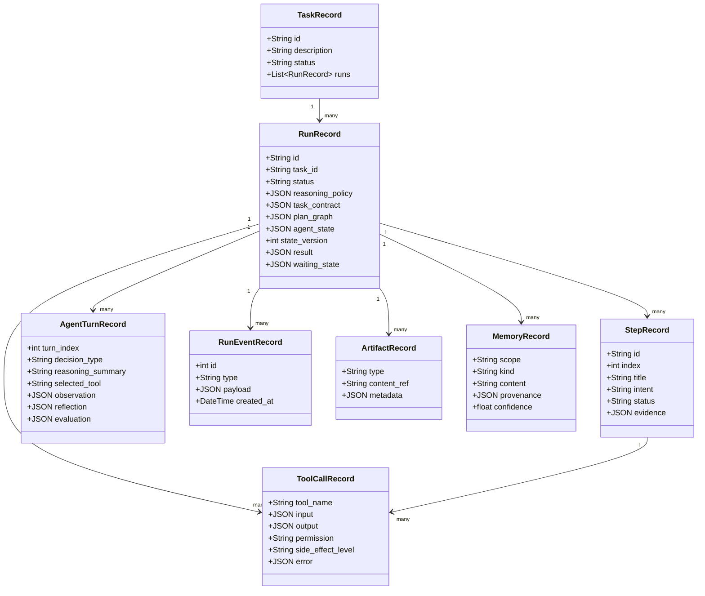

### 5.1 Task 与 Run

`TaskRecord` 表示一段逻辑对话或持续任务；每次用户追问创建新的 `RunRecord`，但复用相同 `task_id`。

这种设计避免把多轮对话覆盖在一条记录中：

```text
Task
├── Run 1：介绍事件循环
├── Run 2：换一个生活中的比喻
└── Run 3：给出 JavaScript 示例
```

每个 Run 都有自己的策略快照、计划、Turn、工具调用和结果，因此历史 Run 不会受到当前 Run 状态污染。

### 5.2 Turn 与 Event

- `AgentTurnRecord` 是语义级决策记录，例如第 2 轮选择 `web_fetch`。
- `RunEventRecord` 是时间序列事件，例如 `answer.delta`、`reflection.created`。

Turn 适合回答“Agent 为什么做这一步”；Event 适合回答“系统按什么顺序发生了什么”。

---

## 6. API 与 Run 创建

前端在 `App.tsx` 的 `submit()` 中调用 `createRun()`：

```ts
createRun(goal, taskId, {
  reasoning_effort: 'fast' | 'balanced' | 'deep',
  planning_strategy: 'direct' | 'adaptive' | 'plan_first',
  reflection_enabled: boolean,
  reflection_trigger: 'failure_only' | 'adaptive' | 'every_turn',
  execution_mode: 'plan_only' | 'request_approval' | 'auto_approval',
  verification_level: 'basic' | 'standard' | 'strict',
}, modelConfig)
```

对应后端入口为 `backend/app/api/runs.py::create_run()`。

核心步骤：

```python
policy = PolicyCompiler().compile(payload.reasoning_policy)
run = await repo.create_task_run(
    goal,
    run_settings.model_policy,
    payload.task_id,
    reasoning_policy=policy.model_dump(mode="json"),
)
asyncio.create_task(start_run_in_process(run.id, run_settings))
```

### 6.1 为什么保存 requested 和 effective 两份策略？

`ReasoningPolicySnapshot` 同时保存：

- `requested`：用户请求值；
- `effective`：通过安全规则编译后的执行值；
- `adjustments`：自动调整原因。

这样可以审计“用户选了什么”以及“系统最终执行了什么”。例如未来高风险任务可以强制：

- `planning_strategy = plan_first`
- `execution_mode = request_approval`
- `verification_level = strict`

当前 API 调用 `compile()` 时仍使用默认 `risk_level=low` 和 `complexity=normal`，因此风险/复杂度自动升级机制已经有代码，但尚未接入真实任务分类器。

---

## 7. 推理策略如何作用于运行时

### 7.1 推理强度预算

`reasoning.py::PolicyCompiler.BUDGETS` 定义：

| 强度 | 最大轮次 | 最大工具调用 | 最大反思 | 最大重规划 | 验证覆盖 |
| --- | ---: | ---: | ---: | ---: | ---: |
| fast | 8 | 5 | 1 | 1 | 1 |
| balanced | 12 | 8 | 3 | 2 | 2 |
| deep | 20 | 16 | 6 | 4 | 3 |

Agent Loop 启动时从 Run 读取 effective policy：

```python
policy_snapshot = ReasoningPolicySnapshot.model_validate(
    initial_run.reasoning_policy or {}
)
policy = policy_snapshot.effective

max_turns = min(policy.budgets.max_turns, settings.agent_max_turns)
max_tool_calls = min(policy.budgets.max_tool_calls, settings.agent_max_tool_calls)
max_reflections = min(policy.budgets.max_reflections, settings.agent_max_reflections)
max_replans = min(policy.budgets.max_replans, settings.agent_max_replans)
```

用户设置决定期望预算，服务端 Settings 是部署级硬上限。运行时将最终限制写入 `reasoning.runtime_limits` 事件。

### 7.2 规划策略

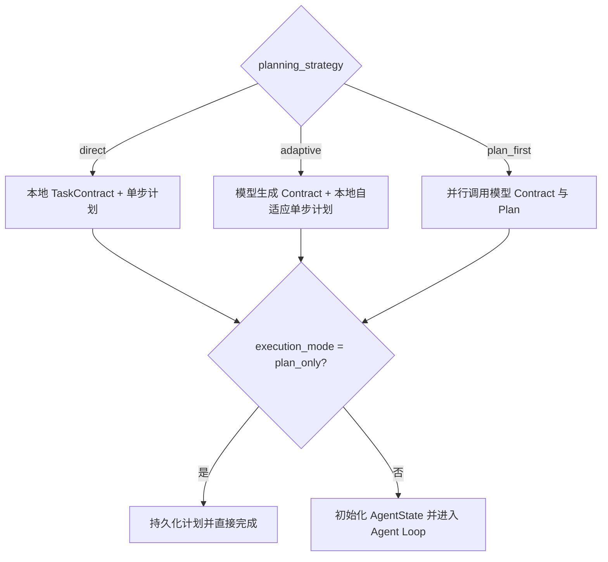

对应代码位于 `engine.py::_run_with_repo()`。

三个策略的工程差异：

- `direct`：最低前置延迟，不调用 planner；
- `adaptive`：先获得模型任务契约，但把动作展开留给 Agent Loop；
- `plan_first`：执行前同时生成契约和多步计划。

### 7.3 反思策略

`ReflectionGate.should_reflect()` 接受信号和已使用次数：

```python
if not policy.reflection_enabled:
    return False
if used >= policy.budgets.max_reflections:
    return False
if trigger == every_turn:
    return True
if trigger == failure_only:
    return signal in FAILURE_SIGNALS
return signal in ADAPTIVE_SIGNALS
```

当前信号包括：

- `model_output_failed`
- `tool_failed`
- `completion_gate_failed`
- `model_requested`
- `expectation_mismatch`
- `evidence_conflict`
- `low_confidence`
- `no_progress`
- `dependency_broken`
- `turn_completed`

未触发或预算耗尽时写入 `reflection.skipped`，而不是伪造一次反思。

---

## 8. RunEngine 总编排

`RunEngine` 是一次 Run 的应用服务层编排器，不负责每轮 Agent 决策。

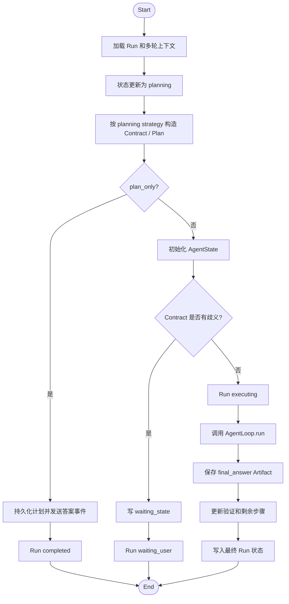

### 8.1 多轮上下文拼装

引擎读取同一 Task 最近 6 个历史 Run，将摘要拼接为：

```text
Conversation context:
User: ...
Assistant: ...
Current user request: ...
```

当前实现使用摘要级上下文，不是完整 token 窗口管理，也没有向量召回和自动压缩策略。

---

## 9. Agent Loop 核心算法

### 9.1 核心类图

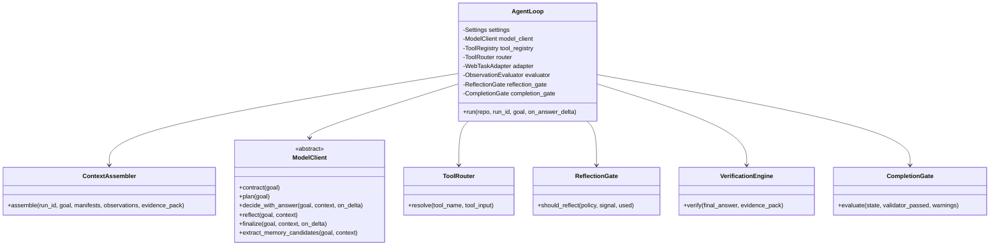

### 9.2 Loop 伪代码

以下伪代码与 `agent_loop.py::AgentLoop.run()` 对应：

```python
load effective policy and calculate runtime limits
load previous observations

for turn_index in range(1, max_turns + 1):
    context = assemble_context(
        goal,
        tool_manifests,
        observations,
        memories,
        reasoning_policy,
        task_contract,
        plan_graph,
        agent_state,
    )

    decision, optional_answer = model.decide_with_answer(context)
    persist AgentTurn(decision)

    if decision == finalize:
        keep streamed answer
        break

    if decision in [blocked, ask_user]:
        persist waiting or blocked state
        break

    if decision == reflect:
        maybe_reflect("model_requested")
        continue

    if decision == replan:
        enforce replan budget

    if decision != call_tool:
        persist generic observation
        maybe_reflect("turn_completed")
        continue

    enforce tool-call budget
    tool = router.resolve(decision.tool_name, decision.tool_input)
    persist ToolCall(started)
    output = await tool.run(input)
    persist ToolCall(result)
    observation = normalize(output)
    evaluation = compare(observation, expected)
    maybe_write_memory()
    maybe_reflect("turn_completed")

on tool error:
    persist failure observation
    compute failure fingerprint
    maybe_reflect("tool_failed")
    enforce retry limit

build evidence pack
obtain or synthesize FinalAnswer
verify result
run completion gate
persist final events and result
```

---

## 10. Agent 决策协议

### 10.1 AgentDecision

模型必须输出结构化 JSON，并由 Pydantic 验证：

```python
class AgentDecision(BaseModel):
    decision_type: str
    reasoning_summary: str
    tool_name: Optional[str]
    tool_input: Dict[str, Any]
    expected_observation: Optional[str]
    target_step_id: Optional[str]
    success_criteria_refs: List[str]
    expected: Optional[ExpectedObservation]
    risk_level: str
    confidence: float
    fallback: Optional[str]
```

允许的核心 decision type：

| 类型 | Runtime 行为 |
| --- | --- |
| `finalize` | 结束循环，进入最终验证 |
| `call_tool` | 通过 ToolRouter 解析并执行工具 |
| `reflect` | 根据 ReflectionGate 决定是否调用 reflector |
| `replan` | 消耗重规划预算并进入下一轮 |
| `ask_user` | 持久化 waiting_state |
| `blocked` | 结束执行并返回阻塞语义 |

### 10.2 决策与答案合并

`decide_with_answer()` 允许模型在判断可以直接回答时，同时返回：

```json
{
  "decision_type": "finalize",
  "reasoning_summary": "该问题属于稳定知识，无需外部工具。",
  "final_answer": {
    "summary": "完整用户回答",
    "findings": [],
    "sources": [],
    "caveats": [],
    "verification_notes": []
  }
}
```

这将“路由决策”和“直接回答”合并为一次模型请求，降低普通问答的首 token 延迟。

---

## 11. 模型客户端实现

### 11.1 OpenAI-compatible 请求

`OpenAICompatibleModelClient._chat_json()` 请求：

```python
POST {base_url}/chat/completions
Authorization: Bearer {api_key}

{
  "model": model_name,
  "messages": messages,
  "response_format": {"type": "json_object"},
  "stream": true
}
```

当前兼容接入包括 OpenAI-compatible、DeepSeek、Qwen、SiliconFlow、Azure 等配置入口，但协议实现主要围绕 OpenAI Chat Completions 兼容格式。

### 11.2 JSON 容错

模型输出存在以下兼容处理：

- Markdown JSON fence 去除；
- 前置自然语言后的首个 JSON Object 提取；
- 第一次非 JSON 时追加严格 JSON 指令重试；
- Contract、Plan、FinalAnswer 字段归一化；
- `null`、标量数组、简写 success criteria 等模型差异兼容；
- 模型错误目标与用户目标不一致时回退默认契约。

这些处理位于：

- `parse_json_object()`
- `normalize_contract_payload()`
- `normalize_plan_payload()`
- `normalize_final_answer_payload()`

### 11.3 流式 JSON 字段提取

模型返回的是流式 JSON，而用户只应看到 `final_answer.summary`，不能看到 JSON 标点和其他字段。

`extract_partial_json_string(content, "summary")` 会从尚未闭合的 JSON 中安全解析已经完整生成的字符串片段，并处理：

- 普通字符；
- `\n` 等 JSON escape；
- `\u4f60` 等 Unicode escape；
- 尚未完整的 escape 序列等待后续 chunk。

每次新增的 summary 部分通过 `on_field_delta` 回调进入 Run 事件流。

---

## 12. 工具系统

### 12.1 Tool UML

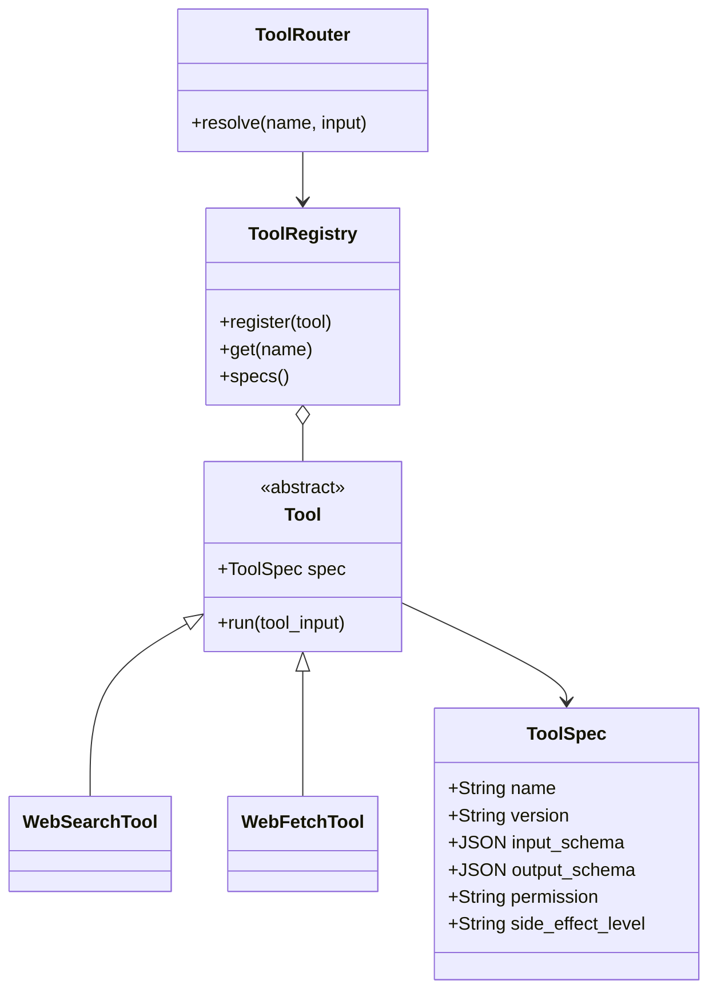

### 12.2 路由校验

`ToolRouter.resolve()` 执行：

1. 工具名非空；
2. 工具属于 allowed tools；
3. 注册表中存在工具；
4. 必填输入字段齐全；
5. 当前只允许 `network_read + read_only`。

因此，即使模型输出 `shell.run`，当前 Router 也会返回 `tool_not_allowed`，不会执行任意命令。

### 12.3 当前 Web 工具

- `web_search`：Google Custom Search 适配；
- `web_fetch`：HTTP 抓取、正文提取、质量分数和 warning。

搜索凭据缺失时抛出真实配置错误，不回退 mock。测试使用独立 fake registry，不进入生产运行路径。

### 12.4 失败指纹

失败签名由以下字段哈希：

```python
{
  "tool": tool_name,
  "input": tool_input,
  "error": error_category,
  "intent": reasoning_summary,
}
```

同一策略达到重试上限后写入 `reasoning.failure_fingerprinted`，防止模型不断重复等价失败动作。

---

## 13. 观察、评估与证据

### 13.1 Observation

工具或用户交互被标准化为 `AgentObservation`：

```python
{
  "kind": "tool_result | tool_error | user_response | validator_result",
  "status": "succeeded | failed | ...",
  "summary": "审计摘要",
  "data": {},
  "error": null
}
```

`ObservationEvaluator` 将实际 observation 与 decision 中的 expected observation 比较，生成：

- `matched`
- `partial`
- `mismatch`
- `conflict`
- `inconclusive`

### 13.2 Evidence Pack

当前 `WebTaskAdapter.build_evidence()` 聚合：

- 搜索 query；
- 候选来源；
- 成功抓取来源；
- 失败来源；
- 去重信息；
- warning；
- 是否尝试过外部证据。

Evidence Pack 被保存为 Artifact，同时传给 FinalAnswer 与 VerificationEngine。

---

## 14. 反思机制

### 14.1 反思不是隐藏思维链

Astra 只保存：

- 触发原因；
- 简短诊断摘要；
- 下一步动作；
- 是否重试；
- 可选的修订工具输入或状态 patch。

系统不要求、不保存模型完整 chain-of-thought。

### 14.2 反思时序

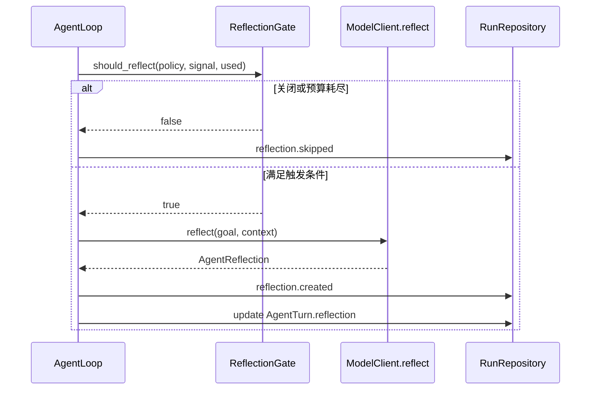

### 14.3 当前边界

`reasoning.py` 的 `apply_reflection_patch()` 负责版本冲突校验和状态变更。主 Agent Loop 在每次获准反思后，会把反思作为下一轮可见的 Observation，并将可执行的 patch 版本化写回 `AgentState`；无效 patch 会产生 `reflection.patch_rejected` 事件，而不会破坏整个 Run。仅包含 `revised_tool_input` 的建议通过反思 Observation 进入下一轮上下文，因为 `AgentState` 当前没有独立的“待重试工具参数”字段。

当前仍有一个边界：如果 Completion Gate 已经失败，末尾反思产生的 patch 会落库，但本次 Run 不会自动重新进入 Agent Loop。下一阶段可以让 Gate 后反思在剩余预算允许时重新执行一次决策。

---

## 15. 验证与 Completion Gate

### 15.1 两层验证

1. `VerificationEngine`：生成来源数、失败来源、低质量来源、caveat 和 notes；
2. `WebTaskAdapter.validate()` + `CompletionGate`：决定能否进入终态。

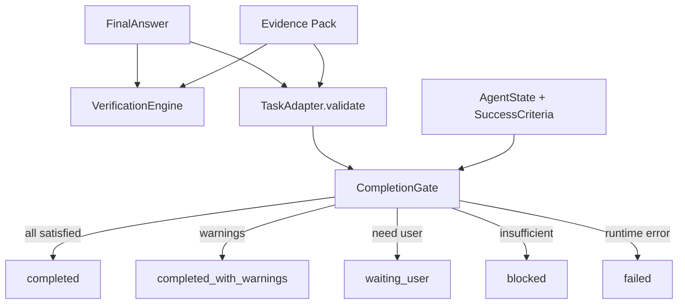

### 15.2 普通知识与 Web 任务的差异

- 未尝试外部证据的普通问答可以无来源完成；
- 一旦尝试 Web 工具，最终回答需要与抓取来源一致；
- 搜索或抓取失败时不能把模型常识伪装成实时证据；
- 来源不足时进入 blocked 或带限制结果。

### 15.3 当前耦合

AgentLoop 当前固定实例化 `WebTaskAdapter`。虽然 TaskAdapter 抽象已经存在，但通用任务类型到 Adapter 的动态选择尚未实现，这是从 Web Agent 走向通用 Agent 的主要扩展点之一。

---

## 16. 记忆系统

`MemoryManager` 在工具成功和最终回答阶段请求模型提取 memory candidates。

记忆必须包含 provenance，例如：

```json
{
  "run_id": "...",
  "artifact_id": "..."
}
```

如果模型返回无效记忆格式，系统写入 `memory.extraction_skipped`，不会让非核心记忆失败阻断最终答案。

当前记忆特点：

- 支持 run scope；
- 有 kind、structured_data、confidence 和 expires_at；
- ContextAssembler 会读取高置信度记忆；
- 尚无向量相似度检索、用户确认、冲突合并和完整跨租户隔离。

---

## 17. Run 状态机

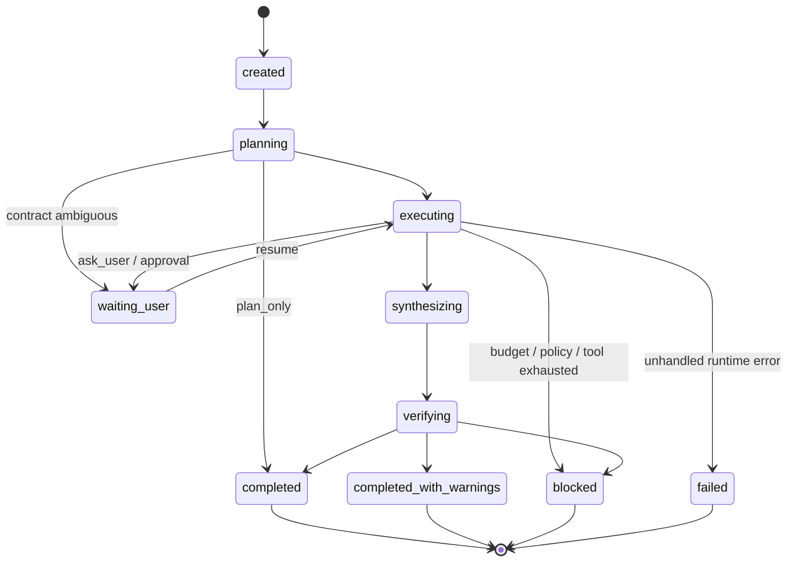

当前状态更新由 Repository 方法完成，并同步写 `run.status_changed` 事件。

`runtime.py::LoopOrchestrator` 还定义了更细粒度的节点迁移与 patch authority，但当前 `AgentLoop.run()` 没有完全通过该 orchestrator 驱动。它更接近目标状态机约束和未来重构基础，而不是当前主执行器。

---

## 18. SSE 全流式链路

### 18.1 时序图

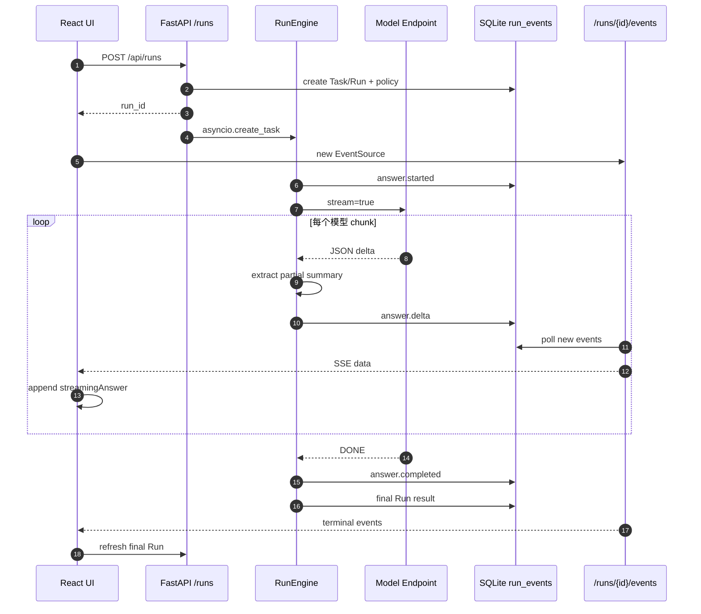

### 18.2 为什么事件先落库？

优点：

- 可审计；
- SSE 断线后可按 event ID 补读；
- 前端刷新后仍能恢复最终结果；
- 模型流与 UI 连接解耦。

代价：

- 每个 delta 都有 SQLite commit；
- SSE 目前轮询数据库（约 50ms），不是消息队列推送；
- 高并发和长回答下数据库写放大会成为瓶颈。

生产化方向是内存/Redis/NATS 事件总线实时推送，同时异步批量落审计事件。

---

## 19. 前端呈现模型

### 19.1 单轮规范化

后端一个 Run 可能有多个 Turn、ToolCall 和 Event。前端 `buildPresentation(run)` 将它们规范化为：

```text
User Message
Process Panel
└── reasoning / tool / reflection / verification timeline
Astra Answer
```

每轮只生成一个 `process` presentation message 和一个 `answer` presentation message，避免多个 Astra 回答框和多个思考 tab。

### 19.2 Markdown 与来源

`MarkdownContent` 使用 `react-markdown + remark-gfm`，支持：

- 标题、列表、任务列表；
- inline code、code block；
- 引用、表格、链接；
- 流式 Markdown 渲染。

原始 HTML 默认不执行。`externalHref()` 会从模型可能返回的“站点名称：https://domain”中提取真实 URL，避免浏览器把无协议链接拼到 Astra 当前域名。

### 19.3 自动滚动

前端维护 `followLatestRef`：

- 新问题发送时恢复跟随；
- 流式回答期间，用户在底部则自动滚动；
- 用户向上滚动超过阈值后停止跟随；
- 显示“回到最新”按钮；
- 点击后平滑回到底部。

---

## 20. 错误模型

### 20.1 API 错误信封

```json
{
  "error": {
    "type": "dependency.model_response_invalid",
    "code": "MODEL_RESPONSE_INVALID",
    "message": "大模型服务返回了无法处理的结果，请稍后重试。",
    "retryable": true,
    "trace_id": "req_xxx",
    "details": {}
  }
}
```

主要分类：

| 类型 | 示例 |
| --- | --- |
| validation | goal 为空、模型配置缺失 |
| resource | Run 不存在 |
| state | Run 不在 waiting 状态、continuation token 失效 |
| dependency.model_unavailable | 模型网络不可达、超时 |
| dependency.model_response_invalid | 模型输出无法归一化 |
| infrastructure.database_unavailable | 数据库不可用 |
| runtime.internal_error | 未分类运行时异常 |

### 20.2 错误处理边界

`RunEngine.run()` 捕获模型配置、模型输出和网络错误，将其转为结构化 run.error，并更新 Run 终态。

Memory 等非核心能力失败会降级，而不是阻断回答。工具失败进入 Observation 与 ReflectionGate。真正未处理的异常进入 `failed`。

### 20.3 日志安全

日志记录：

- Run ID、provider、model、endpoint；
- operation、HTTP status、chunk 数、字符数、耗时；
- phase、decision、tool、error category。

日志不应记录完整 API Key、完整 prompt 或完整模型正文。

---

## 21. 数据一致性与恢复

### 21.1 状态版本

`RunRecord.state_version` 和 `AgentState.version` 用于避免反思或恢复操作基于旧状态提交 patch。

`apply_reflection_patch(state, patch, expected_version)` 在版本不一致时抛出 `StateVersionConflict`。

### 21.2 waiting_user / resume

当 Agent 请求补充信息或批准时：

1. 写入 `waiting_state`；
2. Run 进入 `waiting_user`；
3. 前端继续发送时调用 `POST /runs/{id}/resume`；
4. Repository 校验 continuation token；
5. 后台重新启动同一 Run。

### 21.3 当前恢复限制

- 后台任务使用进程内 `asyncio.create_task`，服务进程崩溃后没有独立 worker 自动接管；
- SQLite 可以保存现场，但缺少启动时扫描未完成 Run 的调度器；
- ToolCall 有 idempotency key 和 phase 字段，但完整 exactly-once 工具执行尚未实现。

---

## 22. 安全与权限边界

当前已经实现：

- 工具白名单；
- ToolSpec permission 和 side-effect 校验；
- Web 工具只允许 `network_read + read_only`；
- 高风险策略自动上调的策略编译基础；
- API Key 不写入 Run 事件；
- 隐藏思维链不持久化；
- 外部链接规范化与 Markdown 原始 HTML 禁用。

当前未完全实现：

- `request_approval` 与 `auto_approval` 对所有工具的通用执行拦截器；
- 服务端加密 Secret Store；
- 用户、租户、RBAC 与 workspace 授权；
- SSRF、DNS rebinding 和企业出网 allowlist 的完整防护；
- 工具成本计费与额度系统。

因此当前版本适合本地研发验证，不应直接作为多租户生产 Agent 平台部署。

---

## 23. 测试体系

### 23.1 后端

当前后端测试覆盖：

- API 创建、读取与错误信封；
- Repository 生命周期和持久化；
- Model JSON 解析与字段归一化；
- Tool 输入、权限与网络错误；
- Agent Loop 搜索、抓取和终态；
- 推理强度实际轮次与工具预算；
- 部署硬上限；
- direct / adaptive / plan-first / plan-only 路径；
- reflection disabled / failure-only / adaptive / every-turn；
- reflection budget 与 skipped event；
- Completion Gate、状态版本和恢复。

最近验证结果：

```text
64 passed, 1 skipped
```

### 23.2 前端

当前前端测试覆盖：

- Run 创建参数；
- 模型和策略选择；
- 历史恢复；
- 单一回答框与单一过程面板；
- Markdown；
- 来源 URL；
- 设置界面和模式控件。

最近验证结果：

```text
22 passed
```

生产构建通过 TypeScript 与 Vite build。

---

## 24. 关键场景时序

### 24.1 稳定知识直接回答

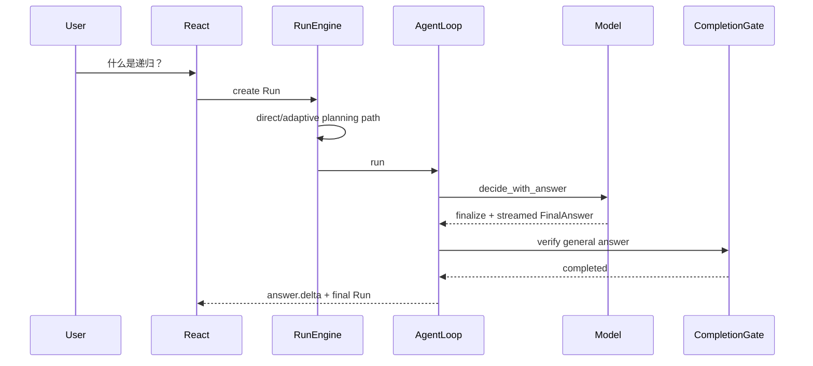

### 24.2 需要实时信息

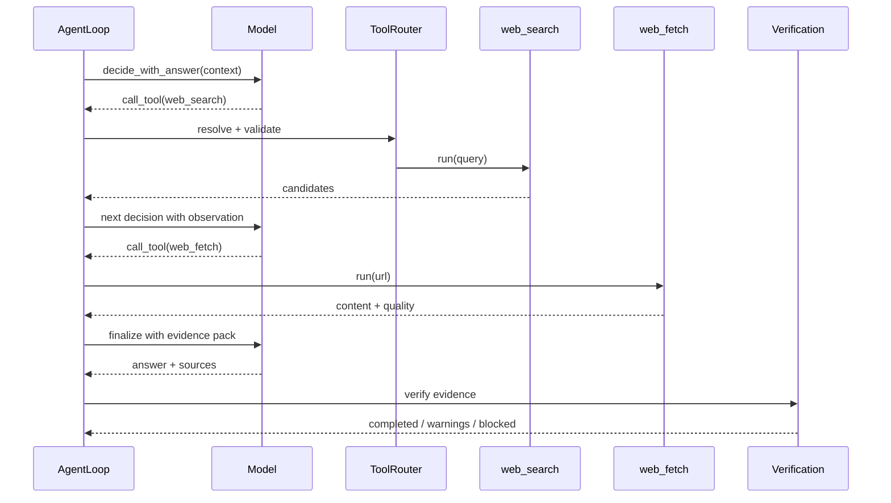

### 24.3 工具失败与反思

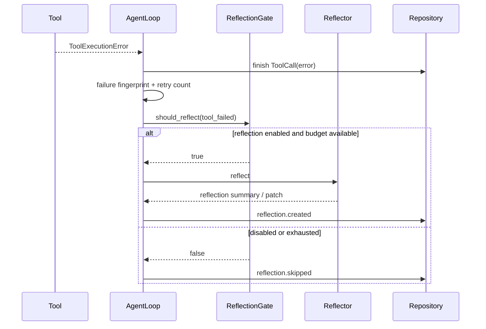

---

## 25. 当前实现成熟度矩阵

| 能力 | 状态 | 说明 |
| --- | --- | --- |
| 多轮 Run 与历史持久化 | 已实现 | Task 下多个 Run，SQLite 持久化 |
| OpenAI-compatible 模型 | 已实现 | DeepSeek 已真实验证 |
| 结构化 Agent 决策 | 已实现 | Pydantic + JSON normalize |
| 推理预算 | 已实现 | 用户策略 + 部署硬上限 |
| 三种规划策略 | 已实现 | 路径可测试区分 |
| 反思门控与预算 | 已实现 | trigger 与 skipped event |
| 反思 patch 版本化应用 | 已实现 | patch 回写 AgentState；非法 patch 被拒绝并记录事件 |
| Web 工具 | 已实现 | search/fetch；需要真实搜索凭据 |
| 通用工具审批 | 部分实现 | 模式字段存在，统一拦截器未完成 |
| 完成验证 | 已实现 | 当前主要是 WebTaskAdapter |
| 多任务 Adapter | 未完成 | AgentLoop 固定 WebTaskAdapter |
| SSE 原生流式 | 已实现 | DB event polling 架构 |
| 分布式 worker | 未完成 | 进程内 background task |
| 生产 Secret 管理 | 未完成 | Key 在浏览器 LocalStorage |
| 多租户权限 | 未完成 | 无用户/RBAC 数据模型 |
| 向量记忆/RAG | 未完成 | 仅结构化 MemoryRecord |

---

## 26. 研发扩展指南

### 26.1 新增工具

1. 实现 `Tool` 子类；
2. 声明 ToolSpec；
3. 注册到 ToolRegistry；
4. 更新 ToolRouter allowed tools 或改为策略驱动；
5. 定义 observation normalize；
6. 增加成功、永久失败、临时失败和权限测试。

### 26.2 新增任务类型

1. 实现新的 TaskAdapter；
2. 定义 evidence schema；
3. 实现结果 validator；
4. 在 Run 创建时确定 `task_adapter`；
5. AgentLoop 根据 adapter registry 动态加载，而不是固定 WebTaskAdapter；
6. 增加 Completion Gate 场景测试。

### 26.3 新增模型供应商

如果供应商兼容 OpenAI Chat Completions，只需配置 provider、base URL、model 和 key。若响应协议不同，需要实现新的 ModelClient，并保持：

- TaskContract；
- PlanOutput；
- AgentDecision；
- AgentReflection；
- FinalAnswer；
- MemoryRecord；

这些内部协议不变。

---

## 27. 建议的后续演进顺序

### P0：正确性闭环

1. 将 replan 决策映射为 PlanGraph 新版本；
2. 让 Completion Gate 失败可以回到 Agent Loop 修复，而不是只记录反思；
3. 将运行时节点迁移统一交给 LoopOrchestrator；
4. 动态选择 TaskAdapter。

### P1：生产运行基础

1. 后台任务迁移到持久化 worker queue；
2. SSE 使用事件总线，审计事件异步批量落库；
3. 服务端 Secret Store；
4. 用户、租户、workspace 和 RBAC；
5. 工具审批中间件与幂等恢复。

### P2：算法能力

1. Context window 管理与自动摘要；
2. 结构化 / 向量混合记忆；
3. 模型路由与成本策略；
4. 任务复杂度、风险和置信度分类器；
5. 基于 trace 的离线评测集和 Agent policy benchmark。

---

## 28. 代码评审检查清单

新增 Agent 能力时建议检查：

- [ ] 是否修改了 Run 的确定性状态，而不仅是 prompt？
- [ ] 是否有用户策略和部署硬上限？
- [ ] 是否记录 requested、effective 和 adjustment？
- [ ] 工具是否有 schema、permission 和 side-effect level？
- [ ] 工具失败是否可分类、可审计、可重试且有上限？
- [ ] 是否可能重复执行有副作用的工具？
- [ ] 模型输出是否经过 Pydantic 验证和 normalize？
- [ ] 非核心能力失败是否错误阻断主结果？
- [ ] Completion Gate 是否覆盖新任务类型？
- [ ] 是否泄露 API Key、prompt、正文或隐藏思维链？
- [ ] SSE 断线后是否能恢复？
- [ ] 是否有行为测试，而不只是字段序列化测试？

---

## 29. 结论

Astra 当前已经形成一个可运行的 Agent 最小闭环：

```text
策略化请求
→ 结构化决策
→ 受控工具
→ 可审计观察
→ 有界反思
→ 证据验证
→ 明确终态
→ 原生流式输出
→ 持久化恢复
```

其主要价值不是某个具体模型或 Web 工具，而是把模型不确定性包裹在确定性的应用协议中：预算、权限、状态、验证、错误、日志和持久化都由 Runtime 控制。

当前版本已经适合企业内部进行 Agent 架构验证、算法策略实验和前后端联调；距离生产级平台仍需要完成反思状态闭环、动态 Adapter、分布式执行、密钥管理和多租户安全。

---

## 附录 A：关键文件索引

| 文件 | 关键内容 |
| --- | --- |
| `frontend/src/App.tsx` | UI 状态、策略选择、单轮 presentation、Markdown、滚动 |
| `frontend/src/api.ts` | Run REST API、SSE EventSource |
| `frontend/src/types.ts` | 前端 Run/Turn/Tool/Result 类型 |
| `backend/app/main.py` | FastAPI、日志中间件、异常处理 |
| `backend/app/api/runs.py` | create/get/list/resume/events |
| `backend/app/core/config.py` | 部署级 Agent 硬上限、模型和工具配置 |
| `backend/app/core/errors.py` | 错误分类与安全错误信封 |
| `backend/app/db/models.py` | SQLAlchemy 领域数据模型 |
| `backend/app/repositories/runs.py` | 所有 Run 持久化操作 |
| `backend/app/runner/engine.py` | Run 总编排和规划路径 |
| `backend/app/runner/agent_loop.py` | Agent 决策循环 |
| `backend/app/runner/model_client.py` | 模型协议、JSON normalize、原生流式 |
| `backend/app/runner/reasoning.py` | Policy、Contract、PlanGraph、ReflectionGate、CompletionGate |
| `backend/app/runner/runtime.py` | 目标节点状态机与 patch authority 基础 |
| `backend/app/runner/adapters.py` | WebTaskAdapter 与证据校验 |
| `backend/app/tools/base.py` | Tool、ToolSpec、ToolRegistry |
| `backend/app/tools/web.py` | Web search/fetch 实现 |

## 附录 B：常用运行状态与事件

### Run 状态

```text
created
planning
executing
synthesizing
verifying
waiting_user
completed
completed_with_warnings
blocked
failed
```

### 关键事件

```text
run.created
run.status_changed
reasoning.policy_adjusted
reasoning.runtime_limits
reasoning.state_initialized
reasoning.decision_validated
reasoning.evaluation_created
reasoning.failure_fingerprinted
reasoning.completion_decided
reflection.created
reflection.skipped
memory.extraction_skipped
answer.started
answer.delta
answer.completed
verification.created
run.error
```
