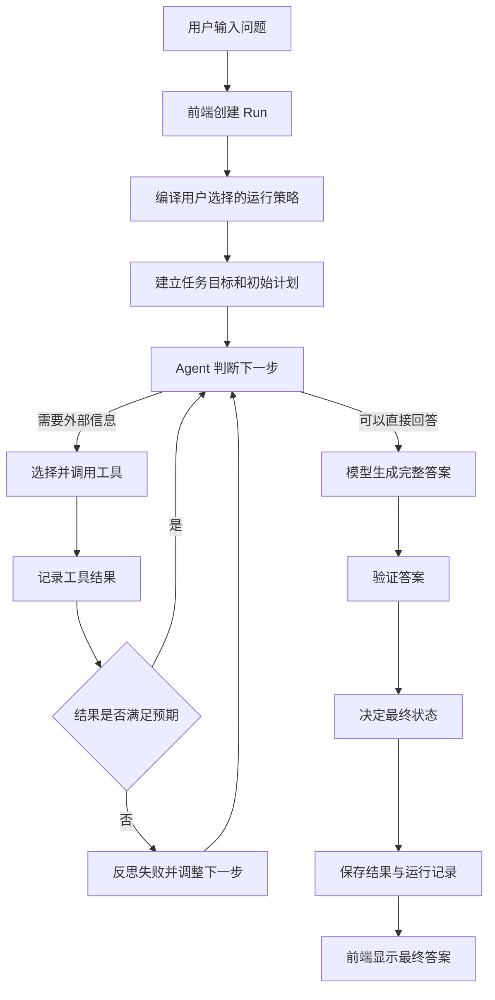
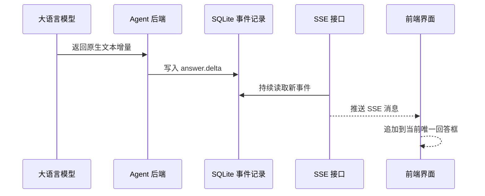

# Astra 当前实现说明书（学生版）

> 适用版本：当前开发版本  
> 阅读对象：第一次接触 Agent、但了解基本前后端概念的学生  
> 目标：看懂用户发送一个问题后，Astra 内部到底做了什么

## 1. Astra 是什么？

Astra 是一个可以调用大语言模型、根据问题决定是否使用工具，并对结果进行检查的通用 Agent 原型。

它与普通聊天页面最大的区别是：普通聊天通常只是“把问题交给模型，再把文字显示出来”；Astra 在模型外面增加了一套可控制、可记录的运行流程。

可以把 Astra 想象成一名完成任务的学生：

1. 先读懂题目；
2. 根据老师要求选择答题方式；
3. 判断是直接回答，还是需要查资料；
4. 如果查资料失败，分析失败原因；
5. 写出答案并检查是否满足要求；
6. 保存本次过程，方便以后查看。

## 2. 系统由哪些部分组成？

| 部分 | 使用的技术 | 主要职责 |
| --- | --- | --- |
| 前端界面 | React、TypeScript、Vite | 接收问题、展示思考过程、工具调用和流式回答 |
| 后端接口 | FastAPI | 创建任务、返回运行状态、提供 SSE 事件流 |
| Agent 引擎 | Python | 组织规划、决策、工具、反思、验证等步骤 |
| 模型客户端 | OpenAI 兼容协议 | 连接 DeepSeek 等兼容模型服务 |
| 工具系统 | Tool Registry | 注册并执行 `web_search`、`web_fetch` 等工具 |
| 数据存储 | SQLite | 保存对话、运行事件、工具调用、记忆和结果 |

前端不是 Agent 的“大脑”。真正决定下一步做什么的是后端 Agent Loop；前端主要负责把过程清楚地呈现给用户。

## 3. 一次问题的完整流程



下面按顺序解释每一个关键节点。

### 3.1 前端发送问题

用户点击发送后，前端调用：

```text
POST /api/runs
```

请求中除了问题，还会包含当前选择的：

- 模型供应商、模型名称和 API 地址；
- 推理强度；
- 规划策略；
- 是否启用反思；
- 执行模式。

后端会创建一个 `Run`。Run 可以理解为“这一次任务的档案袋”，后面的状态变化、工具调用和最终答案都会与它关联。

### 3.2 编译运行策略

用户在界面中可以选择不同策略。

| 用户选项 | 当前作用 |
| --- | --- |
| 快速 | 使用较小的轮次、工具和反思预算 |
| 均衡 | 使用默认预算，兼顾速度与检查能力 |
| 深入 | 允许更多 Agent 轮次、工具调用和反思 |
| 直接 | 尽量减少前置规划 |
| 自适应 | 根据任务情况决定是否继续展开步骤 |
| 先规划 | 先让模型生成较完整的计划 |
| 仅规划 | 输出计划，但不调用工具或执行外部操作 |
| 请求批准 | 作为默认执行模式，受控操作需要批准 |
| 自动批准 | 允许自动执行已注册的操作 |

策略并不只是界面标签。后端会把它们编译成一份 `ReasoningPolicySnapshot`，其中包含最大轮次、最大工具调用数、最大反思次数等运行预算。

如果未来识别到高风险任务，策略编译器还可以自动提高规划和验证等级，并降低自动执行权限。

### 3.3 快速启动或完整规划

为了降低普通问答的首字延迟，当前实现做了两种处理：

- **直接 / 自适应模式**：先建立一个轻量任务契约和单步计划，快速进入 Agent 决策；
- **先规划 / 仅规划模式**：调用模型生成更完整的计划。

任务契约（Task Contract）用于声明：用户目标是什么、需要交付什么、有哪些成功条件、哪些行为不允许执行。

### 3.4 Agent Loop 做决策

Agent Loop 是当前系统的核心循环。每一轮都会组装上下文，然后要求模型选择一种动作：

| 决策 | 含义 |
| --- | --- |
| `finalize` | 信息已经足够，可以生成最终答案 |
| `call_tool` | 需要调用一个已注册工具 |
| `reflect` | 需要反思当前结果 |
| `replan` | 需要修改计划 |
| `ask_user` | 信息不足，需要用户补充 |
| `blocked` | 当前条件下无法继续 |

模型不能随便发明工具名称。工具路由器只允许调用注册表中存在、权限符合要求的工具。

### 3.5 根据问题选择工具

当前主要实现了两个 Web 工具：

- `web_search`：搜索候选网页；
- `web_fetch`：读取指定网页并提取正文。

例如：

- “解释递归是什么”属于稳定知识，通常直接回答；
- “今天北京天气如何”需要实时信息，应尝试搜索工具；
- “总结这个网址”应先读取指定网页。

如果搜索服务没有配置 API Key，工具会返回明确失败，而不是使用假数据。Agent 可以基于失败结果反思，并在答案中说明没有拿到实时证据。

### 3.6 观察、评估与反思

工具执行后会产生一个 Observation（观察结果），其中记录成功、失败、返回字段和错误类型。

系统会将真实结果与预期结果比较：

- 是否拿到了需要的字段；
- 工具是否成功；
- 是否出现来源冲突；
- 是否已经重复失败；
- 是否仍有必要继续调用工具。

当反思功能开启且满足触发条件时，Agent 会生成简短、可展示的反思摘要，并调整下一步策略。这里展示的是可审计摘要，不是模型隐藏的完整思维链。

系统还会为相同失败生成“失败指纹”，避免对同一种无效工具调用无限重试。

### 3.7 生成与验证最终答案

当 Agent 决定 `finalize` 时，模型会返回结构化结果，主要包含：

- `summary`：完整的用户可见回答；
- `findings`：补充发现；
- `sources`：来源；
- `caveats`：限制或注意事项；
- `verification_notes`：验证说明。

之后验证器会检查：

- 普通知识问题是否已经得到完整回答；
- 如果尝试过 Web 工具，是否真的拿到了来源；
- 是否存在失败来源或低质量来源；
- 强制成功条件是否已经满足。

最终状态可能是：

- `completed`：正常完成；
- `completed_with_warnings`：完成，但存在警告；
- `waiting_user`：等待用户补充或批准；
- `blocked`：条件不足，无法继续；
- `failed`：发生未恢复的运行错误。

## 4. 流式输出是怎样实现的？

Astra 使用的是端到端流式输出，而不是等模型生成完后再模拟打字。



后端会依次产生：

1. `answer.started`；
2. 多个 `answer.delta`；
3. `answer.completed`。

前端在流式过程中只维护一个 Astra 回答框。用户如果停留在对话底部，页面会跟随新内容自动下滚；如果用户主动向上滚动，自动跟随会暂停，并显示“回到最新”按钮。

## 5. 前端如何组织一轮回答？

为了避免同一轮出现多个 Astra 回答框，前端会把后端的多条运行记录整理成固定结构：

```text
用户问题
└── 思考过程（默认折叠）
    ├── 推理摘要
    ├── 工具调用及状态
    ├── 反思摘要
    └── 验证结果
└── Astra 最终回答（唯一）
```

回答支持 Markdown，包括标题、列表、粗体、引用、表格、链接和代码块。来源链接会被规范化成真实外部站点地址，不会错误拼接到 Astra 自己的部署地址。

## 6. 多轮对话如何工作？

同一个对话中的追问会创建新的 Run，但继续使用同一个 Task。

后端会读取最近几轮的用户问题和 Astra 摘要，将它们放入新一轮上下文。这样模型可以理解“详细说说”“换一个例子”等依赖上文的追问。

每一轮仍保存自己的运行快照，因此历史答案不会错误地套用当前 Run 的思考过程或结果。

## 7. 数据如何持久化？

当前后端默认使用 SQLite 保存：

- Task 和 Run；
- 对话消息；
- 计划步骤；
- Agent 决策轮次；
- 工具调用及错误；
- 运行事件；
- 最终答案；
- 有来源依据的记忆候选。

模型配置和 API Key 保存在当前浏览器本地，不会写入运行事件。后端日志也不会打印完整 Key、完整提示词或完整模型正文。

## 8. 错误处理

后端将错误分成可识别类型，例如：

- 模型服务不可访问；
- 模型返回格式无效；
- 数据库不可用；
- 工具配置缺失；
- 请求参数无效；
- 运行状态冲突。

接口会返回错误类型、错误代码、是否可以重试和诊断编号。前端将非技术用户需要知道的内容显示为弹窗，技术细节保留在接口响应和日志中。

## 9. 当前已经实现的能力

- 通用问答与多轮追问；
- DeepSeek 等 OpenAI 兼容模型接入；
- 推理强度、规划策略、反思和执行模式控制；
- 基于问题决定直接回答或调用工具；
- Web 搜索与网页读取工具框架；
- 工具失败后的反思和重试限制；
- 结构化结果验证与终态判断；
- 原生 SSE 流式回答；
- 对话、运行记录和模型配置持久化；
- Markdown 回答、来源跳转和统一过程面板；
- 自动跟随最新回答，以及用户滚动后的暂停跟随；
- 关键阶段日志和结构化错误分类。

## 10. 当前限制

这仍然是一个正在开发的 Agent 原型，学生在演示时需要注意：

1. 当前注册的外部工具种类较少，主要是 Web 搜索和网页读取；
2. Web 搜索需要单独配置搜索服务凭据，否则会明确失败；
3. 设置页面中的一部分运行时选项仍属于界面配置展示，尚未全部接入后端；
4. API Key 目前保存在浏览器本地，还不是生产环境的服务端加密密钥管理；
5. SQLite 适合本地开发和演示，大规模多用户部署需要更完整的数据库方案；
6. 模型可能返回不完全符合结构的内容，系统已经做了兼容和重试，但不能保证所有模型行为完全一致。

## 11. 课堂介绍建议

可以使用下面三个问题演示不同路径：

### 示例一：普通问答

```text
请用三句话解释什么是递归。
```

观察重点：Agent 判断无需工具，快速进入流式回答。

### 示例二：需要实时信息

```text
今天北京天气怎么样？
```

观察重点：Agent 选择 Web 工具；如果搜索凭据缺失，会明确展示工具失败和限制说明。

### 示例三：多轮追问

```text
第一轮：介绍一下事件循环。
第二轮：换一个生活中的比喻。
```

观察重点：第二轮能够继承第一轮上下文，同时两轮各自保留独立的思考过程和答案。

## 12. 主要代码位置

| 文件 | 作用 |
| --- | --- |
| `frontend/src/App.tsx` | 对话界面、流式回答、历史记录、过程面板和 Markdown 展示 |
| `frontend/src/api.ts` | Run 接口与 SSE 连接 |
| `backend/app/api/runs.py` | 创建、查询、恢复 Run 以及推送 SSE |
| `backend/app/runner/engine.py` | 一次 Run 的总流程编排 |
| `backend/app/runner/agent_loop.py` | 决策、工具、观察、反思、记忆和验证循环 |
| `backend/app/runner/model_client.py` | 模型请求、原生流式解析和结构化输出兼容 |
| `backend/app/runner/reasoning.py` | 策略编译、任务契约、状态和完成门 |
| `backend/app/runner/adapters.py` | 不同任务类型的结果验证规则 |
| `backend/app/repositories/runs.py` | Run、事件、工具调用和消息持久化 |

## 13. 一句话总结

Astra 当前实现的核心不是“多一个聊天页面”，而是把大语言模型放进一个有策略、有工具、有状态、有反思、有验证、有日志并且可以恢复和审计的任务循环中。
