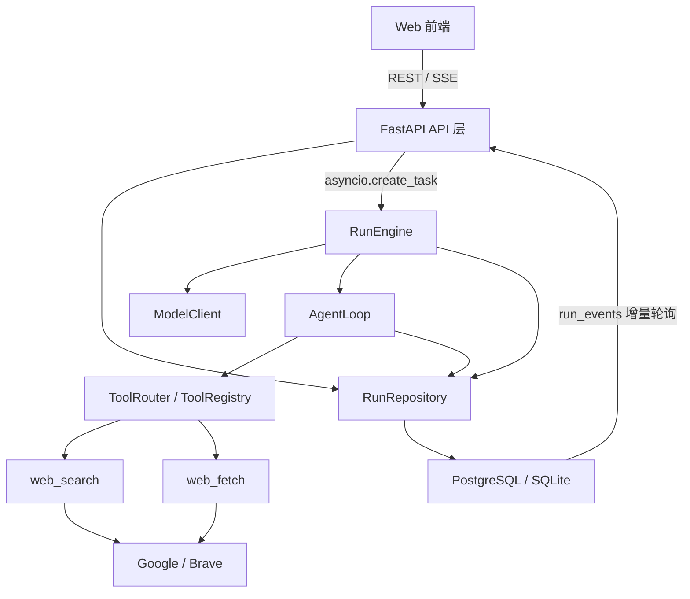
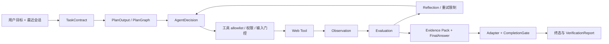

# Astra 后台架构与开发设计（当前实现态）

> 归档基线：2026-07-12；范围：`backend/` 当前代码。本文描述已经落地的实现，不等同于 `astra-agent-platform-v0.1.md` 中的长期产品愿景。

## 1. 系统定位与技术栈

当前后台是一个面向 Web 数据查询和通用问答的单体异步服务。它把一次用户请求建模为可持久化、可审计、可恢复的 Task/Run，通过模型生成任务契约和计划，再由受控 Agent Loop 调用只读 Web 工具，最终输出带证据、验证报告和运行时间线的结果。

主要技术：Python 3.9+、FastAPI、Pydantic v2、SQLAlchemy 2 asyncio、Alembic、httpx、PostgreSQL/SQLite、pytest。生产数据库目标是 PostgreSQL，开发与测试也支持 SQLite；JSON 字段在 PostgreSQL 上自动使用 JSONB。

当前部署形态是单进程应用：HTTP API 与后台 Run 执行在同一个服务进程中，Run 通过 `asyncio.create_task` 启动，没有独立任务队列和 Worker。

## 2. 总体架构



分层职责：

- 接口层负责参数校验、错误信封、Run 创建/查询/恢复和 SSE 输出。
- 编排层负责 Run 生命周期、契约与计划生成、主路径选择、结果合成和终态落库。
- Agent 内核负责逐轮决策、工具策略门控、Observation、Evaluation、Reflection、Memory 与 Completion Gate。
- 工具层负责类型化工具清单、权限元数据、搜索、抓取、正文提取和质量评估。
- 持久化层负责 Task/Run 及全部审计实体的事务写入和读取视图组装。
- Schema 层是模型、运行时、API 和数据库视图之间的结构化契约。

## 3. 核心运行链路

### 3.1 创建与启动

1. `POST /api/runs` 校验目标和可选模型配置。
2. `PolicyCompiler` 将用户请求的推理策略编译为有效策略，并施加风险安全下限。
3. `RunRepository.create_task_run` 创建或复用 Task，创建 Run 和 `run.created` 事件。
4. API 提交事务后用 `asyncio.create_task(start_run_in_process(...))` 启动后台执行，并立即返回 Run ID。
5. 前端通过 `GET /api/runs/{id}` 获取快照，通过 `/events` 获取增量事件。

### 3.2 规划与执行



`RunEngine` 首先拼接同一 Task 最近六次 Run 的用户目标与摘要作为会话上下文，然后生成并校验任务契约与计划。`plan_only` 策略会在规划后直接结束；歧义契约会进入 `waiting_user`。默认开启 `agent_use_loop` 和 `agent_use_general_runtime` 时进入 `AgentLoop`，否则回退到旧的固定 Web 查询编排路径。

Agent 每轮只能产生 `call_tool`、`reflect`、`replan`、`finalize`、`ask_user` 或 `blocked` 等结构化决策。工具调用前必须通过注册、allowlist、必填参数、`network_read` 权限和 `read_only` 副作用检查。相同失败动作受重试预算约束，并以 SHA-256 fingerprint 留痕。

### 3.3 证据与终态

Web 搜索结果先做 URL 合法性校验、二进制内容排除、跟踪参数清理和去重，再抓取正文。抓取结果记录提取策略、正文长度、质量分、warning 和时间。所有成功/失败来源汇总为 Evidence Pack Artifact。

最终答案先经过 `VerificationEngine` 形成展示型验证报告，再由 `WebTaskAdapter.validate` 给出领域验证结论，并由 `CompletionGate` 结合强制成功准则确定终态。终态包括 `completed`、`completed_with_warnings`、`waiting_user`、`blocked` 和 `failed`。

## 4. 数据设计

| 实体 | 核心作用 | 主要关系 |
|---|---|---|
| `tasks` | 稳定的用户任务/会话容器 | 一对多 `runs` |
| `runs` | 一次可恢复执行及其策略、契约、计划、状态、结果 | 从属 Task；聚合其余审计实体 |
| `steps` | 模型计划的持久化步骤和证据 | 从属 Run，可关联 ToolCall |
| `tool_calls` | 工具输入、输出、权限、副作用、错误和耗时审计 | 从属 Run，可选从属 Step |
| `artifacts` | Evidence Pack、Final Answer 等产物 | 从属 Run |
| `run_events` | SSE 时间线的追加式事件源 | 从属 Run，整数 ID 用作游标 |
| `agent_turns` | 每轮决策、观察、反思、评估和幂等阶段 | 从属 Run |
| `memories` | 带 provenance/confidence 的运行或持久记忆 | 可选从属 Run |

Run 的 `state_version` 实现乐观版本控制；更新推理状态时必须匹配预期版本且新版本严格递增。`waiting_state` 保存暂停节点、请求内容和 continuation token；恢复时写入用户 observation、清除歧义并增加版本。

## 5. API 设计

| 方法与路径 | 作用 | 关键行为 |
|---|---|---|
| `GET /api/health` | 健康探针 | 只返回进程存活，不检查数据库或外部依赖 |
| `GET /api/runs?limit=` | 最近 Run 列表 | 默认 100，最大 200，返回完整聚合视图 |
| `POST /api/runs` | 创建并异步启动 Run | 支持 task 复用、推理策略和单次模型覆盖 |
| `GET /api/runs/{run_id}` | 获取 Run 快照 | 包括 steps、turns、calls、artifacts、events、memories、chat view |
| `POST /api/runs/{run_id}/resume` | 恢复等待态 Run | 校验状态与 continuation token |
| `GET /api/runs/{run_id}/events` | SSE 事件流 | 每 250ms 查库；终态后结束；支持 `after_id` 续读 |

所有同步 API 错误使用 `{ "error": { type, code, message, retryable, trace_id, details } }`。422 表示输入错误，404 表示资源不存在，409 表示状态冲突，503 表示基础设施/依赖不可用，其他未分类错误为 500。后台执行错误以同一 payload 写入 `run.error` 和 `result.error`。

## 6. 每个后台文件的内容与核心作用

### 6.1 根配置与迁移

| 文件 | 内容与核心作用 |
|---|---|
| `backend/pyproject.toml` | Python 包元数据、运行/开发依赖、setuptools 包发现、pytest asyncio 配置和 Ruff 规则，是后台构建与开发工具的唯一声明源。 |
| `backend/alembic.ini` | Alembic 脚本目录和日志配置；数据库 URL 不写在此处，而由运行时 Settings 注入。 |
| `backend/alembic/env.py` | 连接 ORM metadata 与 Alembic，支持 offline SQL 生成和 async online migration；URL 来自 `.env`/Settings。 |
| `backend/alembic/versions/0001_initial_run_model.py` | 初始建表：tasks、runs、steps、tool_calls、artifacts、run_events，并建立核心查询索引。 |
| `backend/alembic/versions/0002_agent_turns_memories.py` | 增加 agent_turns 和 memories，使决策/观察/记忆进入持久化审计范围。 |
| `backend/alembic/versions/0003_general_reasoning_core.py` | 为 runs 增加策略、契约、计划图、版本化状态、等待/终止信息；为 turns 增加评估、反思补丁、版本、阶段和幂等字段。 |

### 6.2 应用入口、配置与错误

| 文件 | 内容与核心作用 |
|---|---|
| `backend/app/__init__.py` | 应用包标识，声明 package docstring。 |
| `backend/app/main.py` | FastAPI 工厂与全局 app；注册 CORS、路由、访问日志、异常处理器和健康检查。 |
| `backend/app/core/__init__.py` | core 子包标识。 |
| `backend/app/core/config.py` | `Settings` 集中声明数据库、模型、搜索、抓取、Agent 预算、权限、CORS 和日志配置；读取 `.env` 并缓存实例。 |
| `backend/app/core/errors.py` | 统一错误模型、领域异常到 HTTP 状态的映射，以及模型、httpx、工具、SQLAlchemy/OS 异常到安全错误 payload 的分类；避免泄露堆栈、密钥和连接信息。 |

### 6.3 API 层

| 文件 | 内容与核心作用 |
|---|---|
| `backend/app/api/__init__.py` | API 子包标识。 |
| `backend/app/api/runs.py` | 全部 Run REST/SSE 接口。负责输入语义校验、模型覆盖配置、策略编译、Task/Run 创建、后台任务启动、等待态恢复和事件流轮询。 |

### 6.4 领域与 Schema

| 文件 | 内容与核心作用 |
|---|---|
| `backend/app/models/__init__.py` | domain 子包标识。 |
| `backend/app/models/domain.py` | 数据库状态和权限的轻量枚举：Run/Step/ToolCall 状态、`network_read` 权限及 `read_only` 副作用。 |
| `backend/app/schemas/__init__.py` | schemas 子包标识。 |
| `backend/app/schemas/agent.py` | 后台最大的结构契约文件。定义推理策略和预算、TaskContract、PlanGraph、AgentState、Evaluation/Reflection/Completion、API 请求响应、模型计划/决策/答案、Web 证据对象、数据库展示 View 和 ChatMessage 聚合结构。Pydantic 在所有边界执行解析与约束。 |

`schemas/agent.py` 的模型可按用途分组：

- 策略：`RequestedReasoningPolicy`、`EffectiveReasoningPolicy`、`RunBudgets`、`ReasoningPolicySnapshot`。
- 契约与状态：`TaskContract`、`SuccessCriterion`、`PlanGraph`、`AgentState`。
- 单轮协议：`AgentDecision`、`AgentObservation`、`Evaluation`、`AgentReflection`、`ReflectionPatch`。
- 结果与证据：`FinalAnswer`、`EvidencePack`、`VerificationReport`、各类 Source 模型。
- API 视图：`CreateRunRequest/Response`、`ContinueRunRequest`、`RunView` 及其嵌套 View。

### 6.5 数据访问层

| 文件 | 内容与核心作用 |
|---|---|
| `backend/app/db/__init__.py` | db 子包标识。 |
| `backend/app/db/base.py` | 重导出 ORM `Base`，供 Alembic 获取完整 metadata。 |
| `backend/app/db/session.py` | 按全局 Settings 创建 async engine、sessionmaker 和 FastAPI session dependency。 |
| `backend/app/db/models.py` | 八张表的 SQLAlchemy ORM 定义、关系、UUID/UTC 默认值及跨 SQLite/PostgreSQL JSON 类型适配。 |
| `backend/app/repositories/__init__.py` | repository 子包标识。 |
| `backend/app/repositories/runs.py` | Run 聚合的统一数据访问入口。封装 Task/Run 生命周期、版本化 reasoning state、等待/恢复、Step/ToolCall/Artifact/Turn/Memory/Event CRUD、事务提交和 eager loading；`run_to_view` 组装 API DTO，`build_chat_messages` 把审计记录投影为聊天流。 |

Repository 当前多数写方法内部直接 `commit`，因此它既是数据访问层也是事务边界。持久 Memory 在 `workspace`/`user` scope 下必须带来源和置信度，否则拒绝并记录事件。

### 6.6 编排与 Agent 内核

| 文件 | 内容与核心作用 |
|---|---|
| `backend/app/runner/__init__.py` | runner 子包标识。 |
| `backend/app/runner/engine.py` | Run 顶层编排器。管理会话上下文、规划、契约、等待态、主/兼容执行路径、合成、验证、answer delta 事件和异常终态；`start_run_in_process` 是 API 启动后台工作的入口。 |
| `backend/app/runner/agent_loop.py` | 通用主执行循环。`ToolRouter` 做安全门控，`ContextAssembler` 组装模型上下文，`MemoryManager` 落记忆，`VerificationEngine` 生成报告，`AgentLoop` 驱动决策—执行—观察—评估—反思—完成闭环。 |
| `backend/app/runner/model_client.py` | 模型抽象及两种实现。Mock 提供确定性规划/决策/总结用于开发测试；OpenAI-compatible 客户端通过 `/chat/completions` 流式读取 JSON，覆盖契约、计划、决策、反思、总结和记忆抽取，并包含宽容 JSON 提取和 payload 归一化。 |
| `backend/app/runner/reasoning.py` | 与模型无关的确定性推理规则：策略安全下限、默认契约、契约归一化/校验、计划图构造、Observation 评估、反思准入、版本化 ReflectionPatch、失败 fingerprint 和完成闸门。 |
| `backend/app/runner/runtime.py` | 声明理想化节点状态机、节点 patch 权限和分类错误出口；`LoopOrchestrator` 校验转移/写权限并决定崩溃恢复动作，`ObservationNormalizer` 统一观察，`NoProgressDetector` 检测连续无进展。当前这些能力主要由单元测试覆盖，尚未完整接管 `AgentLoop` 的实际控制流。 |
| `backend/app/runner/adapters.py` | 任务领域适配接口及 Web 实现。限定工具集合，规范化工具结果，进行 URL 过滤/规范化、Evidence Pack 构建和 Web 证据完成判定，把通用内核与 Web 领域规则隔离。 |

模型供应商构造规则：`mock` 使用 Mock；其他 provider 进入 OpenAI-compatible 实现。客户端以 Bearer token、`response_format=json_object` 和 SSE 流读取方式调用 endpoint；异常输出会归一化为 `ModelOutputError`，部分契约/计划错误由 Engine 使用安全默认值降级。

### 6.7 工具层

| 文件 | 内容与核心作用 |
|---|---|
| `backend/app/tools/__init__.py` | tools 子包标识。 |
| `backend/app/tools/base.py` | 工具基础协议。`ToolSpec` 描述输入/输出 schema、权限、副作用、超时、重试、错误类别和幂等性；`Tool` 定义异步执行接口；`ToolRegistry` 管理注册与查找；`ToolExecutionError` 提供可审计错误分类。 |
| `backend/app/tools/web.py` | 两个只读网络工具及正文提取器。`web_search` 支持 Google Programmable Search 与 Brave；`web_fetch` 校验网络权限并用 httpx 抓取。其余函数负责 Google 响应脱敏归一化、CrawlerPlan 校验、安全选择器、HTML metadata/正文抽取、fallback、质量告警、来源类型识别和 registry 构建。 |

Web 工具的重要边界：API Key 仅用于实际 HTTP 请求，不写入工具 input/output；CrawlerPlan 只允许有限策略和简单 selector；正文有最大字符数；质量分当前主要由正文长度相对阈值计算，查询词重叠只产生 warning。

### 6.8 测试文件

| 文件 | 内容与核心作用 |
|---|---|
| `backend/tests/conftest.py` | 创建内存 SQLite async 数据库和隔离 session fixture，每个测试建表后销毁。 |
| `backend/tests/fake_web_tools.py` | FakeSearch/FakeFetch 和测试 registry，为 Engine/Loop 提供无网络的确定性工具。 |
| `backend/tests/test_api.py` | 覆盖创建/查询 Run、空目标、策略编译、错误信封和非法恢复；通过 monkeypatch 隔离后台执行。 |
| `backend/tests/test_engine.py` | 端到端验证 Mock 模型 + Fake Web 工具可以完成一个 Web query Run。 |
| `backend/tests/test_agent_loop.py` | 覆盖 Agent Loop 正常完成、turn limit 阻断和 ToolRouter 拒绝越权工具。 |
| `backend/tests/test_model_client.py` | 覆盖 Mock 的全部结构化输出、真实模型凭据要求、JSON fence/前导文本解析、契约/计划/答案宽容归一化及目标错配回退。 |
| `backend/tests/test_reasoning.py` | 覆盖策略安全下限、契约/计划、评估、反思 patch 与版本冲突、fingerprint、CompletionGate、状态机非法跳转、无进展和幂等恢复。 |
| `backend/tests/test_repository.py` | 覆盖 Run 生命周期、Task 复用、turn/memory 持久化、持久记忆来源约束、等待恢复及 state version 冲突。 |
| `backend/tests/test_tools.py` | 覆盖搜索配置/输入/Google 凭据和 API 错误、manifest、网络权限、URL 输入、HTML selector/metadata 提取、低质量 warning；真实 Google 集成测试按环境变量跳过。 |
| `backend/tests/test_errors.py` | 验证模型连接超时被分类为安全、可重试的依赖错误。 |

## 7. 状态、事件与可观测性

Run 状态通常按 `created → planning → executing → synthesizing → verifying → completed|completed_with_warnings` 演进；也可进入 `waiting_user`、`blocked` 或 `failed`。`RunStatus` 枚举目前没有声明 `waiting_user`，实际代码和 Schema 终态却使用该字符串，开发时应以运行时协议为准并尽快统一枚举。

重要事件包括：`run.created`、`run.status_changed`、`step.created/updated`、`tool_call.started/completed`、`agent_turn.created/updated`、`reasoning.*`、`reflection.created`、`memory.write`、`artifact.created`、`answer.started/delta/completed`、`run.waiting_user/resumed/error`。

HTTP 有开始、完成、失败日志；Engine、Agent、模型与工具也记录结构化关键字段。当前没有 metrics、distributed tracing 或 OpenTelemetry；trace ID 只在错误 payload 内生成。

## 8. 开发与扩展约定

### 新增工具

1. 实现 `Tool` 并完整声明 `ToolSpec`，尤其是权限、副作用、超时、错误类别和幂等性。
2. 在对应 registry 注册。
3. 在 TaskAdapter allowlist 和结果规范化逻辑中显式接入。
4. 补充 Schema、模型 prompt 和 ToolRouter 权限策略；不要只注册而绕过策略层。
5. 测试正常、输入错误、权限拒绝、外部失败、重试和敏感信息不落审计。

### 新增任务领域

实现新的 `TaskAdapter`，定义允许工具、Observation 归一化、Evidence 结构和完成验证；让 Engine 根据 Run 的 `task_adapter` 选择适配器。通用内核不应包含领域特有的 URL、来源或业务判断。

### 数据库变更

同步修改 ORM 与新 Alembic revision；upgrade/downgrade 都要可执行；对 SQLite batch migration 和 PostgreSQL JSONB 都做验证。不要修改已应用 migration 的历史语义。

### 模型输出变更

先修改 Pydantic schema，再修改真实/Mock 模型客户端和 normalize 函数，最后更新 Agent/Engine 消费方与测试。模型只提出结构化意图，权限、状态转移、验证和终态必须由确定性代码决定。

### 推荐本地命令

```bash
cd backend
python -m pip install -e '.[dev]'
alembic upgrade head
pytest
ruff check app tests
uvicorn app.main:app --reload
```

## 9. 当前实现的关键限制与风险

1. 后台执行依赖 Web 进程内 `asyncio.create_task`，服务重启会丢失在途协程；数据库虽记录 phase/idempotency，但尚无启动扫描和 Worker 恢复机制。
2. SSE 使用短周期数据库轮询且列表/详情返回完整聚合，数据量增大后需要事件通知、分页和瘦视图。
3. `RunRepository` 高频独立 commit，使一个逻辑步骤跨多个事务；审计性较好，但原子性、吞吐和失败补偿需进一步设计。
4. `runtime.py` 的严格节点状态机尚未成为主循环的唯一执行器，当前 `AgentLoop` 仍以手写分支控制流程，设计与执行存在双轨。
5. `agent_reasoning_shadow_mode` 配置已声明但当前主代码未使用；`allow_network_read` 主要在 WebFetch 内检查，搜索侧权限语义需保持一致。
6. README 描述默认 `mock` 搜索/模型，但 `Settings` 当前默认是 `openai/gpt-5` 与 `google`；全新环境如果没有密钥会进入 blocked，应统一文档和默认值。
7. Run 状态枚举缺少 `waiting_user`；`task_adapter` 的默认值在 ORM、View fallback 和运行时语义之间也存在历史命名差异。
8. 健康检查不验证数据库、模型或搜索依赖；生产就绪探针应拆分 liveness/readiness。
9. Memory 当前按 Run 读取，没有 embedding/语义召回、去重、更新策略或跨 Run workspace/user 检索主路径。
10. 网络抓取尚未看到 SSRF 私网地址阻断、robots/域名策略、重定向边界和内容类型/体积的流式硬限制；开放到非受信用户前需要安全加固。

## 10. 建议的近期演进顺序

1. 先统一配置默认值、Run 状态枚举和 adapter 命名，消除文档/代码契约漂移。
2. 用 `LoopOrchestrator` 真正驱动 AgentLoop，使所有节点跳转、patch authority 和错误出口只有一个实现。
3. 引入持久任务队列/Worker、租约、启动恢复和幂等 replay，落实可恢复运行。
4. 为 repository 建立显式 Unit of Work，区分事件追加与业务状态原子提交。
5. 加固网络安全与资源限制，再扩展更多工具权限等级。
6. 增加 API 分页、事件保留策略、metrics/tracing 和依赖 readiness。
7. 最后扩展 TaskAdapter、跨 Run Memory 检索和更多任务领域，避免在运行时基础不稳时扩大能力面。

