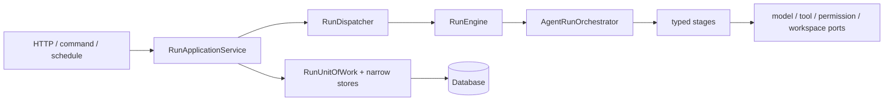

# Astra 后端目标架构

本文描述重构后的代码导航入口与不可破坏的边界。领域词义以
[`domain-glossary.md`](domain-glossary.md) 为准；历史迁移关系以
[`migration-map.md`](migration-map.md) 为准。

## 主要模块地图

| 能力 | 公开入口 | 内部职责 | 不应承担 |
| --- | --- | --- | --- |
| 应用启动 | `app.bootstrap.application:create_application` | 组合依赖、路由、middleware、生命周期 | 业务规则、持久化查询 |
| HTTP 平台 | `app.platform.http` | trace、本机访问、错误映射、请求日志 | 用例编排 |
| Run 管理 | `app.run_management.application:RunApplicationService` | 创建、派发、恢复、审批决定、取消 | Agent 阶段实现、HTTP 映射 |
| Agent runtime | `app.agent_runtime.orchestrator:AgentRunOrchestrator` | 类型化阶段顺序与 outcome 路由 | provider 细节、跨用例提交 |
| Run 持久化 | `app.repositories.run_unit_of_work:RunUnitOfWork` | 组合窄 store、显式 commit/rollback | 自动提交、公共 read-model 拼装 |
| Run 查询 | `app.repositories.run_view_projection:RunViewProjector` | ORM 到 typed public projection | 修改 ORM、触发事务提交 |
| 权限 | `app.permissions` | effect analysis、allow/ask/deny、grant 与 credential scope | 工具执行 |
| Subagent | `app.subagents.facade` | 委派、谱系、预算、权限衰减、join/cancel | 反向依赖 root runner 实现 |
| Workspace / Artifact | `app.workspaces` / `app.artifacts` | 受控可变工作区 / 不可变交付物 | 互相替代概念 |
| Scheduling | `app.scheduling` | 定时配置、claim、投递、心跳 | 导入 HTTP handler |

## Run 调用链

入口只做协议映射；application service 决定事务与派发顺序；runtime 只决定执行
阶段和 outcome。任何新能力若需要越过两个以上边界，应先定义位于概念所有者包的
窄 `Protocol`，再由组合根注入 adapter。

## Agent 阶段与 outcome

一次迭代依次经过：恢复与加载、上下文组装、模型决策、action resolution、effect
analysis、authorization、invocation、observation/evidence、progress/reflection、完成
校验与终态收敛。阶段只返回 `continue`、`wait`、`complete`、`blocked` 或 `failed`
之一；orchestrator 是 outcome 路由的唯一所有者。阶段不得自行启动后台 Run，也不得
将 HTTP response、provider payload 或裸 ORM 字典作为相邻阶段契约。

## 事务与副作用边界

- Repository/store 方法只修改并 `flush`；Run 用例由 `RunUnitOfWork` 显式提交或回滚。
- 创建或恢复 Run 必须先提交，再交给 dispatcher，避免后台 session 看不到状态。
- SSE 事件只在数据库提交成功后发布；回滚不得产生可见事件。
- 模型、网络、工具、sandbox 和文件系统等待前，先持久化 ownership/checkpoint 并结束
  写事务。外部调用结束后开启新事务记录结果。
- approval、continuation token、claim 和 fencing token 必须在同一原子状态转换中消费；
  重放返回冲突，不得部分提交。
- 失败恢复只回滚当前尝试；若恢复动作本身是公开状态（例如恢复原计划并刷新 token），
  application service 必须在返回错误 envelope 前明确提交恢复状态。

## 组合根

`ApplicationContainer` 是运行期依赖的类型化来源。application factory 构造 container、
注册 router/middleware，lifecycle coordinator 按依赖顺序启动并逆序关闭资源。业务模块
不得读取任意 `app.state` 字段；HTTP dependency 只暴露所需的类型化 service。测试通过
同一 factory 覆盖 container 端口，不复制生产组装逻辑。

## 可读性约束

模块名表达概念所有权，类名表达稳定角色，方法名表达用例或状态转换。公共调用链应能从
入口连续读到副作用边界；禁止永久 `compat`/`legacy` facade、跨包 re-export、巨型
`Manager`/`Repository` 和依赖私有函数的测试。默认预算为模块 500 行、函数 60 行、复杂度
10；任何代码不得超过模块 800 行、函数 100 行或复杂度 15。
