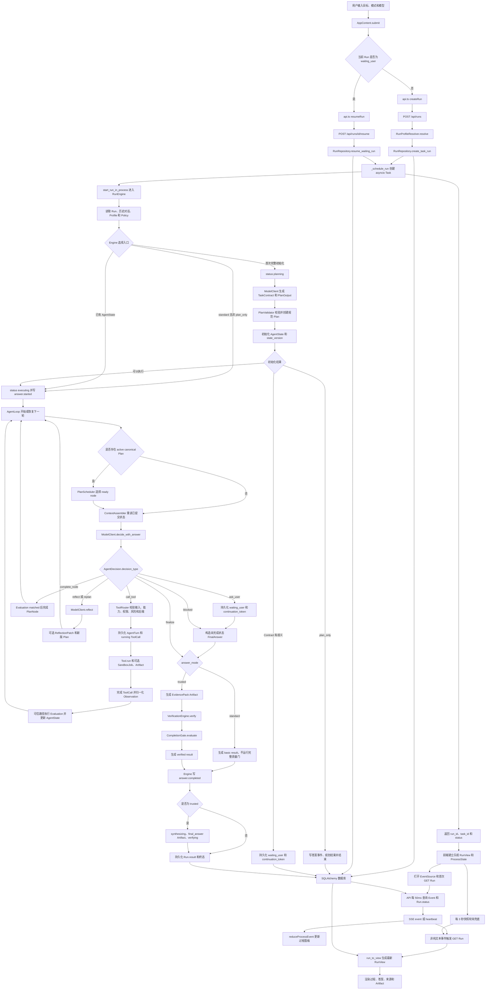
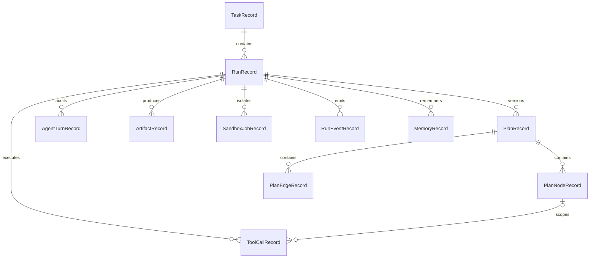

# Astra 端到端代码串讲：一次用户提问如何变成可信答案

本文只讲当前仓库中已经存在的代码，并严格按照一次请求真正发生的时间顺序展开。阅读时建议同时打开 IDE，按每节给出的“代码入口”跳转；不要先按目录逐个读文件，那样很容易把数据结构、运行时骨架和真正的主调用链混在一起。

本文基于当前工作区实现，覆盖以下完整链路：

```text
输入与策略选择
  -> POST /api/runs
  -> Task / Run / Policy / Profile 持久化
  -> 进程内调度 RunEngine
  -> standard 快速路径 或 trusted 可信路径
  -> AgentLoop 多轮决策
  -> ToolCall / SandboxJob / Artifact
  -> Observation / Evaluation / Reflection / PlanPatch
  -> FinalAnswer / Verification / CompletionGate
  -> Run.result 与持久化 Event
  -> SSE + RunView 快照
  -> React 过程面板与最终答案
```

## 0. 先建立一张完整调用图



这张图使用基础 `graph TD` 语法，以兼容当前文档渲染器。`SCHEDULE` 之后，Engine 后台执行与前端的 SSE/快照观察链路实际并行推进。最重要的事实仍然是：**SSE 不是执行状态本身，模型输出也不是最终事实本身。数据库中的 Run、Plan、Turn、ToolCall、Artifact、Event 和 `Run.result` 才是系统可恢复、可展示、可审计的状态。**

## 1. 从前端发送开始：`submit()` 构造的不是一条普通聊天消息

### 1.1 代码入口

- [`frontend/src/App.tsx`](../frontend/src/App.tsx)：`AppContent()`、`submit()`、监听 Run 的 `useEffect()`。
- [`frontend/src/api.ts`](../frontend/src/api.ts)：`createRun()`、`resumeRun()`、`getRun()`、`streamRunEvents()`。
- [`frontend/src/types.ts`](../frontend/src/types.ts)：`RunView`、策略与展示类型。

`AppContent()` 同时维护三类状态：

1. 用户输入和策略：`goal`、`answerMode`、`reasoningEffort`、`planningStrategy`、`reflectionEnabled`、`executionMode`。
2. 后端快照：`run: RunView | null`。
3. 尚未进入最终快照的实时状态：`streamingAnswer`、`processState`、增量缓冲区和刷新定时器。

用户提交时，`submit()` 会先拒绝空输入和并发提交，然后把 UI 选项翻译成后端协议：

```ts
const created = run?.status === 'waiting_user'
  ? await resumeRun(run.id, trimmedGoal, continuationToken, modelConfig)
  : await createRun(trimmedGoal, run?.task_id, answerMode, {
      reasoning_effort: conversationStrategyRef.current.reasoning_effort,
      max_tool_calls: conversationStrategyRef.current.max_tool_calls,
      planning_strategy: conversationStrategyRef.current.planning_strategy,
      reflection_enabled: conversationStrategyRef.current.reflection_enabled,
      reflection_trigger: conversationStrategyRef.current.reflection_trigger,
      execution_mode: executionMode === 'plan'
        ? 'plan_only'
        : executionMode === 'bypass'
          ? 'auto_approval'
          : 'request_approval',
      verification_level: 'standard',
    }, modelConfig);
```

这里有三个容易误读的点：

- `task_id` 表示对话容器，当前这次执行会创建新的 `Run`；所以连续追问是“同一个 Task 下的多个 Run”。
- `waiting_user` 不创建新 Run，而是通过 `resumeRun()` 恢复原 Run。
- 前端提交的是 requested policy。后端还会根据 `answer_mode` 和风险规则编译出 effective policy，二者不一定完全相同。

### 1.2 为什么接口返回后界面立刻出现用户消息

`POST /api/runs` 返回的只是：

```json
{
  "task_id": "...",
  "run_id": "...",
  "status": "created",
  "answer_mode": "standard"
}
```

前端不会等第一次 `GET`，而是先构造一个最小的乐观 `RunView`：

```ts
const current = normalizeRunView({
  id: created.run_id,
  task_id: created.task_id,
  status: created.status,
  result: null,
  steps: [], tool_calls: [], artifacts: [], events: [], turns: [], memories: [],
  chat_messages: [{
    id: `optimistic-${created.run_id}`,
    role: 'user',
    content: trimmedGoal,
    status: 'completed',
    metadata: {},
  }],
} as RunView);
```

随后 `createOptimisticProcessState()` 先显示“正在理解任务并制定计划”，并异步请求第一次 `getRun(run_id)`。因此首屏响应速度不依赖后台是否已经进入模型调用。

## 2. HTTP 入口：`create_run()` 冻结一次 Run 的运行事实

### 2.1 应用启动与路由注册

代码入口是 [`backend/app/main.py`](../backend/app/main.py) 的 `create_app()`。它完成四件事：

1. 启动 `RuntimeProfileService`，并修正上次中断的 usage 记录。
2. 注册 CORS。
3. 挂载 runs、conversations、preferences、runtime、tools、usage 路由。
4. 把业务错误、Pydantic 请求错误、数据库错误统一转成稳定错误包。

Run 主入口位于 [`backend/app/api/runs.py`](../backend/app/api/runs.py) 的 `create_run()`。

### 2.2 `CreateRunRequest` 是前后端的第一道契约

定义在 [`backend/app/schemas/agent.py`](../backend/app/schemas/agent.py)：

```python
class CreateRunRequest(BaseModel):
    goal: str = Field(min_length=1, max_length=4000)
    task_id: str | None = None
    answer_mode: AnswerMode = AnswerMode.standard
    reasoning_policy: RequestedReasoningPolicy = Field(default_factory=RequestedReasoningPolicy)
    model: dict[str, str] | None = None
```

`create_run()` 依次执行：

```python
tool_states = await ToolSettingsRepository(session).get_or_create(...)
run_settings = apply_tool_states(settings, tool_states)
run_settings = _apply_model_config(run_settings, payload.model)
profile = RunProfileResolver().resolve(payload.answer_mode, payload.reasoning_policy)
run = await repo.create_task_run(
    goal,
    run_settings.model_policy,
    payload.task_id,
    reasoning_policy=profile.reasoning_policy.model_dump(mode="json"),
    answer_mode=profile.answer_mode.value,
    execution_profile=profile.model_dump(mode="json"),
    agent_profile_snapshot=load_agent_profile().snapshot(),
)
```

这段代码把可持久化、可审计的运行事实冻结进 Run，同时把凭据仅保留在本次后台执行使用的 `run_settings` 中：

- 数据库中的工具启停状态被应用到本次 `Settings`。
- 前端选定的 provider、model、base URL 和 API key 会覆盖本次执行使用的服务默认配置；持久化的 `model_policy` 只记录 provider、model 和 base URL，不保存 API key。
- `RunProfileResolver` 生成不可变 `RunExecutionProfile`。
- `AgentProfile` 的身份文档快照随 Run 固化，运行中修改文件不会改变已创建 Run 的身份。

### 2.3 standard 与 trusted 在这里第一次真正分叉

[`backend/app/runner/reasoning.py`](../backend/app/runner/reasoning.py) 的 `RunProfileResolver.resolve()` 是产品模式到运行事实的翻译器。

| 运行事实 | `standard` | `trusted` |
|---|---|---|
| `reasoning_effort` | 强制 `fast` | 保留用户选择 |
| `max_tool_calls` / `max_turns` | 不设置 Run 级上限，仅受部署硬上限约束 | 保留用户选择并受部署硬上限约束 |
| `planning_strategy` | 强制 `adaptive` | 保留 `adaptive` / `plan_first` |
| Reflection | 关闭 | 按用户策略 |
| `contract_mode` | `system_minimal` | `model` |
| `assurance_level` | `basic` | `full` |
| 验证器 | Artifact 引用边界 | Task Adapter + Artifact 引用边界 |

`PolicyCompiler.compile()` 进一步把推理强度编译成 `RunBudgets`。例如 `fast`、`balanced`、`deep` 会得到不同的 plan depth、turn、tool、reflection、replan 上限；用户提供的 `max_tool_calls` 会写入预算，但真正运行时还会再与服务端 Settings 取较小值。

### 2.4 Task、Run 和事件如何第一次落库

[`backend/app/repositories/runs.py`](../backend/app/repositories/runs.py) 的 `create_task_run()` 是持久化入口：

```python
task = await session.get(TaskRecord, task_id) if task_id else None
if task is None:
    task = TaskRecord(title=goal[:240], description=goal, ...)

run_policy = {**model_policy, "conversation_goal": goal}
run = RunRecord(
    task=task,
    status="created",
    mode="web_agent",
    answer_mode=answer_mode,
    execution_profile=deepcopy(execution_profile or {}),
    model_policy=run_policy,
    agent_profile_snapshot=deepcopy(agent_profile_snapshot or {}),
    reasoning_policy=reasoning_policy or {},
)
await add_event(run.id, "run.created", {"goal": goal, "status": run.status})
```

创建完成时至少已经存在：`TaskRecord`、`RunRecord`、`run.created`，以及可选的 `agent_profile.frozen`。所以即使稍后的模型调用失败，用户请求和失败前的配置仍能被审计。

## 3. API 为什么立刻返回：后台执行是进程内 Task

`create_run()` 在提交数据库后调用 `_schedule_run()`：

```python
task = asyncio.create_task(
    start_run_in_process(run_id, settings),
    name=f"astra-run-{run_id}",
)
_background_tasks.add(task)
_background_tasks_by_run[run_id] = task
```

强引用集合防止 Task 在完成前被回收，并允许取消接口按 `run_id` 找到它。真正入口是：

```text
start_run_in_process()
  -> RunEngine(settings)
  -> RunEngine.run(run_id)
  -> RunEngine._run_with_repo(repo, run_id)
```

当前没有 Redis、Celery 或独立 worker。数据库状态可以保留，但正在执行的协程属于当前 FastAPI 进程；进程退出后，恢复依赖持久化 checkpoint 逻辑，而不是任务队列自动接管。

## 4. `RunEngine` 接管：恢复 Profile、对话上下文并选择主路径

代码入口是 [`backend/app/runner/engine.py`](../backend/app/runner/engine.py)。

### 4.1 `run()` 负责最外层错误边界

`RunEngine.run()` 先把 `DatabaseUsageRecorder(run_id)` 绑定到模型客户端，使模型调用可以按 Run 计量；然后新建数据库 Session 调 `_run_with_repo()`。

异常被分成两类：

- Profile、模型配置、模型输出和 HTTP 请求错误：Run 进入 `blocked`。
- 未分类异常：Run 进入 `failed`。

两类都会先写 `run.error`，再持久化结构化 `error_result`。`CancelledError` 不在这里吞掉，而是先冲刷未提交答案增量，再交给外层把 Run 标为 `cancelled`。

### 4.2 对话上下文不是浏览器把全部消息重新传回

`_conversation_goal()` 查询同一 Task 下最多最近六个历史 Run：

```python
context_lines.extend([
    f"User: {previous_goal}",
    f"Assistant: {item.summary or ''}",
])
return (
    "Conversation context:\n"
    + "\n".join(context_lines)
    + f"\nCurrent user request: {current_goal}"
)
```

因此后端对话记忆来自持久化的历史 `Run.summary`，不是前端 React state，也不是把每个工具消息原样回传。

### 4.3 真实主路径判断

当前最关键的分支在 `_run_with_repo()`：

```python
if (
    execution_profile is not None
    and execution_profile.answer_mode == AnswerMode.standard
    and policy_snapshot.effective.execution_mode.value != "plan_only"
):
    await self._execute_agent_loop(repo, run_id, goal)
    return

if run.state_version and run.agent_state:
    await self._execute_agent_loop(repo, run_id, goal)
    return
```

含义是：

- 普通 `standard` 请求直接进入 Agent Loop，不创建 TaskContract、规范 Plan 或 AgentState。
- `trusted` 请求先进入规划阶段。
- 已有 `AgentState` 的恢复请求不重复规划。
- `plan_only` 即使是 standard 也要先生成计划，因为它的交付物就是计划。

这比简单理解为“所有请求先规划再执行”更准确。

## 5. trusted 规划阶段：从模型输出变成可执行规范 Plan

### 5.1 `_prepare_plan()` 根据策略选择模型调用

| 策略 | Contract | Plan |
|---|---|---|
| 历史 `direct` | 默认或模型 Contract | 单节点默认计划 |
| `adaptive` | trusted 下调用模型 Contract | 单节点“自适应处理”计划 |
| `plan_first` | 模型 Contract | 模型 Plan，与 Contract 并发生成 |
| 通用 runtime 关闭 | 兼容路径 | 只调用模型 Plan；但执行阶段会拒绝旧 runtime |

`plan_first` 使用 `asyncio.gather(..., return_exceptions=True)` 并发执行 `contract()` 和 `plan()`。`ModelOutputError` 会触发安全回退；其他异常继续向上抛出。

当前代码还对空计划做了两层防御：

1. `PlanOutput.steps` 在 Pydantic 层要求 `min_length=1`。
2. `_resolve_plan()` 和 `plan_output_to_draft()` 对绕过正常校验的空列表仍生成单节点默认计划。

这保证 `PlanDraft.nodes` 不会为空，调度器始终有合法根节点。

### 5.2 模型的 `PlanOutput` 还不是数据库中的 Plan

模型只返回较轻的结构：

```python
class PlanOutput(BaseModel):
    steps: list[PlanStep] = Field(min_length=1)
    required_tools: list[str] = Field(default_factory=list)
    success_criteria: list[str] = Field(default_factory=list)
    risk_level: str = "low"
```

[`backend/app/runner/planning.py`](../backend/app/runner/planning.py) 的 `plan_output_to_draft()` 将其升级成 `PlanDraft`：

- 为节点生成稳定的 `step-1`、`step-2` key。
- 非 direct 策略默认把节点串成前后依赖。
- 把 Contract 的 criterion ID 写进 `success_criteria_refs`。
- 为每个节点生成 `ExpectedObservation`。
- 把 `required_tools` 转成 `required_capabilities`。

### 5.3 `PlanValidator` 在落库前验证什么

`PlanService.create()` 先调用 `PlanValidator.validate()`：

- node key 唯一；
- 依赖引用存在且不能自依赖；
- success criterion 引用存在；
- required capability 在当前工具注册表能力集合内；
- DAG 无环且至少有一个根；
- 节点数和最大深度不超过预算。

通过后，[`backend/app/repositories/plans.py`](../backend/app/repositories/plans.py) 的 `PlanRepository.create()` 才写入：

```text
PlanRecord(version=N, status=active/planned)
  ├─ PlanNodeRecord(step-1, ...)
  ├─ PlanNodeRecord(step-2, ...)
  └─ PlanEdgeRecord(predecessor -> successor)
```

`RunRecord.active_plan_id` 指向唯一活动版本；新 Plan 版本激活时，旧活动版本变成 `superseded`。

### 5.4 初始化 AgentState，或停在 `waiting_user` / `plan_only`

`canonical_agent_state()` 生成初始 `AgentState`，随后 `initialize_reasoning_state()` 一次写入：

- `task_contract`
- `plan_graph` 展示投影
- `agent_state`
- `state_version`

如果 Contract 标记目标有歧义，Engine 调 `set_waiting_state()` 保存 `continuation_token` 并停止。如果执行模式是 `plan_only`，Plan 保持 `planned`，Run 直接返回“规划已生成”；之后调用 `/activate-plan` 才把同一 Plan 激活并继续执行。

## 6. 进入 `AgentLoop`：一次循环开始前建立所有运行边界

代码入口是 [`backend/app/runner/agent_loop.py`](../backend/app/runner/agent_loop.py) 的 `AgentLoop.run()`。

Engine 先把 Run 改为 `executing`，写 `answer.started`，再调用：

```python
loop_result = await agent_loop.run(
    repo,
    run_id,
    goal,
    on_answer_delta=lambda delta: self._handle_answer_delta(repo, run_id, delta),
)
```

`AgentLoop.run()` 初始化：

- `ContextAssembler`：每轮重建模型上下文。
- `MemoryManager`：提取并持久化 memory candidates。
- `VerificationEngine`：聚合验证结果。
- `ArtifactService`：接收、校验和登记文件。
- `SandboxJobService`：管理隔离计算任务。
- `PlanScheduler`：选择 ready node。
- `LoopOrchestrator`：检查关键阶段转换是否合法。
- `NoProgressDetector`：连续三次无证据、准则、节点或计划版本变化时触发信号。

真正预算取两层限制的较小值：

```python
max_turns = settings.agent_max_turns if policy.budgets.max_turns is None else min(policy.budgets.max_turns, settings.agent_max_turns)
max_tool_calls = settings.agent_max_tool_calls if policy.budgets.max_tool_calls is None else min(policy.budgets.max_tool_calls, settings.agent_max_tool_calls)
max_reflections = min(policy.budgets.max_reflections, settings.agent_max_reflections)
max_replans = min(policy.budgets.max_replans, settings.agent_max_replans)
```

`standard` 将前两项 Run 级预算记录为 `None`，因此直接采用部署硬上限；`trusted` 仍取用户预算与部署硬上限的较小值。

### 6.1 中断恢复发生在新 turn 前

Loop 会检查最后一个 `AgentTurn` checkpoint：

- `phase=result_recorded` 且 ToolCall 已有 output：重新归一化结果并提交 Observation，不重复执行工具。
- `phase=executing` 且工具是 `read_only`：标记旧调用中断，允许按同一幂等语义重试。
- `phase=executing` 且工具不是只读：进入 `waiting_user`，因为外部副作用是否发生已经未知。

这就是 `AgentTurn.phase` 的意义：它不是展示文案，而是恢复协议。

## 7. 每个 turn 的第一步：选节点，再重建 Context

### 7.1 trusted 路径只允许一个 active node

`PlanScheduler.select_next()`：

1. 读取活动 Plan。
2. 找出依赖节点全为 `completed` 的 pending 节点。
3. 按 index 选择第一个。
4. 执行 `pending -> running`。
5. 把 node ID 写入 `AgentState.active_node_id` 并增加状态版本。

若前驱已 `failed` 或 `blocked`，后继会被标为 `dependency_broken`。节点状态转换还受 `NODE_TRANSITIONS` 限制，completed 节点不能重新打开。

standard 快速路径没有规范 Plan，所以 `canonical_plan` 和 `active_node` 都是 `None`，模型直接围绕整个 goal 决策。

### 7.2 `ContextAssembler.assemble()` 决定模型能看见什么

每轮都重新读取数据库，而不是沿用上一轮 Python 字典：

```python
return {
    "run_id": run_id,
    "goal": goal,
    "tool_manifests": {...},
    "unavailable_capabilities": unavailable,
    "observations": observations,
    "evidence_pack": evidence_pack or {},
    "memory_reads": [...],
    "reasoning_policy": run.reasoning_policy or {},
    "answer_mode": run.answer_mode,
    "execution_profile": run.execution_profile or {},
    "task_contract": run.task_contract or {},
    "plan_graph": plan_view,
    "active_node": active_node,
    "agent_state": run.agent_state or {},
}
```

工具 manifest 先经过 `ToolRouter.eligible_specs()`，再按 active node 的 `required_capabilities` 收窄。Memory 当前通过 `list_memories(run_id=run_id, limit=8)` 读取，所以注入的是本 Run memory；数据模型虽支持 workspace/user scope，但这里没有跨 Run 检索。

## 8. 模型协议：模型返回 JSON 决策，流式文字只是其中两个字段

代码入口是 [`backend/app/runner/model_client.py`](../backend/app/runner/model_client.py)。

### 8.1 Profile 如何进入每次模型调用

`RunEngine` 用已冻结快照调用 `model_client.bind_agent_profile(profile)`；`OpenAICompatibleModelClient` 再创建 `PromptComposer(profile)`。不同操作使用 `ModelOperation` 选择对应身份文档组合，运行上下文通过 `PromptComposer.runtime_context()` 作为带边界的数据传入。

### 8.2 `decide_with_answer()` 的返回协议

模型必须返回一个 JSON 对象，核心结构可以简化为：

```json
{
  "decision_type": "call_tool | complete_node | reflect | replan | finalize | ask_user | blocked",
  "reasoning_summary": "可向用户审计的简短摘要",
  "tool_name": "web_search",
  "tool_input": {},
  "target_step_id": "...",
  "node_result": {},
  "final_answer": {
    "summary": "完整用户答案",
    "findings": [],
    "sources": [],
    "caveats": [],
    "verification_notes": []
  }
}
```

`reasoning_summary` 不是隐藏思维链；系统提示明确要求它简短、可审计。`final_answer` 只在 `finalize` 时出现。

### 8.3 为什么 JSON 还可以流式显示自然语言

`_chat_json()` 在接收 provider 的流式 token 时，一边累积完整 JSON，一边从未完成 JSON 中抽取字符串字段：

- `reasoning_summary` -> `on_reasoning_delta()` -> `reasoning.summary.delta`。
- `final_answer.summary` -> `on_answer_delta()` -> `answer.delta`。

JSON 完成后仍必须通过 `AgentDecision` 和 `FinalAnswer` 的 Pydantic 校验。无法解析时会产生 `ModelOutputError`；Loop 重置可能已经显示的答案流，记录 `model_error` Observation，并按策略决定是否 Reflection。

### 8.4 为什么节点处理中不向用户流出“半成品答案”

Loop 只有在没有 active node 时才把 `on_answer_delta` 传给模型：

```python
on_delta = on_answer_delta if canonical_plan is None or active_node is None else None
```

如果模型在处理最后一个节点时返回 `finalize`，该内容先只作为节点完成候选；节点通过 Evaluation 后，Loop 再开启一个没有 active node 的 canonical final turn，让最终用户答案从头流式生成。这样不会把“节点结果”误当成“任务最终答案”。

## 9. 决策分派：每种 `decision_type` 到底走到哪里

### 9.1 所有已接受决策先成为 `AgentTurn`

模型决策通过 active node 和能力检查后，`create_agent_turn()` 保存：

- `turn_index`
- `decision_type` 与 `reasoning_summary`
- 完整 decision JSON
- memory reads
- state / plan version
- plan node
- tool 幂等键
- checkpoint phase

同时产生 `agent_turn.created`。所以 AgentTurn 是“一次读取上下文、决定动作并记录结果”的审计单元，不等同于聊天消息。

### 9.2 `finalize`

- 有 active node：把 `node_result` 或候选答案转成 Observation，经 Evaluation matched 后完成节点，不能结束整个任务。
- 没有 active node：保存 `streamed_final_answer` 并退出 turn 循环。

### 9.3 `complete_node`

只允许 trusted 规范 Plan 的 active node 使用。`evaluate_node_completion()` 构造节点 Observation；只有 `ObservationEvaluator` 返回 `matched`，`PlanService.complete_node()` 才允许 `running -> completed`。

### 9.4 `ask_user` / `blocked`

两者都会记录 Observation 并停止循环。`ask_user` 还调用 `set_waiting_state()` 保存请求、state version、plan version 和 continuation token。

### 9.5 `reflect` / `replan`

`reflect` 以 `model_requested` 信号进入 Reflection。`replan` 先消耗 replan 预算，再以 `dependency_broken` 信号反思；真正改变计划必须返回可执行 `PlanPatch`。

### 9.6 其他非工具动作

被归一为 `agent_state` Observation，写入 Turn，然后下一轮重新组装 Context。若连续无进展，`NoProgressDetector` 会触发 Reflection 信号。

## 10. 工具调用主链：Decision 不会绕过 Router 直接执行工具

### 10.1 工具注册表

[`backend/app/tools/registry.py`](../backend/app/tools/registry.py) 的 `build_tool_registry()` 当前注册：

- `web_search`
- `web_fetch`
- `chart.render`（只有 sandbox runtime 可用时）

每个工具在 [`backend/app/tools/base.py`](../backend/app/tools/base.py) 中通过 `ToolSpec` 声明输入 schema、capabilities、permissions、risk、side effect 和 execution backend。

### 10.2 `ToolRouter.resolve()` 的五层检查

执行前必须同时满足：

1. 工具名存在且在 allowlist 中。
2. 必填输入存在。
3. capability 被允许。
4. permission 被允许。
5. risk 和 execution backend 被当前运行环境允许。

trusted 路径还额外检查该工具是否满足 active node 声明的 required capability。模型即使生成了合法工具名，也不能越过节点能力边界。

当前 `request_approval` / `auto_approval` 会进入策略快照，但 Agent Loop 尚未根据它们实现逐次审批暂停；现有强制边界是 Router、ToolSpec 和 waiting/recovery 机制。阅读代码时不要把 UI 名称推断成已经存在的完整审批工作流。

### 10.3 ToolCall 的 checkpoint 顺序

```text
AgentTurn.phase=prepared
  -> RunRepository.start_tool_call(status=running)
  -> AgentTurn.phase=executing
  -> tool.run(input, ToolExecutionContext)
  -> RunRepository.finish_tool_call(output/error)
  -> AgentTurn.phase=result_recorded
  -> output 归一化为 Observation
  -> AgentTurn.phase=committed
```

`ToolExecutionContext` 把 `run_id`、`tool_call_id`、`step_id`、trace ID、ArtifactService 和 SandboxJobService 传给工具。工具不需要自行操作 Run 表。

### 10.4 Web 工具与图表工具的不同执行面

- [`backend/app/tools/web.py`](../backend/app/tools/web.py) 的搜索与抓取在进程内执行。`web_search` 的 auto 模式按已配置 Google/Brave，再到无密钥 Bing/DuckDuckGo fallback 选择 provider，并在 output 中记录 attempts、degraded 和 warnings。
- [`backend/app/tools/chart.py`](../backend/app/tools/chart.py) 的 `chart.render` 把声明式请求写入临时输入目录，再通过 SandboxJobService 调隔离 runtime，禁用网络，最后收集 PNG/SVG/HTML 等输出。

### 10.5 Artifact 不是任意文件路径

[`backend/app/artifacts.py`](../backend/app/artifacts.py) 的 ArtifactService/Collector 对文件数量、大小、路径、MIME、安全状态和存储 key 做检查；只有 `security_status=verified` 且存在 `storage_key` 的 Artifact 才会在 `RunView` 中获得 `content_url`。

最终答案中的 `artifact_ids` 还会被 `normalize_final_answer_artifact_references()` 再清洗一次：必须属于当前 Run、可访问、去重。模型编造、跨 Run 或未验证 ID 会被移除并进入验证警告。

## 11. 工具 output 如何变成下一轮能理解的 Observation

`ToolCall.output` 是工具的原始审计结果；Agent 不直接把它当成任务事实。

`ProcessorRegistry` 根据工具选择 Adapter：

- `WebTaskAdapter`：把搜索、抓取结果转成来源相关 Observation，并累计 Evidence Pack 所需信息。
- `ChartTaskAdapter`：把 Sandbox 和 Artifact 结果转成图表 Observation。
- 无专用 Processor：生成通用 `tool_result` Observation。

trusted 路径继续调用 `ObservationEvaluator.evaluate()`：

```text
status=failed                         -> mismatch
没有 ExpectedObservation             -> inconclusive
kind 匹配且缺少 required fields       -> partial
kind 匹配且字段齐全                   -> matched
```

matched 会把关联 success criteria 更新为 satisfied。注意：**工具成功只表示 ToolCall succeeded；节点是否完成还取决于 Observation 是否满足 ExpectedObservation。**

standard 快速路径在工具成功后直接提交 Turn 并进入下一轮，不创建 Evaluation、AgentState 或规范节点。

## 12. 状态更新、Memory、Reflection 与 Replan

### 12.1 `state_version` 是乐观并发边界

`persist_progress()` 从数据库重读当前 Run，更新 observations、failure fingerprints、evaluations、criterion status、budget usage 和 active plan，再调用：

```python
update_reasoning_state(
    run_id,
    expected_version=current.state_version,
    agent_state=state.model_dump(mode="json"),
    ...,
)
```

Repository 要求数据库版本等于 `expected_version`，且新版本必须递增。Reflection 也使用同一边界，防止较旧结果覆盖较新状态。

### 12.2 Memory 当前如何写和读

每轮工具结果后以及最终化前，`MemoryManager.write_candidates()` 可以调用模型提取候选并写入 `MemoryRecord`。workspace/user scope 必须提供 provenance 和 confidence，否则 Repository 拒绝写入并产生 `memory.write_rejected`。

当前 Context 读取仍限定 `run_id`，因此这里的 Memory 更接近本 Run 的结构化工作记忆；跨 Run 长期检索尚未接入该主循环。

### 12.3 ReflectionGate 何时允许反思

- `reflection_enabled=false`：不反思。
- `failure_only`：工具失败、模型输出失败、完成门失败。
- `adaptive`：再增加 expectation mismatch、冲突、低置信度、无进展、依赖断裂、模型主动请求等信号。
- `every_turn`：预算内每轮可触发。

模型返回 `AgentReflection`，其中的 `ReflectionPatch` 可以修改事实、准则、验证要求、终止意图，也可以携带 `PlanPatch`。

### 12.4 PlanPatch 为什么生成新版本而不是原地改 Plan

`PlanService.apply_patch()` 要求：

- `expected_plan_version` 与当前活动版本一致；
- 没有 running 节点；
- completed/running 节点不能被修改；
- 操作后的完整 DAG 重新通过 PlanValidator。

成功后创建新的 `PlanRecord(version+1)`，保留节点 lineage、已完成状态和证据，旧版本变成 superseded。失败则写 `plan.patch_rejected` 或 `reflection.patch_rejected`，不会部分修改当前计划。

## 13. 循环退出后：standard 和 trusted 的最终化再次分叉

### 13.1 先得到并清洗 `FinalAnswer`

退出 turn loop 后：

1. Web Adapter 从尝试记录构造 Evidence Pack。
2. 如果已有流式 `FinalAnswer`，直接复用；否则调用 `model_client.finalize()`。
3. 清洗 Artifact 引用。

若因重试、预算或 blocked 退出，则构造一份“运行状态说明”作为 FinalAnswer，不把未完成任务伪装成成功答案。

### 13.2 standard 快速终态

`quick_mode` 分支：

```python
result = final_answer.model_dump()
result["answer_mode"] = "standard"
result["assurance_level"] = "basic"
result["verification_report"] = None
result["completion_decision"] = None
```

它保留 ToolRouter 和 Artifact 引用安全边界，但跳过：

- Evidence Pack Artifact
- Memory 写入
- Task Adapter 完整验证
- VerificationReport
- CompletionGate
- synthesizing / verifying 两个持久化阶段

Engine 直接把 `Run.result` 写成终态。这是产品的低延迟路径，不应与 trusted 的完整可信链混为一谈。

### 13.3 trusted 可信终态

trusted 路径继续：

1. 写 `evidence_pack` Artifact。
2. 提取最终 Memory candidates。
3. Adapter 执行任务类型验证。
4. `VerificationEngine.verify()` 合并来源、Artifact 和 Adapter 结果。
5. 把 ValidationOutcome 回写 success criteria。
6. `CompletionGate.evaluate()` 检查计划、Contract、强制准则、验证要求和 waiting state。

CompletionGate 的顺序是：

```text
runtime error               -> failed
需要用户输入                -> waiting_user
必需 PlanNode failed/blocked -> blocked
必需 PlanNode 未完成         -> continue
强制准则或验证未满足         -> blocked
只有 warning                -> completed_with_warnings
全部满足                    -> completed
```

如果循环已经退出却得到 `continue`，当前代码会把它收敛为 `blocked`，因为已经没有后续 turn 可以完成剩余节点。

最终 `Run.result` 在 `FinalAnswer` 基础上增加：

- `answer_mode`
- `assurance_level`
- `verification_report`
- `completion_decision`
- `audit_refs`

## 14. Engine 如何把最终答案变成前端可消费的事件和快照

### 14.1 答案流的四个关键事件

[`backend/app/runner/engine.py`](../backend/app/runner/engine.py) 管理答案事件：

| Event | 含义 |
|---|---|
| `answer.started` | 新答案流开始，清空前端旧缓冲 |
| `answer.delta` | 可展示的 summary 增量 |
| `answer.settling` | 文本字段结束，正在结构化和验证 |
| `answer.completed` | 完整、清洗后的 summary，可覆盖临时文本 |

增量按“首段立即，之后约 20ms 或 96 字符”批量提交，避免每个 token 都写数据库。内部 `\0` 表示重置流，`\1` 表示 summary 字段结束；它们不会进入用户正文。

### 14.2 trusted 的最终状态提交

Engine 收到 Loop 结果后，先 `answer.completed`，再进入 `_finalize_agent_loop()`：

```text
synthesizing
  -> 保存 final_answer Artifact
verifying
  -> 更新展示 Step 的验证证据
terminal status
  -> 写 summary + Run.result
```

因此存在一个很短的窗口：前端已经收到完整答案文字，但 `Run.result` 仍未提交。前端用 `answerSettling` 表示“正在整理并验证”，直到刷新到终态快照。

## 15. SSE 只负责通知，`RunView` 才是完整展示快照

### 15.1 后端事件流

`stream_run_events()` 每 50ms 查询：

```python
events = await stream_repo.list_events(run_id, last_id)
```

事件按数据库自增 ID 顺序发送，支持 `after_id` 续传。连接开始先发 `stream.ready`；Run 进入 Repository 定义的终态后关闭。`waiting_user` 也会关闭 SSE，因为这次执行已暂停，之后 resume 会重新建立流。

### 15.2 `run_to_view()` 如何构造快照

[`backend/app/repositories/runs.py`](../backend/app/repositories/runs.py) 的 `run_to_view()` 聚合：

```text
Run
  + active canonical Plan -> steps
  + ToolCalls
  + Artifacts
  + SandboxJobs
  + Events
  + AgentTurns
  + Memories
  + chat_messages
  + policy / contract / agent_state / waiting_state
  + RunResult
```

存在规范 Plan 时，API 的 `steps` 来自 active PlanNode 投影；否则才回退到旧 `StepRecord`。这避免两个可写计划来源互相覆盖。

Artifact 的内部 `storage_key` 不会发给前端，只有验证通过时生成 `/api/artifacts/{id}/content`。Profile 也通过 `safe_agent_profile_manifest()` 只暴露文件名、哈希、大小和状态，不暴露身份文档正文。

### 15.3 前端如何合并 SSE 与快照

监听 Run 的 `useEffect()` 同时做三件事：

1. `streamRunEvents()` 实时接收事件。
2. 非纯文本事件触发短延时 `getRun()` 刷新。
3. 每 3 秒轮询兜底，SSE 断开也能恢复。

文本增量和过程事件都先进入 ref 缓冲，再用 `requestAnimationFrame` 批量更新 React state，避免高频事件导致每 token 重渲染。

[`frontend/src/processStream.ts`](../frontend/src/processStream.ts) 的 `reduceProcessEvent()` 把后端事件投影成过程面板条目；`reconcileProcessSnapshot()` 又能从完整 `RunView` 重建过程状态。因此页面刷新后不依赖丢失的内存事件也能恢复展示。

[`frontend/src/conversations.ts`](../frontend/src/conversations.ts) 的 `buildPresentation()` 最终构造三类消息：

- `user`：用户消息。
- `process`：携带 Run 快照的过程面板。
- `assistant`：终态结构化答案。

流式期间 App 会暂时过滤正式 assistant 消息，显示 `streamingAnswer`；终态快照带 `result` 后，临时答案被正式答案替换。

## 16. 暂停、恢复、取消和失败是主流程的一部分

### 16.1 `waiting_user` 与恢复

产生 waiting 的入口包括：

- Contract 有歧义；
- 模型选择 `ask_user`；
- 中断时非幂等行动结果未知。

`set_waiting_state()` 生成 continuation token。前端下一次提交改走 `/api/runs/{id}/resume`；`resume_waiting_run()` 校验 token，把用户输入变成 Observation，清除 Contract 歧义，增加 state version，把同一个 Run 改回 executing，再次调度 Engine。

### 16.2 用户取消

前端调用 `/api/runs/{id}/cancel`。API 先取消内存中的 asyncio Task，再调用 Repository 收敛数据库状态：

- pending/running Step -> cancelled
- pending/running PlanNode -> blocked，failure=`user_cancelled`
- running ToolCall / SandboxJob -> cancelled
- active AgentTurn -> cancelled
- running ModelInvocation -> interrupted
- Run -> cancelled

已产生的 `answer.delta` 会拼成 partial answer，保留在取消结果中。重复取消同一个 Run 是幂等的。

### 16.3 模型和基础设施失败

ModelClient 的格式错误先在 Loop 内成为 Observation，并可能反思重试；模型配置、网络错误或未恢复异常越过 Loop 后由 Engine 统一写 `run.error`。HTTP 层只负责把创建/读取阶段的异常转成用户可读 ErrorEnvelope，不替代 Run 内错误记录。

## 17. 数据实体之间的关系：结合表结构看调用链

定义集中在 [`backend/app/db/models.py`](../backend/app/db/models.py)：



把这些实体按职责分成四层更容易理解：

| 层 | 实体 | 作用 |
|---|---|---|
| 对话与执行 | Task、Run | 一段对话与其中一次执行 |
| 计划与推理 | Plan、PlanNode、PlanEdge、AgentState、AgentTurn | 计划版本、活动节点、决策与恢复 checkpoint |
| 外部行动 | ToolCall、SandboxJob、Artifact | 执行、隔离环境和可交付文件 |
| 观察与交付 | Event、Memory、Run.result | 实时通知、工作记忆和最终稳定结果 |

## 18. 用一条典型 trusted 请求串起所有关键写入

假设用户问“查询最新数据并生成柱状图”，一条可能的持久化顺序是：

```text
run.created
agent_profile.frozen
reasoning.phase.started(planning)
run.status_changed(planning)
plan.created(version=1, active)
reasoning.state_initialized
reasoning.phase.started(executing)
run.status_changed(executing)
answer.started

plan.node.updated(step-1 -> running)
reasoning.phase.started(selecting_action, turn=1)
reasoning.summary.delta / completed
agent_turn.created(call_tool: web_search)
tool_call.started
tool_call.completed
reasoning.evaluation_created
reasoning.state_updated
agent_turn.updated(committed)

... web_fetch / chart.render 的更多 turn ...

plan.node.updated(last node -> completed)
agent_turn.created(finalize)
answer.delta ...
answer.settling
artifact.created(evidence_pack)
reasoning.completion_decided
verification.created
answer.completed
reasoning.phase.started(synthesizing)
artifact.created(final_answer)
reasoning.phase.started(verifying)
run.status_changed(completed 或 completed_with_warnings)
```

实际事件可能因模型选择、工具失败、Reflection、PlanPatch 或模式不同而变化，但每一步都能在 RunView 的 `events`、`turns`、`tool_calls`、`artifacts` 和 `result` 中找到对应证据。

## 19. 建议按这个顺序在 IDE 中跟读

1. 前端提交：`frontend/src/App.tsx::submit`
2. HTTP 封装：`frontend/src/api.ts::createRun`
3. 请求契约：`backend/app/schemas/agent.py::CreateRunRequest`
4. API 创建：`backend/app/api/runs.py::create_run`
5. Profile 编译：`backend/app/runner/reasoning.py::RunProfileResolver`
6. 初始持久化：`backend/app/repositories/runs.py::create_task_run`
7. 后台调度：`backend/app/api/runs.py::_schedule_run`
8. Engine 分流：`backend/app/runner/engine.py::_run_with_repo`
9. 规划：`RunEngine._prepare_plan` -> `plan_output_to_draft` -> `PlanService.create`
10. Loop：`backend/app/runner/agent_loop.py::AgentLoop.run`
11. 模型协议：`backend/app/runner/model_client.py::decide_with_answer`
12. 工具：`ToolRouter.resolve` -> `Tool.run` -> `RunRepository.start_tool_call`
13. 状态：`persist_progress` -> `update_reasoning_state`
14. 完成：`VerificationEngine.verify` -> `CompletionGate.evaluate`
15. 终态：`RunEngine._finalize_agent_loop`
16. 快照：`RunRepository.run_to_view`
17. SSE：`backend/app/api/runs.py::stream_run_events`
18. 前端归并：`processStream.ts` -> `conversations.ts` -> `App.tsx::MessageBubble`

可以用下面的命令快速定位这些符号：

```bash
rg -n "async function submit|useEffect\(\(\) =>" frontend/src/App.tsx
rg -n "async def create_run|async def stream_run_events" backend/app/api/runs.py
rg -n "async def _run_with_repo|async def _execute_agent_loop" backend/app/runner/engine.py
rg -n "class AgentLoop|async def run\(" backend/app/runner/agent_loop.py
rg -n "class RunRepository|def run_to_view" backend/app/repositories/runs.py
```

## 20. 当前实现边界：读代码时必须保持的几个判断

1. `standard` 不是 trusted 的低预算版本，而是明确跳过规范计划和完整质量门的快速路径。
2. `trusted` 才具有完整 TaskContract、版本化 Plan、AgentState、Reflection、Verification 和 CompletionGate。
3. `request_approval` 当前尚未在 ToolRouter 前形成逐次审批 UI；不要仅凭枚举名认定已实现。
4. SSE 是数据库事件的运输层，不是内存 pub/sub，也不是状态真源。
5. 当前执行调度是 FastAPI 进程内 asyncio Task，不是独立 worker。
6. 当前 Memory 上下文只读取本 Run，跨 Run 长期记忆检索尚未进入主链。
7. `runtime.py` 的 `TRANSITIONS`、`LoopOrchestrator` 和 `NoProgressDetector` 已被 AgentLoop 部分采用，但它不是另一个独立顶层 orchestrator。
8. `StepRecord` 是兼容/展示路径；存在 active canonical Plan 时，PlanNode 才是计划执行事实源。
9. 最终可信交付边界是持久化的 `Run.result`，不是最后一个模型 token，也不是某条 SSE 事件。

## 21. 与主链直接对应的测试

阅读实现时可同时打开这些测试验证语义：

- [`backend/tests/test_api.py`](../backend/tests/test_api.py)：创建、SSE、resume、cancel、默认 standard profile。
- [`backend/tests/test_engine.py`](../backend/tests/test_engine.py)：standard fast path、trusted 规划、空计划 fallback、plan_only 激活、checkpoint 恢复、最终节点重新生成 canonical stream。
- [`backend/tests/test_agent_loop.py`](../backend/tests/test_agent_loop.py)：工具循环、Artifact 引用、Reflection、状态持久化、Verification。
- [`backend/tests/test_reasoning.py`](../backend/tests/test_reasoning.py)：Profile、Policy、ReflectionGate、CompletionGate、恢复策略。
- [`backend/tests/test_plan_runtime.py`](../backend/tests/test_plan_runtime.py)：Plan 校验、调度、PlanPatch、空步骤防御。
- [`backend/tests/test_artifacts_sandbox.py`](../backend/tests/test_artifacts_sandbox.py)：路径逃逸、文件校验、SandboxJob、Artifact 安全。
- [`backend/tests/test_model_client.py`](../backend/tests/test_model_client.py)：部分 JSON 字符串抽取、双字段流式回调和输出归一化。

如果只记住一条主线，可以记成：

```text
Run 冻结策略和身份
  -> Engine 选择 standard / trusted
  -> Loop 每轮把已提交状态组装成 Context
  -> 模型只给 Decision
  -> 系统执行并形成 Observation
  -> trusted 再做 Evaluation / Reflection / CompletionGate
  -> Engine 将结构化结果写入 Run.result
  -> SSE 通知前端刷新这个事实快照
```
