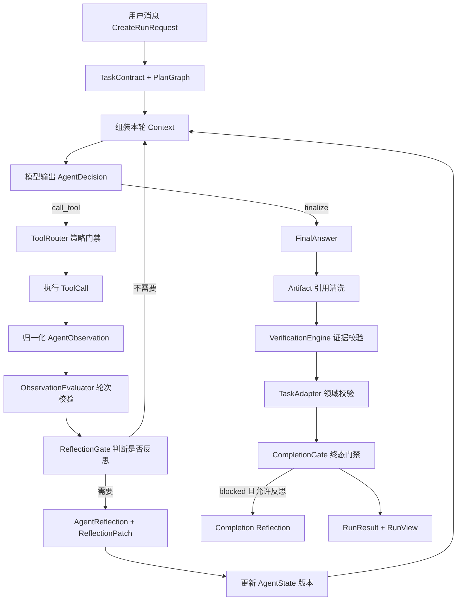

先给结论：在 Astra 当前实现里，校验、反思、门禁是三种不同职责。

- 校验回答“刚才发生的结果是否可信、是否符合预期”。
- 反思回答“如果不符合预期，下一步策略或状态要怎么改”。
- 门禁回答“现在是否允许结束，以及以什么状态结束”。

它们不是简单的：

```text
校验 → 反思 → 门禁
```

而是一个循环：



## 一、“一次对话”实际上有两层

### 1. 用户的一问一答：一个 Run

前端发送的入参是 [`CreateRunRequest`](/Users/levishang/projects/Astra/backend/app/schemas/agent.py:251)：

```json
{
  "goal": "帮我搜索最新的 OpenAI 信息",
  "task_id": "已有对话的 Task ID，可选",
  "reasoning_policy": {
    "reasoning_effort": "balanced",
    "planning_strategy": "adaptive",
    "reflection_enabled": true,
    "reflection_trigger": "adaptive",
    "execution_mode": "request_approval",
    "verification_level": "standard"
  },
  "model": {
    "provider": "openai",
    "name": "gpt-5",
    "api_key": "...",
    "base_url": "..."
  }
}
```

接口立即返回：

```json
{
  "task_id": "task-xxx",
  "run_id": "run-xxx",
  "status": "created"
}
```

对应代码在 [`create_run()`](/Users/levishang/projects/Astra/backend/app/api/runs.py:105)。

同一个 `task_id` 表示同一段连续对话，但每次用户发送消息都会创建新的 `Run`。`RunEngine` 会读取同一 Task 最近六个 Run 的：

```text
User: previous_goal
Assistant: previous_summary
```

再拼上本次请求，见 [`_conversation_goal()`](/Users/levishang/projects/Astra/backend/app/runner/engine.py:274)。

所以模型实际收到的 `goal` 可能是：

```text
Conversation context:
User: 上一个问题
Assistant: 上一次回答摘要
Current user request: 本次问题
```

### 2. Run 内部的一次思考行动：一个 AgentTurn

一个用户 Run 内可能包含多个 `AgentTurn`：

```text
AgentTurn 1：决定搜索
AgentTurn 2：根据搜索结果决定抓取
AgentTurn 3：抓取失败后反思
AgentTurn 4：修改 URL 再抓取
AgentTurn 5：生成答案
```

每个 AgentTurn 最终会记录：

```json
{
  "turn_index": 3,
  "decision_type": "call_tool",
  "reasoning_summary": "需要抓取候选来源正文",
  "selected_tool": "web_fetch",
  "decision": {},
  "observation": {},
  "evaluation": {},
  "reflection": {},
  "reflection_patch": {},
  "state_version_before": 2,
  "state_version_after": 3,
  "phase": "committed",
  "status": "completed"
}
```

持久化输出结构见 [`run_to_view()`](/Users/levishang/projects/Astra/backend/app/repositories/runs.py:903)。

## 二、Run 开始前：先建立后续校验的标准

`RunEngine` 不会直接问模型“答案是什么”，而是先建立 `TaskContract`。

输入：

```json
{
  "goal": "搜索 OpenAI 最新信息"
}
```

模型输出的 [`TaskContract`](/Users/levishang/projects/Astra/backend/app/schemas/agent.py:127)：

```json
{
  "original_goal": "搜索 OpenAI 最新信息",
  "deliverables": ["一份带来源的最新信息总结"],
  "constraints": ["只使用公开来源"],
  "prohibited_actions": ["执行未授权工具"],
  "assumptions": [],
  "success_criteria": [
    {
      "id": "criterion-result",
      "description": "提供有来源支持的最新信息",
      "mandatory": true,
      "verification_method": "task_adapter",
      "status": "pending",
      "evidence_refs": []
    }
  ],
  "verification_requirements": [
    {
      "id": "verify-result",
      "validator": "task_adapter",
      "mandatory": true,
      "config": {}
    }
  ],
  "risk_level": "low",
  "ambiguity_status": "clear",
  "clarification_question": null
}
```

这里最重要的是：

```text
success_criteria = 完成门判断任务是否完成的标准
verification_requirements = 应该由谁、用什么方式验证
```

随后系统执行 [`validate_contract()`](/Users/levishang/projects/Astra/backend/app/runner/reasoning.py:193)，检查：

- 原始目标不能为空；
- 必须有交付物；
- 必须有成功准则；
- 准则 ID 必须唯一；
- 每个准则必须指定验证方式；
- 如果任务有歧义，必须给出澄清问题。

如果 `ambiguity_status != clear`，还没进入 Agent Loop 就会被门禁挡住，状态变为 `waiting_user`。

## 三、每个 AgentTurn 的入参和输出

### 1. 决策模型的入参 Context

每轮由 [`ContextAssembler.assemble()`](/Users/levishang/projects/Astra/backend/app/runner/agent_loop.py:163) 生成：

```json
{
  "run_id": "run-xxx",
  "goal": "完整对话上下文 + 当前问题",
  "tool_manifests": {
    "web_search": {
      "input_schema": {},
      "permissions": ["network_read"],
      "risk": "sandboxed"
    }
  },
  "unavailable_capabilities": {},
  "observations": [],
  "evidence_pack": {},
  "memory_reads": [],
  "reasoning_policy": {},
  "task_contract": {},
  "plan_graph": {},
  "agent_state": {}
}
```

### 2. 决策模型的输出 AgentDecision

模型输出 [`AgentDecision`](/Users/levishang/projects/Astra/backend/app/schemas/agent.py:315)：

```json
{
  "decision_type": "call_tool",
  "reasoning_summary": "问题需要当前网络信息，先搜索候选来源",
  "tool_name": "web_search",
  "tool_input": {
    "query": "OpenAI latest news"
  },
  "target_step_id": "step-1",
  "success_criteria_refs": ["criterion-result"],
  "expected": {
    "kind": "tool_result",
    "success_condition": "至少返回一个有效候选来源",
    "required_fields": ["candidates"]
  },
  "risk_level": "low",
  "confidence": 0.85,
  "fallback": "搜索失败时调整查询"
}
```

`decision_type` 可以是：

- `call_tool`
- `reflect`
- `replan`
- `finalize`
- `ask_user`
- `blocked`

模型决策入口见 [`decide_with_answer()`](/Users/levishang/projects/Astra/backend/app/runner/model_client.py:470)。

如果选择 `finalize`，同一次模型响应还应包含：

```json
{
  "decision_type": "finalize",
  "reasoning_summary": "已有足够信息，可以回答",
  "final_answer": {
    "summary": "完整用户答案",
    "findings": [],
    "sources": [],
    "failed_sources": [],
    "source_quality": [],
    "conflicts": [],
    "caveats": [],
    "verification_notes": []
  }
}
```

## 四、第一类门禁：ToolRouter 策略门禁

当模型输出 `call_tool` 后，不会直接执行工具。

[`ToolRouter.resolve()`](/Users/levishang/projects/Astra/backend/app/runner/agent_loop.py:113) 校验：

```text
工具是否注册
  ↓
是否属于允许工具
  ↓
必填输入是否完整
  ↓
capabilities 是否允许
  ↓
permissions 是否允许
  ↓
risk 是否允许
  ↓
execution backend 是否可用
```

输入：

```json
{
  "tool_name": "web_search",
  "tool_input": {
    "query": "OpenAI latest news"
  }
}
```

成功输出是一个可执行的 `Tool`；失败则抛出：

```json
{
  "category": "permission_denied",
  "message": "Tool permission is not allowed: web_search"
}
```

这是一种“执行前门禁”，解决的是：

> 这个动作能不能执行？

它不是最终 `CompletionGate`，也不判断任务是否已经完成。

## 五、工具结果如何变成可校验对象

工具原始输出首先保存为 `ToolCall.output`。例如现在的自动搜索：

```json
{
  "query": "OpenAI latest news",
  "provider": "bing",
  "provider_mode": "auto",
  "provider_attempts": [
    {
      "provider": "bing",
      "status": "succeeded",
      "candidate_count": 5
    }
  ],
  "degraded": true,
  "candidate_count": 5,
  "warnings": [
    "当前使用无密钥公共搜索入口，不保证商业生产环境的可用性或结果 SLA。"
  ],
  "candidates": []
}
```

随后 `WebTaskAdapter.process()` 把它归一化成 [`AgentObservation`](/Users/levishang/projects/Astra/backend/app/schemas/agent.py:330)：

```json
{
  "kind": "tool_result",
  "status": "succeeded",
  "summary": "web_search completed",
  "data": {
    "tool_name": "web_search",
    "provider": "bing",
    "candidate_count": 5,
    "candidates": []
  },
  "error": null
}
```

同时生成 Step evidence：

```json
{
  "candidate_count": 5,
  "deduped_count": 4,
  "warnings": []
}
```

对应代码在 [`WebTaskAdapter.process()`](/Users/levishang/projects/Astra/backend/app/runner/adapters.py:69)。

这里要区分：

- `ToolCall.output`：工具原始执行结果。
- `AgentObservation`：下一轮模型可以理解的归一化观察。
- `Step evidence`：用于展示某个计划步骤完成情况的简化证据。

## 六、轮次校验：ObservationEvaluator

工具执行成功不等于达到了模型预期。

[`ObservationEvaluator.evaluate()`](/Users/levishang/projects/Astra/backend/app/runner/reasoning.py:247) 的入参是：

```json
{
  "observation": {
    "kind": "tool_result",
    "status": "succeeded",
    "data": {
      "candidates": []
    }
  },
  "expected": {
    "kind": "tool_result",
    "required_fields": ["candidates"]
  },
  "criterion_refs": ["criterion-result"]
}
```

输出 [`Evaluation`](/Users/levishang/projects/Astra/backend/app/schemas/agent.py:203)：

```json
{
  "outcome": "matched",
  "summary": "Observation evaluated as matched",
  "expected": {},
  "observation_refs": [],
  "criterion_updates": {
    "criterion-result": "satisfied"
  },
  "conflicts": []
}
```

当前支持的结果：

- `matched`
- `partial`
- `mismatch`
- `conflict`
- `inconclusive`

但当前实现有一个需要特别说明的边界：

> `Evaluation.criterion_updates` 目前主要被记录在 AgentTurn 和事件里，没有在成功工具轮次中直接合并回 `AgentState.task_contract.success_criteria`。

最终阶段是由 `TaskAdapter.validate()` 成功后，一次性把强制准则标为 `satisfied`，见 [`agent_loop.py`](/Users/levishang/projects/Astra/backend/app/runner/agent_loop.py:989)。

所以当前轮次 Evaluation 更接近“审计与观察判断”，还不是完整的逐准则状态推进器。

## 七、反思流程

反思不是每轮固定执行，而是先经过 `ReflectionGate`。

### 1. ReflectionGate 输入

```json
{
  "policy": {
    "reflection_enabled": true,
    "reflection_trigger": "adaptive",
    "budgets": {
      "max_reflections": 3
    }
  },
  "signal": "tool_failed",
  "used": 1
}
```

支持的主要信号包括：

- `tool_failed`
- `model_output_failed`
- `model_requested`
- `expectation_mismatch`
- `evidence_conflict`
- `low_confidence`
- `no_progress`
- `dependency_broken`
- `completion_gate_failed`

规则见 [`ReflectionGate`](/Users/levishang/projects/Astra/backend/app/runner/reasoning.py:275)。

不同策略：

- `failure_only`：只在工具失败、模型输出失败、完成门失败时反思。
- `adaptive`：只响应预定义异常信号。
- `every_turn`：预算允许时每轮都反思。

当前成功工具轮次传入的是 `turn_completed`。它不属于 `adaptive` 信号，因此默认 `adaptive` 模式不会在每个成功轮次后反思；只有 `every_turn` 会这样做。

### 2. 反思模型输入

典型输入：

```json
{
  "last_observation": {
    "kind": "tool_error",
    "status": "failed",
    "summary": "web_search failed",
    "error": {
      "category": "search_failed",
      "message": "..."
    },
    "data": {
      "tool_name": "web_search",
      "retry_count": 1,
      "failure_fingerprint": "..."
    }
  },
  "retry_count": 1
}
```

### 3. 反思模型输出

[`AgentReflection`](/Users/levishang/projects/Astra/backend/app/schemas/agent.py:338)：

```json
{
  "trigger": "tool_failed",
  "summary": "原搜索词过窄，应扩大检索范围",
  "next_action": "retry",
  "retry": true,
  "revised_tool_input": {
    "query": "OpenAI announcements"
  },
  "level": "local",
  "diagnosis": "查询策略过窄",
  "invalidated_assumptions": [],
  "violated_criteria": ["criterion-result"],
  "patch": {
    "level": "local",
    "revised_tool_input": {
      "query": "OpenAI announcements"
    },
    "invalidated_assumption_ids": [],
    "fact_updates": [],
    "criterion_updates": {},
    "replacement_plan": null,
    "added_verification_requirements": [],
    "terminal_intent": null
  }
}
```

反思可以修改：

- 工具输入建议；
- 假设有效性；
- accepted facts；
- 成功准则状态；
- 整个 `PlanGraph`；
- 验证要求；
- terminal intent。

### 4. ReflectionPatch 门禁

反思输出也不是直接生效。

[`apply_reflection_patch()`](/Users/levishang/projects/Astra/backend/app/runner/reasoning.py:300) 会检查：

- `expected_version` 是否等于当前 `AgentState.version`；
- patch 是否真的包含可执行修改；
- replacement plan 版本是否递增；
-字段是否符合 Pydantic 合约。

通过后：

```text
AgentState.version: 2 → 3
PlanGraph.version: 1 → 2（如果替换计划）
TaskContract.success_criteria 更新
accepted_facts 更新
terminal_intent 更新
```

失败则记录：

```text
reflection.patch_rejected
```

不会静默覆盖当前状态。

反思完成后还会生成一个新的 Observation：

```json
{
  "kind": "reflection",
  "status": "completed",
  "summary": "原搜索词过窄，应扩大检索范围",
  "data": {
    "signal": "tool_failed",
    "next_action": "retry",
    "retry": true,
    "revised_tool_input": {
      "query": "OpenAI announcements"
    }
  }
}
```

它会进入下一轮 Context，所以反思对下一轮生效。

## 八、最终校验实际分成三层

### 1. Artifact 引用校验

模型可能在 `Finding.artifact_ids` 中引用 Artifact。

系统只保留：

```text
属于当前 Run
security_status == verified
存在 storage_key
```

无效引用会被删除并计数，见 [`normalize_final_answer_artifact_references()`](/Users/levishang/projects/Astra/backend/app/runner/agent_loop.py:44)。

输出：

```json
{
  "invalid_artifact_references": 2,
  "referenced_artifact_ids": ["artifact-valid-1"]
}
```

### 2. VerificationEngine：生成证据报告

输入：

```json
{
  "final_answer": {
    "summary": "...",
    "sources": [],
    "caveats": [],
    "verification_notes": []
  },
  "evidence_pack": {
    "candidates": [],
    "fetched_sources": [],
    "failed_sources": [],
    "warnings": [],
    "external_evidence_attempted": true
  }
}
```

输出 [`VerificationReport`](/Users/levishang/projects/Astra/backend/app/schemas/agent.py:383)：

```json
{
  "status": "completed_with_warnings",
  "source_count": 0,
  "caveat_count": 0,
  "low_quality_sources": [],
  "failed_sources": [],
  "memory_references": [],
  "invalid_artifact_references": 0,
  "notes": [
    "没有成功抓取到可用来源。",
    "最终答案缺少来源引用。"
  ]
}
```

实现见 [`VerificationEngine.verify()`](/Users/levishang/projects/Astra/backend/app/runner/agent_loop.py:257)。

它回答的是：

> 这个答案的证据状况如何？

但它本身不直接决定 Run 能否完成。

### 3. TaskAdapter：领域校验

Web 任务通过 [`WebTaskAdapter.validate()`](/Users/levishang/projects/Astra/backend/app/runner/adapters.py:99) 判断：

```text
没有请求外部证据，但已有正常答案
  → completed

尝试了 Web，但没有 fetched_sources 或答案没有 sources
  → blocked

有证据，但存在失败来源或低质量来源
  → completed_with_warnings

有已审计来源且质量正常
  → completed
```

输入：

```json
{
  "result": "FinalAnswer.model_dump()",
  "evidence": "EvidencePack"
}
```

输出：

```json
{
  "state": "completed_with_warnings",
  "reason": "Web 结果已验证，但存在来源质量或抓取警告。",
  "unmet_criteria": [],
  "warnings": ["无密钥公共搜索不保证 SLA"],
  "required_user_action": null
}
```

它回答的是：

> 按 Web 任务的领域规则，这个结果够不够交付？

## 九、CompletionGate：最后的终态门禁

[`CompletionGate.evaluate()`](/Users/levishang/projects/Astra/backend/app/runner/reasoning.py:339) 的入参是：

```json
{
  "state": "完整 AgentState",
  "validator_passed": true,
  "warnings": [],
  "required_user_action": null,
  "runtime_error": null
}
```

注意：当前 `CompletionGate` 直接消费的是 `TaskAdapter` 是否通过，而不是整个 `VerificationReport` 对象。

判断顺序是：

```text
runtime_error 存在
  → failed

需要用户输入，或 TaskContract 仍有歧义
  → waiting_user

所有 mandatory success criteria 已 satisfied
且 validator_passed == true
  → completed / completed_with_warnings

否则
  → blocked
```

输出 [`CompletionDecision`](/Users/levishang/projects/Astra/backend/app/schemas/agent.py:236)：

```json
{
  "state": "completed_with_warnings",
  "reason": "任务契约与验证要求已满足。",
  "unmet_criteria": [],
  "warnings": [
    "当前使用无密钥公共搜索入口，不保证商业生产环境的可用性或结果 SLA。"
  ],
  "required_user_action": null
}
```

五个主要终态：

- `completed`
- `completed_with_warnings`
- `waiting_user`
- `blocked`
- `failed`

## 十、完成门失败后的反思

如果最终 `CompletionGate` 返回 `blocked`，且此前没有明确的 `terminal_override`，系统还会触发：

```json
{
  "signal": "completion_gate_failed",
  "last_observation": {
    "kind": "completion_gate",
    "status": "failed",
    "summary": "仍有强制成功准则未满足。",
    "data": {
      "state": "blocked",
      "unmet_criteria": ["criterion-result"]
    }
  }
}
```

模型可以输出一次 `completion_reflection`。

但当前实现有一个重要边界：

> 这次完成门反思发生在循环已经结束之后，反思完成后不会重新进入 Agent Loop，也不会重新执行 CompletionGate。

所以它目前主要用于：

- 记录为什么没有通过；
- 更新持久化反思记录；
- 为后续恢复或审计提供依据。

它不能在同一次 Run 中自动“反思后再执行一次，然后转为 completed”。

## 十一、最终输出给前端的参数

Agent Loop 最终返回给 `RunEngine`：

```json
{
  "answer": "FinalAnswer",
  "result": {
    "summary": "...",
    "findings": [],
    "sources": [],
    "failed_sources": [],
    "source_quality": [],
    "conflicts": [],
    "caveats": [],
    "verification_notes": [],
    "verification_report": {},
    "completion_decision": {},
    "audit_refs": {
      "evidence_pack_artifact_id": "artifact-xxx",
      "agent_turn_count": 5,
      "referenced_artifact_ids": []
    }
  },
  "status": "completed_with_warnings"
}
```

`RunEngine` 再把状态依次切换为：

```text
executing
→ synthesizing
→ verifying
→ completed / completed_with_warnings / blocked / failed
```

最终 `GET /api/runs/{run_id}` 返回的 `RunView` 同时包含：

```json
{
  "status": "completed_with_warnings",
  "summary": "用户可读答案",
  "result": {
    "verification_report": {},
    "completion_decision": {}
  },
  "steps": [],
  "tool_calls": [],
  "artifacts": [],
  "sandbox_jobs": [],
  "events": [],
  "turns": [],
  "memories": []
}
```

## 十二、三者最准确的关系

可以把它们理解成：

| 部分 | 核心问题 | 输入 | 输出 | 是否改变状态 |
|---|---|---|---|---|
| `ObservationEvaluator` | 工具结果符合本轮预期吗 | Observation + Expected | Evaluation | 当前主要记录审计 |
| `VerificationEngine` | 最终答案的证据质量如何 | FinalAnswer + EvidencePack | VerificationReport | 不直接决定终态 |
| `TaskAdapter.validate` | 领域规则是否满足 | Result + Evidence | CompletionDecision | 为完成门提供 validator 结果 |
| `ReflectionGate` | 当前异常是否值得反思 | Policy + signal + used | boolean | 不直接改变状态 |
| `ModelClient.reflect` | 下一步应该怎么调整 | 失败观察 + 重试次数 | AgentReflection | 通过 Patch 间接改变状态 |
| `CompletionGate` | 现在允许以什么状态结束 | AgentState + validator 结果 | CompletionDecision | 决定终态 |

最核心的一句话是：

> 校验产生证据和判断，反思利用失败判断调整下一轮，门禁依据任务契约和领域校验决定是否允许结束。

另外，[`runtime.py`](/Users/levishang/projects/Astra/backend/app/runner/runtime.py:7) 中的 `TRANSITIONS`、`LoopOrchestrator`、`NoProgressDetector` 目前还是更严格状态机的控制面骨架，只在测试中使用；当前真正执行上述流程的是 [`AgentLoop.run()`](/Users/levishang/projects/Astra/backend/app/runner/agent_loop.py:330)，不能把 `runtime.py` 中的全部节点都理解成已经接管生产执行路径。